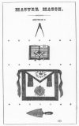
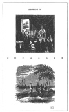
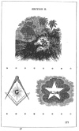
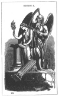
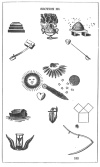
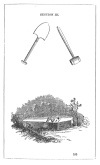

  
[Intangible Textual Heritage](../../index)  [Freemasonry](../index.md) 
[Index](index)  [Previous](gar48)  [Next](gar50.md) 

------------------------------------------------------------------------

[Buy this Book at
Amazon.com](https://www.amazon.com/exec/obidos/ASIN/B002AMUDMG/internetsacredte.md)

------------------------------------------------------------------------

  
*General Ahiman Rezon*, by Daniel Sickels, \[1868\], at Intangible
Textual Heritage

------------------------------------------------------------------------

p. 171

### THIRD DEGREE.

### MASTER MASON.

"In the ceremonial of the Third Degree the last grand mystery is
attempted to be illustrated in a forcible and peculiar manner, showing,
by striking analogy, that the Master Mason cannot be deemed perfect in
the glorious science until by the cultivation of his intellectual powers
he has gained such moral government of his passions, such serenity of
mind, that in synonymous apposition with mastership in operative art his
thoughts, like his actions, have become as useful as human intelligence
will permit; and that, having passed through the trials of life with
fortitude and faith, he is fitted for that grand, solemn, and mysterious
consummation by which alone he can become acquainted with the great
security of Eternity. Unlike the Entered Apprentice and Fellow-Craft,
who each anticipate improvement as they advance, the Master Mason can
learn nothing beyond the Third Degree; his hopes, therefore, with his
thoughts and wishes, should be directed to the Grand Lodge above, where
the world's great Architect lives and reigns forever. The ceremonial and
the lecture beautifully illustrate this all. engrossing subject, and the
conclusion we arrive at is that youth properly directed leads us to
honorable and virtuous maturity, and that the life of man regulated by
morality, faith and justice, will be rewarded at its closing hour by the
prospect of Eternal Bliss."—DR. CRUCEFIX.

p. 172 p. 173

  [  
Click to enlarge](img/17300.jpg.md)

p. 174 p. 175

  [  
Click to enlarge](img/17500.jpg.md)

p. 176 p. 177

  [  
Click to enlarge](img/17700.jpg.md)

p. 178 p. 179

  [  
Click to enlarge](img/17900.jpg.md)

p. 180 p. 181

  [  
Click to enlarge](img/18100.jpg.md)

p. 182 p. 183

  [  
Click to enlarge](img/18300.jpg.md)

p. 184 p. 185

  [  
Click to enlarge](img/18500.jpg.md)

------------------------------------------------------------------------

[Next: Symbolism of the Degree](gar50.md)
