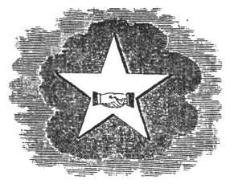

  
[Intangible Textual Heritage](../../index)  [Freemasonry](../index.md) 
[Index](index)  [Previous](gar53)  [Next](gar55.md) 

------------------------------------------------------------------------

[Buy this Book at
Amazon.com](https://www.amazon.com/exec/obidos/ASIN/B002AMUDMG/internetsacredte.md)

------------------------------------------------------------------------

  
*General Ahiman Rezon*, by Daniel Sickels, \[1868\], at Intangible
Textual Heritage

------------------------------------------------------------------------

#### RITES OF SEPULTURE.

#### HEBREW CUSTOMS.

ALL nations of the earth, from time immemorial, however much they have
differed in most things, have ever agreed in this, viz: that it is a
sacred duty to dispose of the bodies of the departed in a reverential
manner. The most prevalent custom has been to bury them in the earth or
place them in tombs. Among the Greeks, the duty of burying the dead was
considered so important, that they enacted a law, requiring that whoever
should meet a corpse in his path, should cover it with earth, turning
the eyes to the evening-star. In some of the Oriental nations, the
practice of burning the dead, and preserving their ashes in funereal
urns, prevailed; but this custom was not tolerated in Judea. The Jews
celebrated their funerals with great ceremony. Large crowds generally
followed the body to its last resting-place, and—what seems strange to
us—hired mourners, with lamentations and tears, proclaimed the grief of
the surviving friends.

p. 201

The prejudices of the people would not allow interments to be made in
cities, and, consequently, every town had its cemetery without its
walls. This fact would seem to be contradicted by a statement made in
this section of the third degree, and Masonic writers have been much
perplexed to find a means of reconciling the contradiction. But the
subject is really free of all difficulty. The scene referred to is not
historically true. Neither the supreme act of this degree—as we have
heretofore remarked—nor the final one here described, are to be
considered as commemorative of historical facts. The whole together
forms a sublime myth, whose significance we have explained in our
annotations elsewhere.

The Hebrews had cheerful views of death, and awaited its approach with
calmness. With confidence and filial trust they closed their eyes on
life, its splendors and enjoyments, and departed joyfully to join the
great assembly of the blessed. "Yea, though I walk through the valley of
the shadow of death, I will fear no evil!" was the exulting exclamation
of one of them. When loved ones were stricken down, and consigned to the
grave, they did not speak of them as *dead*, but said "*they sleep with
their fathers!*" Hence, their burial-places were generally selected for
their agreeable scenery, and were shaded with the Cypress and Cedar, and
adorned with the Tamarisk and "golden-haired" Acacia.

The Jews undoubtedly erected monuments, bearing appropriate emblems and
inscriptions, to commemorate the virtues of distinguished men; but the
mausoleums which they best loved, were those that Nature supplies.
Obelisks of granite and marble will crumble to dust as the ages revolve,
but Nature's monuments—the trees and the flowers, symbols of Love, Hope,
and Immortality—are perpetually renewed.

Some of the ancient Oriental cemeteries yet exist. A late traveler found
one near Babylon, and growing near one of its venerable graves was a
Tamarisk, which seemed to belong to the epoch when the Chaldean State
was at the summit of its glory. "It appears," he says, "to be of the
highest antiquity, and has been a superb tree—perhaps a scion of the
monarch of the hanging gardens. Its present height is only twenty-three
feet; its trunk has been of great circumference; though now rugged and
rifted, it still stands proudly up; and, although nearly worn away, has
still sufficient strength to bear the burden of its limbs in the stern
grandeur of its decaying greatness. The fluttering and rustling sound
produced by the wind sweeping through its delicate branches, has an
indescribably melancholy

p. 202

effect, and seems as if entreating the traveler to remain, and unite in
mourning over those who slumber below. I scarcely dared ask why, while
standing beneath this precious relic of the past and prophet of the
future, I had nearly lost the power of forcing myself from the spot.

"I turned from all it brought to those it could not
bring." [\*](#fn_28.md)

The emblems of the second class, which are peculiar to this degree—the
Spade, Coffin, Sprig of Acacia, etc.—are well known to all
thoroughly-qualified Masons. They are all expressive and eloquently
instructive; but we have always regarded the acacia as the most
beautiful and significant; for it speaks of immortality. So the trees,
the shrubs, and flowers with which the old Hebrews were wont to surround
the tombs and graves of their "loved and lost," were carefully selected
with reference to their symbolic meaning. They were types of sympathy,
affection, hope, and of the love which is eternal.

This should also be the practice of modern Freemason. The adorning of
our graves with those symbols of sympathy and everlasting affection
which Nature so richly furnishes, takes away the gloom and terror of the
"narrow house." Let the rose, the amaranth, and the myrtle bloom around
the places where our loved departed rest from the toils and conflicts of
life. Let the acacia, cypress, and cedar be planted there, and embellish
the soil which is consecrated to the dead. Thus, on every returning
Spring, each swelling bud and opening flower will seem to declare that
the night of death is passing;

"And beauty immortal awakes from the tomb."

Thus every wind that softly breathes through the green foliage, and fans
the verdant coverings of the dead, will seem to be an echo of the voice
of GOD, or the Archangel's trump, commanding the dead to rise. Then will
holy and trustful thoughts and bright hopes hover over their tombs, as
crowns of stars. The grave will be transfigured, and shine with a light
immortal

By following the example of our brethren of the old days, we render a
homage, justly due, to the spirits of the honored dead. Each grave thus
becomes an altar, consecrated by sighs, and tears, and holy affections;
and the flowers that bloom thereon, are the

p. 203

offerings which unforgetting love presents to the cherished being who
slumbers beneath.

"Then, like the Hebrew, bear your dead  
To fields with pleasant verdure spread,  
  And lay him down to rest,  
Where th’ Acacias, with the Cypress blent,  
Weep mutely o’er the tenement  
  Which holds a slumbering guest.  
Oh, bear along the sable pall  
Without the crowded city's wall!"

 

WHEN the necessities of a Brother call for my aid and support, I will be
ever ready to render him such assistance, to save him from sinking, as
may not be detrimental to myself \#\#\# connections, if I find him
worthy thereof.

Indolence shall not cause my footsteps to halt, nor shall wrath turn
them aside; but, forgetting every selfish consideration, I will be ever
swift of foot to save, help, and execute benevolence to a
fellow-creature in distress, particularly to a brother Mason.

When I offer up my devotions to Almighty God, I will remember a
Brother's welfare as my own; for, most assuredly, will the petitions of
a fervent heart be acceptable at the Throne of Grace; and our prayers
are certainly required for each other.

A Brother's secrets, delivered to me as such, I will keep as I would my
own, because, by betraying that trust, I might be doing him the greatest
injury he could possibly sustain.

A Brother's character I will support in his absence as I would in his
presence; I will not wrongfully revile him myself, nor will I suffer it
to be done by others, if in my power to prevent it.

p. 204

Thus are we linked together in one indissoluble chain of sincere
affection, brotherly love, relief, and truth.

It has been the practice in all ages to erect monuments to the memory of
departed worth; and the section closes with a tribute to the memory of
that distinguished artist who preferred to lose his life rather than
betray his trust.

------------------------------------------------------------------------

### Footnotes

[202:\*](gar54.htm#fr_28.md) Travels in the Holy
Land and Chaldea, by Capt. ROBT. MIQUARI. 1829.

------------------------------------------------------------------------

[Next: King Solomon's Temple](gar55.md)
