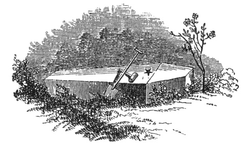

  
[Intangible Textual Heritage](../../index)  [Freemasonry](../index) 
[Index](index)  [Previous](gar55)  [Next](gar57) 

------------------------------------------------------------------------

[Buy this Book at
Amazon.com](https://www.amazon.com/exec/obidos/ASIN/B002AMUDMG/internetsacredte)

------------------------------------------------------------------------

  
*General Ahiman Rezon*, by Daniel Sickels, \[1868\], at Intangible
Textual Heritage

------------------------------------------------------------------------

In this section are also explained a variety of appropriate emblems,
with which the skillful brother will not fail to make himself familiarly
acquainted, and they are thus explained:

### THE THREE STEPS,

\[paragraph continues\] Usually delineated
upon the Master's carpet, are emblematical of the three principal stages
of human life, viz:—YOUTH, MANHOOD, and AGE. In *Youth*, as Entered
Apprentices, we ought industriously to occupy our minds in the
attainment of useful knowledge; in *Manhood*, as Fellow-Crafts, we
should apply our knowledge to the discharge of our respective duties to
GOD, our neighbor, and ourselves; that so, in *Age*, as Master Masons,
we may enjoy the happy reflection consequent on a well-spent life, and
die in the hope of a glorious immortality.

The morning is the youth of the day; youth is vigorous till noon; then
comes the age of man; to which succeeds the evening of old age; sunset
follows the evening or death of the day. Frugality is a great revenue,
but no where greater than in this case.

p. 210

#### THE POT OF INCENSE

\[paragraph continues\] Is an emblem of a
pure heart, which is always an acceptable sacrifice to the Deity; and as
this glows with fervent heat, so should our hearts continually glow with
gratitude to the great and beneficent Author of our existence, for the
manifold blessings and comforts we enjoy.

#### THE BEE-HIVE

\[paragraph continues\] Is an emblem of
industry, and recommends the practice of that virtue to all created
beings, from the highest seraph in heaven to the lowest reptile of the
dust. It teaches us that, as we carne into the world rational and
intelligent beings, so we should ever be industrious ones; never sitting
down contented while our fellow-creatures around us are in want,
especially when it is in our power to relieve them without inconvenience
to ourselves.

When we take a survey of Nature, we view man in his infancy, more
helpless and indigent than the brute creation: he lies languishing for
days, months, and years, totally incapable of providing sustenance for
himself, of guarding against the attack of the wild beasts of the field,
or sheltering himself from the inclemencies of the weather.

p. 211

\[paragraph continues\] It might have
pleased the great Creator of heaven and earth to have made man
independent of all other beings; but as dependence is one of the
strongest bonds of society, mankind were made dependent on each other
for protection and security, as they thereby enjoy better opportunities
of fulfilling the duties of reciprocal love and friendship. Thus was man
formed for social and active life—the noblest part of the work of GOD;
and he that will so demean himself as not to be endeavoring to add to
the common stock of knowledge and understanding, may be deemed a *drone*
in the *hive* of Nature, a useless member of society, and unworthy of
our protection as Masons.

#### THE BOOK OF CONSTITUTIONS, GUARDED BY THE TILERS SWORD,

\[paragraph continues\] Reminds us that we
should be ever watchful and guarded in our thoughts, words, and actions,
particularly when before the enemies of Masonry—ever bearing in
remembrance those truly Masonic virtues, *silence* and *circumspection*.

#### THE SWORD, POINTING TO A NAKED HEART,

\[paragraph continues\] Demonstrates that
justice will sooner or later overtake us; and although our thoughts,
words,

p. 212

and actions may be hidden from the eyes of man, yet that

#### ALL-SEEING EYE,

whom the SUN, MOON, and STARS obey, and under whose watchful care even
COMETS perform their stupendous revolutions, pervades the inmost
recesses of the human HEART, and will reward us according to our merits.

#### THE ANCHOR AND ARK

\[paragraph continues\] Are emblems of a
well-grounded *hope* and a well-spent life. They are emblematical of
that divine *Ark* which safely wafts us over this tempestuous sea of
troubles, and that *Anchor* which shall safely moor us in a peaceful
harbor, where the wicked cease from troubling, and the weary shall find
rest.

#### THE FORTY-SEVENTH PROBLEM OF EUCLID.

This was an invention of our ancient friend and brother, the great
PYTHAGORAS, who, in his travels through Asia, Africa, and Europe, was
initiated into the several orders of priesthood. and raised to the
sublime degree of Master Mason. This wise philosopher enriched his mind
abundantly in a general knowledge of things

p. 213

and more especially in Geometry, or Masonry. On this subject he drew out
many problems and theorems; and, among the most distinguished, he
erected this, which, in the joy of his heart, he called EUREKA, in the
Grecian language signifying *I have found it;* and upon the discovery of
which he is said to have sacrificed a hecatomb. It teaches Masons to be
general lovers of the arts and sciences.

#### THE HOUR-GLASS

\[paragraph continues\] Is an emblem of
human life. Behold! how swiftly the sands run, and how rapidly our lives
are drawing to a close! We cannot without astonishment behold the little
particles which are contained in this machine; how they pass away almost
imperceptibly; and yet, to our surprise, in the short space of an hour
they are all exhausted! Thus wastes man. To-day, he puts forth the
tender leaves of Hope; to-morrow, blossoms, and bears his blushing
honors thick upon him; the next day comes a frost, which nips the shoot;
and when he thinks his greatness is still, aspiring, he falls like
autumn leaves, to enrich our mother-earth.

p. 214

#### THE SCYTHE

\[paragraph continues\] Is an emblem of
Time, which cuts the brittle thread of life, and launches us into
eternity. Behold! what havoc the scythe of Time makes among the human
race! If by chance we should escape the numerous evils incident to
childhood and youth, and with health and vigor arrive to the years of
manhood; yet, withal, we must soon be cut down by the all-devouring
scythe of Time, and be gathered into the land where our fathers have
gone before us.

\*       \*       \*       \*       \*       \*       \*

 

Thus we close the explanation of the emblems upon the solemn thought of
death, which, without revelation, is dark and gloomy; but we are

p. 215

suddenly revived by the *ever-green* and ever-living *sprig* of Faith in
the merits of the Lion of the tribe of Judah; which strengthens us, with
confidence and composure, to look forward to a blessed immortality; and
doubt not, but in the glorious morn of the resurrection, our bodies will
rise, and become as incorruptible as our souls.

Then let us imitate the good man in his virtuous and amiable conduct; in
his unfeigned piety to GOD; in his inflexible fidelity to his trust;
that we may welcome the grim tyrant Death, and receive him as a kind
messenger sent from our Supreme Grand Master, to translate us from this
imperfect to that all-perfect, glorious, and celestial Lodge above,
where the Supreme Architect of the Universe presides.

------------------------------------------------------------------------

[Next: Charge to the Candidate](gar57)
