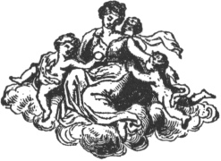

  
[Intangible Textual Heritage](../../index)  [Freemasonry](../index.md) 
[Index](index)  [Previous](gar56)  [Next](gar58.md) 

------------------------------------------------------------------------

[Buy this Book at
Amazon.com](https://www.amazon.com/exec/obidos/ASIN/B002AMUDMG/internetsacredte.md)

------------------------------------------------------------------------

  
*General Ahiman Rezon*, by Daniel Sickels, \[1868\], at Intangible
Textual Heritage

------------------------------------------------------------------------

p. 216

#### CHARGE TO THE CANDIDATE.

BROTHER: Your zeal for our institution, the progress you have made in
our mysteries, and your steady conformity to our useful regulations,
have pointed you out as a proper object for this peculiar mark of our
favor.

Duty and honor now alike bind you to be faithful to every trust; to
support the dignity of your character on all occasions; and strenuously
to enforce, by precept and example, a steady obedience to the tenets of
Freemasonry. Exemplary conduct, on your part, will convince the world
that merit is the just title to our privileges, and that on you our
favors have not been undeservedly bestowed.

In this respectable character, you are authorized to correct the
irregularities of your less informed brethren; to fortify their minds
with resolution against the snares of the insidious, and to guard them
against every allurement to vicious practices. To preserve unsullied the
reputation of the Fraternity ought to be your constant care; and,
therefore, it becomes your province to caution the inexperienced against
a

p. 217

breach of fidelity. To your inferiors in rank or office, you are to
recommend obedience and submission; to your equals, courtesy and
affability; to your superiors, kindness and condescension. Universal
obedience you are zealously to inculcate; and by the regularity of your
own conduct, endeavor to remove every aspersion against this venerable
institution. Our ancient landmarks you are carefully to preserve, and
not suffer them on any pretense to be infringed, or countenance a
deviation from our established customs.

Your honor and reputation are concerned in supporting with dignity the
respectable character you now bear. Let no motive, therefore, make you
swerve from your duty, violate your vows, or betray your trust; but be
true and faithful, and imitate the example of that celebrated artist
whom you have this evening represented. Thus you will render yourself
deserving of the honor which we have conferred, and worthy of the
confidence we have reposed in you.

 

Having thus given a general summary of the Lectures restricted to the
three Degrees of the Order, and made such remarks on each Degree as
might illustrate the subjects treated, little farther can be wanted to
encourage the zealous

p. 218

\[paragraph continues\] Mason to persevere
in his researches. He who has traced the Art in a regular progress, from
the commencement of the First to the conclusion of the Third Degree,
according to the plan here laid down, must have amassed an ample store
of knowledge, and will reflect with pleasure on the good effects of his
past diligence and attention. By applying the improvements he has made
to the general advantage of society, he will secure to himself the
veneration of Masons and the approbation of all good men.

 

------------------------------------------------------------------------

[Next: Officers' Clothing and Jewels](gar58.md)
