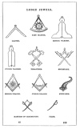
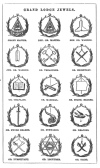

  
[Intangible Textual Heritage](../../index)  [Freemasonry](../index) 
[Index](index)  [Previous](gar57)  [Next](gar59) 

------------------------------------------------------------------------

[Buy this Book at
Amazon.com](https://www.amazon.com/exec/obidos/ASIN/B002AMUDMG/internetsacredte)

------------------------------------------------------------------------

  
*General Ahiman Rezon*, by Daniel Sickels, \[1868\], at Intangible
Textual Heritage

------------------------------------------------------------------------

p. 219

  [  
Click to enlarge](img/21900.jpg)

p. 220

#### OFFICERS' CLOTHING AND JEWELS.

SUBORDINATE LODGE.

The COLLAR must be blue, (of velvet, silk, or merino,) trimmed with
material of same color, bordered with silver lace. They may be
ornamented with embroidery or stars. The Jewel is to be suspended from
the point of the Collar.

The APRON is white lambskin, square at the corners—13x15 in., with flap
triangular shape, 5 inches deep at the point, lined and bordered with
blue. On the flap is delineated an eye, irradiated; on the area the
square and compass and the letter G, irradiated, with flat Masonic tags
suspended on either side from under the flap. See illustration p. 173.

JEWELS (silver).

|                   |       |                                                                                               |
|-------------------|-------|-----------------------------------------------------------------------------------------------|
| Past Master       | wears | a compass opened on a quarter circle, sun in the center. [\*](#fn_29) |
| Master            | „     | a square.                                                                                     |
| Senior Warden     | „     | a level.                                                                                      |
| Junior Warden     | „     | a plumb.                                                                                      |
| Treasurer         | „     | cross keys.                                                                                   |
| Secretary         | „     | cross pens.                                                                                   |
| Senior Deacon     | „     | square and compass, sun in the center.                                                        |
| Junior Deacon     | „     | square and compass, quar. moon in center.                                                     |
| Stewards          | „     | a cornucopia.                                                                                 |
| Chaplain          | „     | an open Bible.                                                                                |
| Marshal           | „     | cross batons.                                                                                 |
| Organist          | „     | a lyre.                                                                                       |
| M's of Ceremonies | „     | cross swords.                                                                                 |
| Tiler             | „     | a sword, sabre shape.                                                                         |

p. 221

  [  
Click to enlarge](img/22100.jpg)

#### GRAND LODGE.

The COLLARS of a Grand Lodge should be made of royal purple silk velvet,
enriched with gold embroidery, trimmed with gold lace, and lined with
purple silk. The Jewel is to be suspended from the point of the Collar.

The APRON is white lambskin, 13×15 in., square at the corners, trimmed
with purple and gold, and flat Masonic tags. The Apron and Collar should
be made to correspond in richness to the grade of the officer for whom
they were intended.

#### JEWELS.

The Jewels of a Grand Lodge are made of gold (or yellow metal), and
suspended in a circle or wreath.

|                     |       |                                                         |
|---------------------|-------|---------------------------------------------------------|
| Grand Master        | wears | a compass opened on a quarter circle sun in the center. |
| Past Grand Master   | „     | the same, with triangle.                                |
| Deputy Grand Master | „     | a square.                                               |
| Senior Grand Warden | „     | a level.                                                |
| Junior Grand Warden | „     | a plumb.                                                |
| Grand Treasurer     | „     | cross keys.                                             |
| Grand Secretary     | „     | cross pens.                                             |
| Grand Chaplains     | „     | the Holy Bible.                                         |
| Grand Marshal       | „     |  a scroll and sword crossed.                            |
| G. Standard Bearer  | „     | a plate, representing a banner.                         |
| Grand Sword Bearer  | „     | a straight sword.                                       |
| Grand Stewards      | „     | a cornucopia.                                           |
| Grand Deacons       | „     | a dove, bearing an olive branch.                        |
| Grand Pursuivant    | „     | a sword and trumpet crossed.                            |
| Grand Tiler         | „     | cross swords.                                           |

------------------------------------------------------------------------

### Footnotes

[220:\*](gar58.htm#fr_29) This Jewel may be made
of gold, and enclosed to a wreath.

------------------------------------------------------------------------

[Next: Introduction](gar59)
