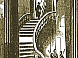

  
[Intangible Textual Heritage](../../index)  [Freemasonry](../index.md) 
[Index](index)  [Previous](gar59)  [Next](gar61.md) 

------------------------------------------------------------------------

[Buy this Book at
Amazon.com](https://www.amazon.com/exec/obidos/ASIN/B002AMUDMG/internetsacredte.md)

------------------------------------------------------------------------

  
*General Ahiman Rezon*, by Daniel Sickels, \[1868\], at Intangible
Textual Heritage

------------------------------------------------------------------------

p. 223

#### SECTION I.

#### CONSECRATION, DEDICATION, CONSTITUTION, AND INSTALLATION OF OFFICERS OF A NEW LODGE.

ANY number of Master Masons, not less than seven, desirous of forming a
new Lodge, must apply, by petition, [\*](#fn_30.md)
to the Grand Master, Deputy Grand Master, or Grand Lodge of the State in
which they reside, as follows;

p. 224

#### FORM OF PETITION FOR A NEW LODGE.

*To the M. W. Grand Master of Masons of the State of .......:*

THE undersigned petitioners, being Ancient Free and Accepted Master
Masons, having the prosperity of the Fraternity at heart, and willing to
exert their best endeavors to promote and diffuse the genuine principles
of Masonry, respectfully represent—That they are desirous of forming a
new Lodge in the .... of ........, to be named , No .... They therefore
pray for Letters of Dispensation, to empower them to assemble as a
regular Lodge, to discharge the duties of Masonry, in a regular and
constitutional manner, according to the original forms of the Order and
the regulations of the Grand Lodge. They have nominated and do recommend
Brother A. B. to be the first Master; Brother C. D. to be the first
Senior Warden; and Brother F. F. to be the first Junior Warden of said
Lodge. If the prayer of this petition shall be granted, they promise a
strict conformity to the edicts of the Grand Master, and the
Constitution, laws, and regulations of the Grand Lodge. [\*](#fn_31.md)

p. 225

#### CONSECRATION.

ON the day and hour appointed, the Grand Master and his officers, or
their representatives, meet in a convenient room, near to that in which
the Lodge is to be consecrated, and open the Grand Lodge.

After the officers of the new Lodge are examined, they send a messenger
to the Grand Master with the following message:

MOST WORSHIPFUL: The Officers and Brethren of ...... Lodge, who are now
assembled at ....., have instructed me to inform you that the Most
Worshipful Grand Lodge (or Grand Master) was pleased to grant them a
Letter of Dispensation, bearing date the .... day of ....., in the year
...., authorizing them to form and open a Lodge of Free and Accepted
Masons, in the ...... of

p. 226

\[paragraph continues\] ......; that since
that period they have regularly assembled, and conducted the business of
MASONRY according to the best of their abilities; that their proceedings
having received the approbation of the Most Worshipful Grand Lodge, they
have obtained a Charter of Constitution, and are desirous that their
Lodge should be consecrated, and their Officers installed, agree ably to
the ancient usages and customs of the Craft; for which purpose they are
now met, and await the pleasure of the Most Worshipful Grand Master.

 

The Grand Lodge then walk in procession to the room of the new Lodge.
When the Grand Master enters, the grand honors [\*](#fn_32.md) are given, under direction of the Master
of the new

p. 227

\[paragraph continues\] Lodge. The
officers of the new Lodge resign their seats to the Grand Officers, and
take their stations on their left.

p. 228

If the ceremonies are performed in public, the Grand Marshal then forms
the procession in the following order:

Tiler, with drawn sword;

Two Stewards, with white rods;

Master Masons, two and two;

Junior Deacons;

Senior Deacons;

Secretaries;

Treasurers;

Past Wardens;

Junior Wardens;

Senior Wardens;

Past Masters;

Members of the higher degrees;

THE NEW LODGE.

Tiler, with drawn sword;

Stewards, with white rods;

Master Masons;

Junior and Senior Deacons;

Secretary and Treasurer;

Two brethren, carrying the Lodge;

Junior and Senior Wardens;

The Holy Writings, carried by the oldest member not in office.

Worshipful Master;

p. 229

*Music*.

THE GRAND LODGE;

Grand Tiler, with drawn sword;

Grand Stewards, with white rods;

Grand Pursuivant, with sword;

Grand Secretary and Grand Treasurer;

A. Past Master, bearing the Holy Writings, Square, and Compasses,
supported by two Stewards, with rods;

Two Burning Tapers, borne by two Past Masters;

Grand Chaplain and Orator;

The Tuscan and Composite Orders;

The Doric, Ionic, and Corinthian Orders;

Past Grand Wardens;

Past Deputy Grand Masters;

Past Grand Masters;

The Celestial and Terrestrial Globes, borne by two brethren;

Junior Grand Warden, carrying a silver vessel with oil;

Senior Grand Warden, carrying a silver vessel with wine;

Deputy Grand Master, carrying a golden vessel with corn;

Master of the oldest Lodge, carrying the Book of

Constitutions;

GRAND MASTER,

Supported by the Grand Deacons, with white rods;

Grand Standard-Bearer;

Grand Sword-Bearer, with drawn sword.

The procession moves on to the church or house where the services are to
be performed. When the front of the procession arrives at the door, they
halt, open to the right and left, and face inward, while the Grand
Master and others, in succession, pass through, and enter the house.

A platform is erected in front of the pulpit, and provided with seats
for the accommodation of the Grand Officers.

The Bible, Square, and Compasses, and Book of Constitutions,

p. 230

are placed upon a table in front of the Grand Master; the *Lodge* [\*](#fn_33.md) is placed in the center, upon a platform
covered with white linen, and encompassed by the three tapers and the
vessels of corn, wine, and oil.

The following services then take place:

**ODE**.

AIR—*Shirland*. S. M.

  [  
Click to enlarge](img/23000.jpg.md)

Great Source of Light and Love,  
  To thee our songs we raise!  
Oh! in thy temple, Lord above,  
  Hear and accept our praise!

p. 231

Shine on this festive day,  
  Succeed its hoped design,  
And may our Charity display  
  A love resembling thine!

May this fraternal band,  
  Now *Consecrated*—blest—  
In union all distinguished stand,  
  In purity be drest!

The following, or an extemporaneous Prayer, will be offered by the Grand
Chaplain:

Great, Adorable, and Supreme Being! We praise thee for all thy mercies,
and especially for giving us desires to enjoy, and powers of enjoying,
the delights of society. The affections which thou hast implanted in us,
and which we cannot destroy without violence to our nature, are among
the chief blessings which thy benign wisdom hath bestowed upon us. Help
us duly to improve all our powers to the promotion of thy glory in the
world, and the good of our fellow-creatures. May we be active under thy
divine light, and dwell in thy truth.

Extend thy favor to us who are now entering into a Fraternal compact
under peculiar obligations. Enable us to be faithful to thee, faithful
in our callings in life, faithful Masons in all the

p. 232

duties of the Craft, and faithful to each other as members of this
society. Take us under the shadow of thy protection; and to thy service
and glory may we consecrate our hearts. May we always put *faith* in
thee, have *hope* in salvation, and be in *charity* with all
mankind!—AMEN.

*Response by the brethren*.—So mote it be.

An ORATION, by some competent brother, when practicable.

**ODE**.

AIR—*Duke Street*. L. M.

  [  
Click to enlarge](img/23200.jpg.md)

How blest the sacred tie, that binds,  
In sweet communion kindred minds!  
How swift the heavenly course they run, p.
233  
Whose hearts, whose faith, whose hopes are one.

  [  
Click to enlarge](img/23300.jpg.md)

Together oft they seek the place  
Where Masons meet with smiling face;  
How high, how strong their raptures swell,  
There's none but kindred souls can tell.

Nor shall the glowing flame expire,  
When dimly burns frail Nature's fire;  
Then shall they meet in realms above,  
A heaven of joy, a heaven of love.

The Grand Marshal then forms the officers and members of the new Lodge
in front of the Grand Master. The Deputy Grand Master addresses the
Grand Master as follows:

MOST WORSHIPFUL: A number of brethren, duly instructed in the mysteries
of Masonry, having assembled together at stated periods, for some time
past, by virtue of a Dispensation granted them for that purpose, do now
desire to be *constituted* into a *regular Lodge*, agreeably to the
ancient usages and customs of the Fraternity.

The records are then presented to the Grand Master, who examines them,
and, if found correct, proclaims

p. 234

The records appear to be correct, and are approved. Upon due
deliberation, the Grand Lodge have granted the brethren of this new
Lodge a Warrant, establishing and confirming them in the rights and
privileges of a *regularly-constituted Lodge;* which the Grand Secretary
will now read.

After the Warrant is read, the Grand Master then says:

We shall now proceed, according to ancient usage, to constitute these
brethren into a regular Lodge.

Whereupon the several officers of the new Lodge deliver up their jewels
and badges to their Master, who presents them, with his own, to the
Deputy Grand Master, and he to the Grand Master.

The Deputy Grand Master presents the Master elect to the Grand Master;
saying,

MOST WORSHIPFUL: I present you Brother ...., whom the members of the
Lodge now to be constituted have chosen for their Master.

The Grand Master asks the brethren if they remain satisfied with their
choice. \[*They bow in token of assent*.\]

The Master elect then presents, severally, his Wardens and other
officers, naming them and their respective offices. The Grand Master
asks the brethren if they remain satisfied with ' ach and all of them.
\[*They bow, as before*.\]

p. 235

The officers and members of the new Lodge form in front of the Grand
Master; and the ceremonies of Consecration commence.

The Grand Master and Grand Officers now form themselves in order around
the Lodge—all kneeling.

A piece of solemn music is performed while the Lodge is being uncovered.

After which, the first clause of the *Consecration Prayer* is rehearsed
by the Grand Chaplain, as follows:

Great Architect of the Universe! Maker and Ruler of all Worlds! Deign,
from thy celestial temple, from realms of light and glory, to bless us
in all the purposes of our present assembly! We humbly invoke thee to
give us at this, and at all times, *wisdom* in all our doings,
*strength* of mind in all our difficulties, and the *beauty* of harmony
in all our communications! Permit us, O thou Author of Light and Life,
great Source of Love and Happiness, to erect this Lodge, and now
solemnly to *consecrate* it to the honor of thy glory!

*Response*.—As it was in the beginning, is now, and ever shall be; world
without end.—AMEN.

The Deputy Grand Master presents the golden vessel of corn, and the
Senior and Junior Grand Wardens the silver vessels of wine and oil, to
the Grand Master, who sprinkles the elements of Consecration upon the
Lodge.

p. 236

 

The Grand Chaplain then continues:

Grant, O Lord our God, that those who are now about to be invested with
the government of this Lodge may be endowed with wisdom to instruct
their brethren in all their duties. May *brotherly love*, *relief*, and
*truth* always prevail among the members of this Lodge! May this bond of
union continue to strengthen the Lodges throughout the world!

Bless all our brethren, wherever dispersed; and grant speedy relief to
all who are either oppressed or distressed.

We affectionately commend to thee all the members of thy whole family.
May they increase in grace, in the knowledge of thee, and in the love of
each other.

Finally: May we finish all our work here below with thy approbation; and
then have our transition from this earthly abode. to thy heavenly

p. 237

temple above, there to enjoy light, glory, and bliss, ineffable and
eternal!

*Response*.—As it was in the beginning, is now, and ever shall be. So
mote it be.—AMEN.

------------------------------------------------------------------------

### Footnotes

[223:\*](gar60.htm#fr_30.md) The mode of applying
by petition to the Grand Master for a warrant to meet as a regular
Lodge, commenced only in the year 1718; previous to that time, Lodges
were empowered, by inherent privileges vested in the Fraternity at
large, to meet and act occasionally under the direction of some able
architect; and the proceedings of those meetings being approved by the
majority of the brethren convened at another Lodge assembled in the same
district, were deemed constitutional. By such an inherent authority the
Lodge of Antiquity in London now acts, having no warrant from any Grand
Lodge, but an authority traced from time Immemorial, which has been long
and universally admitted and acknowledged by the whole Fraternity
throughout the world, and which no warrant or other instrument of any
particular Masonic jurisdiction can possibly supersede.

[224:\*](gar60.htm#fr_31.md) This petition, being
signed by at least seven regular Masons, and recommended by a Lodge or
Lodges nearest to the place where the new Lodge is to be holden, is
delivered to the Grand Secretary, who lays it before the G. Lodge.

In many jurisdictions, the Grand and Deputy Grand Masters, respectively,
are invested with authority to grant dispensations at pleasure during
the recess of the Grand Lodge; in some, they are never issued without
the special direction of the Grand Lodge.

Lodges working under dispensation are merely the agents of the G. Lodge
or Grand officer granting the authority; their presiding officers are
not entitled to the rank of Past Masters; their officers are not
privileged with a vote or voice in the Grand Lodge; they cannot change
their officers without the special approbation and appointment of the
Grand Lodge or Grand officer granting p. 225
the authority; and in case of the cessation of such Lodges, their funds,
jewels, and other property accumulated by initiations into the several
degrees, become the property of the Grand Lodge, and must be delivered
over to the G. Treasurer.

When Lodges that are at first instituted by dispensation have passed a
proper term of probation, they make application to the Grand Lodge for a
Charter of Constitution. If this be obtained, they are then confirmed in
the possession of their property, and possess all the rights and
privileges of regularly-constituted Lodges, as long as they conform to
the Constitutions of Masonry. After a Charter is granted by the Grand
Lodge, the Grand Master appoints a day and hour for consecrating and
constituting the new Lodge, and for installing its Master, Wardens, and
other officers. If the Grand Master, in person, attends the ceremony,
the Lodge Is said to be constituted In AMPLE FORM; if the Deputy Grand
Master only, it is said to be constituted in DUE FORM; but if the power
of performing the ceremony is vested in any other person, it is said to
be constituted in FORM.

When the Charters of Constitution are granted for places where the
distance is so great as to render it inconvenient for the Grand Officers
to attend, the Grand Master or his Deputy issues a written instrument,
under his hand and private seal, to some worthy Present or Past Master,
with full power to congregate, dedicate, and constitute the Lodge, and
install its officers.

[226:\*](gar60.htm#fr_32.md) The Grand Honors of
Masonry are those peculiar acts and gestures by which the Craft have
always been accustomed to express their homage, their joy, or their
grief, on memorable occasions. They are of two kinds, the private and
public, and carp of them are used on different occasions and for
different purposes,

The private Grand Honors of Masonry are performed in a manner known only
to Master Masons, since they can only be used in a Master's Lodge. They
are practiced by the Craft only on four occasions:—when a Masonic Hall
is to be consecrated, a new Lodge to be constituted, a Master slept to
be installed, or a Grand Master or his Deputy to be received on an
official visitation to a Lodge. They are used at all these ceremonies as
tokens of congratulation and homage. And as they can only be given by
Master Masons, it is evident that every consecration of a hall, or
constitution of a new Lodge, every installation of a Worshipful Master,
and every reception of a Grand Master, must be done in the third degree.
It is also evident, from what has been said, that the mode and manner of
giving the private Grand Honors can only be personally communicated to
Master Masons. They are among the *aporreta*—the things forbidden to be
divulged.

The public Grand Honors, as their name imports, do not partake pr this
secret character. They are given on all public occasions, in the
presence of the profane p. 227 as well as the
initiated. They are used at the laying of corner-stones of public
buildings, or in other services in which the ministrations of the
Fraternity are required, and especially in funerals. They are given in
the following manner: Both arms are crossed on the breast, the left
uppermost, and the open palms of the bands sharply striking the
shoulders; they are then raised above the head, the palms striking each
other, and then made to fall smartly upon the thighs. This is repeated
three times, and as there are three blows given each time—namely, on the
breast, on the palms of the hands, and on the thighs—making nine
concussions in all, the Grand Honors are technically said to be given
"by three times three." On the occasion of funerals, each one of these
honors is accompanied by the words, "*The will of God is accomplished;
so mote it be!*" audibly pronounced by the brethren.

These Grand Honors of Masonry have undoubtedly a classical origin, and
are but an imitation of the plaudits and acclamations practiced by the
ancient Greeks and Romans, in their theaters, their senates, and their
public games. There is abundant evidence in the writings of the ancients
that, in the days of the empire, the Romans had circumscribed the mode
of doing homage to their emperors and great men when they made their
appearance in public, and of expressing their approbation of actors at
the theatre within as explicit rules and regulations as those that
govern the system of giving the Grand Honors in Freemasonry. This was
not the case in the earlier ages of Rome; for OVID, speaking of the
Rabbles, says that, when they applauded, they did so without any rules
of art:

"In medio plausu, plausus tunc arte carebat."

\[paragraph continues\] And PROPERTIUS
speaks, at a later day, of the ignorance of the country people, who, at
the theatres, destroyed the general harmony, by their awkward attempts
to join in the modulated applauses of the more skillful citizens.

The ancient Romans had carried their science on this subject to such an
extent, as to have divided these *honors* into three kinds, differing
from each other in the mode in which the hands were struck against each
other, and in the sound that thence resulted. SUETONIUS, in his Life of
NERO, (cap. xx.) gives the names of these various kinds of applause,
which he says were called *bombi*, *imbrices*, and *testæ;* and SENECA,
in his "*Naturales Quæstiones*," gives a description of the manner in
which they were executed. The "bombi," or *hums*, wore produced by
striking the palms of the hands together, while they were in a hollow or
concave position, and doing this at frequent intervals, but with little
force, so as to imitate the humming sound of a swarm of bees. The
"imbrices," or *tiles*, were made by briskly striking the flattened and
extended palms of the hands against each other, so as to resemble the
sound of hail pattering upon the tiles of a roof. The "testæ," or
*earthen vases*, were executed by striking the palm of the left hand
with the fingers of the right collected into one point. By this blow a
sound was elicited, which imitated that given out by an earthen vase
when struck by a stick.

The Romans and other ancient nations having invested this system of
applauding with all the accuracy of a science, used it in its various
forms, not only for p. 228 the purpose of
testifying their approbation of actors in the theatre, but also bestowed
it, as a mark of respect or a token of adulation, on their emperors and
other great men, on the occasion of their making their appearance in
public. Huzzas and cheers have, in this latter case, been generally
adopted by the moderns, while the manual applause is only appropriated
to successful public speakers and declaimers. The Freemasons, however,
have altogether preserved the ancient custom of applause, guarding and
regulating its use by as strict, though different rules, as did the
Romans; and thus showing, as another evidence of the antiquity of their
institution, that the "Grand Honors" of Freemasonry are legitimately
derived from the "pietism" or applaudings practiced by the ancients on
public occasions.—MACKEY'S *Lexicon of Freemasonry*. SEE NOTE, p. 336.

[230:\*](gar60.htm#fr_33.md) The *Lodge*,
technically speaking, is a piece of furniture, made in imitation of the
Ark of the Covenant, which was constructed according to the form of the
Temple. The instrument usually used on occasions of Constituting,
Consecrating, and. Dedicating Lodges, is a box, of an oblong-square
shape, covered with white linen.

------------------------------------------------------------------------

[Next: Dedication and Constitution of a New Lodge](gar61.md)
