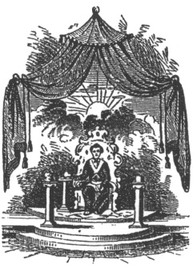
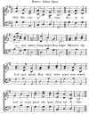
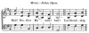
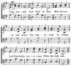

  
[Intangible Textual Heritage](../../index)  [Freemasonry](../index.md) 
[Index](index)  [Previous](gar61)  [Next](gar63.md) 

------------------------------------------------------------------------

[Buy this Book at
Amazon.com](https://www.amazon.com/exec/obidos/ASIN/B002AMUDMG/internetsacredte.md)

------------------------------------------------------------------------

  
*General Ahiman Rezon*, by Daniel Sickels, \[1868\], at Intangible
Textual Heritage

------------------------------------------------------------------------

p. 240

##### INSTALLATION

###### OF THE

#### OFFICERS OF A LODGE.

THE new Lodge having been Consecrated, Dedicated and Constituted, the
officers are then to be installed.

At every annual election in a warranted Lodge, it is necessary that the
officers should be installed. This ceremony may be performed by any Past
Master. At the Annual Installation, the Installing Officer appoints some
Present or Past Master, or, if none be present, an old well-informed
Master Mason, to act as Marshal, whose duties will be to present the
officers elect severally in front of the altar for installation.

The jewels of the several officers are collected, and laid in an orderly
manner upon the altar, for convenient use.

The Grand Master or Installing Officer then says:

RIGHT WORSHIPFUL DEPUTY: Have you carefully examined the Master
nominated in the warrant (or elect), and do you find him well-skilled in
the noble science and the royal art?

The Deputy replies:

MOST WORSHIPFUL GRAND MASTER: I have carefully examined, and so find
him. [\*](#fn_34.md)

*G. M.* You will then present him at the altar for installation.

The Deputy, taking the Master elect, presents him at the altar, saying:

p. 241

MOST WORSHIPFUL GRAND MASTER: I present my worthy Brother, A. B., to be
installed Master of this \[new\] Lodge. I find him to be of good morals
and of great skill, true and trusty; and as he is a lover of the
Fraternity, I doubt not he will discharge his duties with fidelity and
with honor.

The Grand Master then addresses him:

BROTHER: Previous to your investiture, it is necessary that you should
signify your assent to those Ancient Charges and Regulations which point
out the duty of a Master of a Lodge.

The Grand Master then reads a summary of the Ancient Charges to the
Master elect, as follows:

I. You agree to be a good man and true, and strictly to obey the moral
law?

*Ans*. I do.

II\. You agree to be a peaceful citizen, and cheerfully to conform to
the laws of the country in which you reside?

*Ans*. I do.

III\. You promise not to be concerned in plots and conspiracies against
the government, but

p. 242

patiently to submit to the law and the constituted authorities?

*Ans*. I do.

IV\. You agree to pay a proper respect to the civil magistrates, to work
diligently, live creditably, and act honorably by all men?

*Ans*. I do.

V. You agree to hold in veneration the original rulers and patrons of
the Order of Masonry, and their regular successors, supreme and
subordinate, according to their stations; and to submit to the awards
and resolutions of your brethren, in Lodge convened, in every case
consistent with the Constitutions of the Order?

*Ans*. I do.

VI\. You agree to avoid private piques and quarrels, and to guard
against intemperance and excess?

*Ans*. I do.

VII\. You agree to be cautious in your behavior, courteous to your
brethren, and faithful to your Lodge?

*Ans*. I do.

VIII\. You promise to respect genuine brethren,

p. 243

and to discountenance impostors, and al\] dissenters from the original
plan of Masonry? Ans. I do.

IX\. You agree to promote the general good of society, to cultivate the
social virtues, and to propagate the knowledge of the mystic art?

*Ans*. I do.

X. You promise to pay homage to the Grand Master for the time being, and
to his officers when duly installed; and strictly to conform to every
edict of the Grand Lodge, or General Assembly of Masons, that is not
subversive of the principles and ground-work of Masonry?

*Ans*. I do.

XI\. You admit that it is not in the power of any man, or body of men,
to make innovations in the body of Masonry?

*Ans*. I do.

XII\. You promise a regular attendance on the committees and
communications of the Grand Lodge, on receiving proper notice; and to
pay attention to all the duties of Masonry, on convenient occasions?

*Ans*. I do.

XIII\. You admit that no new Lodge shall be

p. 244

formed without permission of the Grand Lodge; and that no countenance be
given to any irregular Lodge, or to any person clandestinely initiated
therein, being contrary to the Ancient Charges of the Order?

*Ans*. I do.

XIV\. You admit that no person can be regularly made a Mason in, or
admitted a member of, any regular Lodge, without previous notice, and
due inquiry into his character?

*Ans*. I do.

XV\. You agree that no visitors shall be received into your Lodge
without due examination, and producing proper vouchers of their having
been initiated into a regular Lodge?

*Ans*. I do.

These are the Regulations of Free and Accepted Masons.

The Grand Master then addresses the Master elect as follows:

Do you submit to these Charges, and promise to support these
Regulations, as Masters have done in all ages before you?

The Master having signified his cordial submission, as before, the Grand
Master thus addresses him;

p. 245

BROTHER A. B.: In consequence of your conformity to the Charges and
Regulations of the Order, you are now to be installed Master of this
Lodge, in full confidence of your care, skill, and capacity to govern
the same.

The Master is then regularly invested with the insignia of his office,
and the furniture and implements of his Lodge. The various implements of
his profession are emblematical of our conduct in life, and upon this
occasion are carefully enumerated.

The *Holy Writings*, that great light in Masonry, will guide you to all
truth; it will direct your paths to the temple of happiness, and point
out to you the whole duty of man.

The *Square* teaches us to regulate our actions by rule and line, and to
harmonize our conduct by the principles of morality and virtue.

The *Compasses* teach us to limit our desires in every station, that,
rising to eminence by merit, we may live respected and die regretted.

The *Rule* directs that we should punctually observe our duty; press
forward in the path of virtue, and, neither inclining to the right nor
to the left, in all our actions have eternity in view.

The *Line* teaches us the criterion of moral

p. 246

rectitude, to avoid dissimulation in conversation and action, and to
direct our steps to the path which leads to immortality.

The *Book of Constitutions* you are to search at all times. Cause it to
be read in your Lodge, that none may pretend ignorance of the excellent
precepts it enjoins.

You now receive in charge the *Charter*, by the authority of which this
Lodge is held. You are carefully to preserve, and in no case should it
ever be out of your immediate control, and duly transmit it to your
successor in office.

You will also receive in charge the *By-Laws* of your Lodge, which you
are to see carefully and punctually executed.

You will now be solemnly inducted into the oriental chair of King
SOLOMON; during the performance of this ceremony it is requested that
all but regularly-installed Masters of Lodges and Past Masters will
retire. [\*](#fn_35.md)

All but actual Masters and Past Masters of Warranted Lodges [†](#fn_36.md) are required to retire (or, if more
convenient, are

p. 247

requested to face to the West); the new Master is then invested with the
mysteries of the Past Master's degree, and solemnly inducted into the
oriental chair of SOLOMON. When the doors are opened, the brethren
return (or are requested to face the East); and, forming an avenue on
each side, from the West to the East, the new Master being in the chair,
the Grand Master says:

 

Master, behold your brethren!

Brethren, behold your Master!

The grand honors are then given.

When the grand honors are given, a procession is formed, and the
brethren pass around the Lodge, signifying their respect and obedience
by the usual *distinctive marks* in the different degrees; during which
time the following Installation Ode may be sung:

p. 248

 
[  
Click to enlarge](img/24800.jpg.md)  
Music—*Italian Hymn*.  

Hail, Masonry divine,  
Glory of ages, shine;  
  Long mayst thou reign!  
Where’er thy Lodges stand,  
May they have great command,  
And always grace the land;  
Thou art divine.

Great fabrics still arise,  
And grace the azure skies—  
   Great are thy schemes;  
Thy noble orders are  
Matchless beyond compare; p. 249  
No art with thee can share;  
Thou art divine.

HIRAM, the architect,  
Did all the Craft direct  
  How they should build;  
SOLOMON, great Israel's king,  
Did mighty blessings bring,  
And left us room to sing,  
Hail, Royal Art!

After the singing of the ode, the Master calls the Lodge to order, and
the other officers are respectively presented in the same manner as the
Master, by the Conductor, When the installing officer delivers to each a
short Charge, as follows:

#### THE SENIOR WARDEN.

BROTHER C. D.: You are appointed [\*](#fn_37.md)
Senior Warden of this Lodge, and are now invested with the insignia of
your office.

The *Level* demonstrates that we are descended from the same stock,
partake of the same nature, and share the same hope; and though
distinctions among men are necessary to preserve subordination, yet no
eminence of station should make us forget that we are brethren; for he
who is placed on the lowest spoke of Fortune's wheel may be entitled to
our regard; because a time

p. 250

will come, and the wisest knows not how soon, when all distinctions, but
that of goodness, shall cease; and Death, the grand leveler of human
greatness, reduce us to the same state.

Your regular attendance on our stated meetings is essentially necessary.
In the absence of the Master, you are to govern this Lodge; in his
presence, you are to assist him in the government of it. I firmly rely
on your knowledge of Masonry and attachment to the Lodge for the
faithful discharge of the duties of this important trust. *Look well to
the West*.

He is conducted to his station in the Lodge.

#### THE JUNIOR WARDEN.

BROTHER E. F: You are appointed Junior Warden of this Lodge, and are now
invested with the badge of your office.

The *Plumb* admonishes us to walk uprightly in our several stations; to
hold the scales of Justice in equal poise; to observe the just medium
between intemperance and pleasure; and to make our passions and
prejudices coincide with the line of our duty. To you is committed the
superintendence of the Craft during the hours

p. 251

of refreshment: it is, therefore, indispensably necessary that you
should not only be temperate and discreet in the indulgence of your own
inclinations, but carefully observe that none of the Craft be suffered
to convert the purposes of refreshment into intemperance and
excess.—Your regular and punctual attendance is particularly requested,
and I have no doubt that you will faithfully execute the duty which you
owe to your present appointment.—*Look well to the South*.

He is conducted to his station.

#### THE TREASURER.

BROTHER G. H.: You are appointed Treasurer of this Lodge, and are now
invested with the badge of your office. It is your dirty to receive all
moneys from the hands of the Secretary; keep just and regular accounts
of the same, and pay them out by order of the Worshipful Master and the
consent of the Lodge. I trust your regard for the Fraternity will prompt
you to the faithful discharge of the duties of your office.

He is conducted to his station.

p. 252

#### THE SECRETARY.

BROTHER I. K.: You are appointed Secretary of this Lodge, and are now
invested with the badge of your office. It is your duty to observe all
the proceedings of the Lodge; make a fair record of all things proper to
be written; receive all moneys due the Lodge, and pay them over to the
Treasurer. Your good inclination to Masonry and this Lodge, I hope, will
induce you to discharge the duties of your office with fidelity, and, by
so doing, you will merit the esteem and applause of your brethren.

He is conducted to his station.

#### THE CHAPLAIN.

REV. BROTHER L. M.: You are appointed Chaplain of this Lodge, and are
now invested with the badge of your office. It is your duty to perform
those solemn services which we should constantly render to our infinite
Creator; and which, when offered by one whose holy profession is "to
point to heaven, and lead the way," may, by refining our souls,
strengthening our virtues, and purifying our minds, prepare us for
admission into the society of those above, whose happiness will be as
endless as it is perfect.

p. 253

#### THE SENIOR AND JUNIOR DEACONS.

BROTHERS L. M. AND N. O.: You are appointed Deacons of this Lodge, and
are now invested with the badge of your office. It is your province to
attend on the Master and Wardens, and to act as their proxies in the
active duties of the Lodge; such as in the reception of candidates into
the different degrees of Masonry; the introduction and accommodation of
visitors, and in the immediate practice of our rites. The Square and
Compasses, as badges of your office, I intrust to your care, not
doubting your vigilance and attention.

They are conducted to their stations.

#### THE STEWARDS, OR MASTERS OF CEREMONIES. [\*](#fn_38.md)

BROTHERS R. S. AND T. U.: You are appointed Stewards (Masters of
Ceremonies) of this Lodge, and are now invested with the badge of your
office. You are to assist the Deacons and other officers in performing
their respective duties. Your regular and early attendance at our
meetings will afford the best proof of your zeal and attachment to the
Lodge.

p. 254

#### THE TILER.

BROTHER V. W.: You are appointed Tiler of this Lodge, and I invest you
with the implement of your office. As the sword is placed in the hands
of the Tiler, to enable him effectually to guard against the approach of
cowans and eavesdroppers, and suffer none to pass or repass but such as
are duly qualified, so it should admonish us to set a guard over our
thoughts, a watch at our lips, post a sentinel over our actions; thereby
preventing the approach of every unworthy thought or deed, and
preserving consciences void of offense toward GOD and toward man. Your
early and punctual attendance will afford the best proof of your zeal
for the institution.

He is conducted to his station.

#### CHARGES TO THE OFFICERS.

WORSHIPFUL MASTER: The Grand Lodge having committed to your care the
superintendence and government of the brethren who are to compose this
Lodge, you cannot be insensible of the obligations which devolve on you
as their head, nor of your responsibility for the faithful discharge of
the important duties annexed to

p. 255

your appointment. The honor, reputation, and usefulness of your Lodge
will materially depend on the skill and assiduity with which you manage
its concerns; while the happiness of its members will be generally
promoted, in proportion to the zeal and ability with which you propagate
the genuine principles of our institution.

For a pattern of imitation, consider the great luminary of Nature,
which, rising in the *East*, regularly diffuses light and luster to all
within the circle. In like manner, it is your province to spread and
communicate light and instruction to the brethren of your Lodge.
Forcibly impress upon them the dignity and high importance of Masonry;
and seriously admonish them never to disgrace it. Charge them to
practice *out* of the Lodge those duties which they have been taught in
it; and by amiable, discreet, and virtuous conduct, to convince mankind
of the goodness of the institution; so that when a person is said to be
a member of it, the world may know that he is one to whom the burdened
heart may pour out its sorrows; to whom distress may prefer its suit;
whose hand is guided by justice, and whose heart is expanded by
benevolence. In

p. 256

short, by a diligent observance of the By-laws of your Lodge, the
Constitutions of Masonry, and, above all, the Holy Scriptures, which are
given as a rule and guide to your faith, you will be enabled to acquit
yourself with honor and reputation, and lay up a *crown of rejoicing*,
which shall continue when time shall be no more.

 

BROTHER SENIOR AND JUNIOR WARDENS: You are too well acquainted with the
principles of Masonry, to warrant any distrust that you will be found
wanting in the discharge of your respective duties. Suffice it to say,
that what you have seen praiseworthy in others, you should carefully
imitate; and what in them may have appeared defective, you should in
yourselves amend. You should be examples of good order and regularity;
for it is only by a due regard to the laws, in your own conduct, that
you can expect obedience to them from others. You are assiduously to
assist the Master in the discharge of his trust; diffusing light and
imparting knowledge to all whom he shall place under your care. In the
absence of the Master, you will succeed to higher duties; your
acquirements must, therefore, be such, as that the Craft may never
suffer for want of

p. 257

proper instruction. From the spirit which you have hitherto evinced, I
entertain no doubt that your future conduct will be such as to merit the
applause of your brethren and the testimony of a good conscience.

The members of the Lodge then, all standing, the Grand Master delivers
the following

#### CHARGE TO THE BRETHREN OF THE LODGE.

Such is the nature of our constitution, that as some must of necessity
rule and teach, so others must, of course, learn to submit and obey.
Humility, in both, is an essential duty. The officers who are appointed
to govern your Lodge are sufficiently conversant with the rules of
propriety, and the laws of the institution, to avoid exceeding the
powers with which they are intrusted; and you are of too generous
dispositions to envy their preferment. I, therefore, trust that you will
have but one aim, to please each other, and unite in the grand design of
being happy and communicating happiness.

Finally, my brethren, as this association has been formed and perfected
in so much unanimity and concord, in which we greatly rejoice, so may it
long continue. May you long enjoy every

p. 258

satisfaction and delight, which disinterested friendship can afford. May
kindness and brotherly affection distinguish your conduct, as men and as
Masons. Within your peaceful walls, may your children's children
celebrate with joy and gratitude the annual recurrence of this
auspicious solemnity. And may the *tenets of our profession* be
transmitted through your Lodge, pure and unimpaired, from generation to
generation.

The Grand Marshal then proclaims the new Lodge, as follows:

In the name of the Most Worshipful Grand Lodge of the State of ........,
I proclaim this new Lodge, by the name of ...... Lodge, No. ....,
legally consecrated, dedicated, constituted, and the officers duly
installed.

The grand honors are then given.

The following, or some other appropriate ODE may he sung:

 
[  
Click to enlarge](img/25800.jpg.md)  
Music—*Italian hymn*.  

Hail! Brother Masons! hail!  
Let friendship p. 259 long prevail,  
  And bind us fast;  
May harmony and peace  
Our happiness increase,  
And friendship never cease,  
  While life doth last.

  [  
Click to enlarge](img/25900.jpg.md)

We on the level meet,  
And every brother greet,  
  Skilled in our art;  
And when our labor's past,  
Each brother's hand we'll grasp,  
Then on the square, at last,  
  Friendly we'll part.

May Wisdom be our care,  
And Virtue form the square  
  By which we live;  
That we at last may join  
The Heavenly Lodge sublime,  
Where we shall perfect shine  
  With GOD above.

p. 260

The new Master may return thanks.

The Grand Chaplain then pronounces the following, or some other
appropriate

#### BENEDICTION.

ALMIGHTY and everlasting GOD, from whom cometh every good and perfect
gift, send down upon thy servants here assembled the healthful spirit of
thy grace, that they may truly please thee in all their doings. Grant, O
LORD, power of mind and great understanding unto those whom we have this
day clothed with authority to preside over and direct the affairs of
this Lodge; and so replenish them with the truth of thy doctrine, and
adorn them with humility of life, that, both by word and good example,
they may faithfully serve thee, to the glory of thy holy name, and to
the advancement, for all good purposes, of our beloved
institution.—AMEN.

*Response*.—So mote it be.

The Grand Lodge returns to its own hall, and closes.

------------------------------------------------------------------------

### Footnotes

[240:\*](gar62.htm#fr_34.md) A private examination
is understood to precede the installation of the Master.

[246:\*](gar62.htm#fr_35.md) If the installation is
performed in a public place, this as well as other private ceremonies
are omitted.

[246:†](gar62.htm#fr_36.md) Chapter Past Masters,
who have never presided over a Symbolic Lodge are not permitted to be
present at this ceremony.

[249:\*](gar62.htm#fr_37.md) When the Installation
is not of the officers of a new Lodge, the words "have been elected,"
should be substituted for the words "are appointed." in all cases where
the officer is chosen by ballot.

[253:\*](gar62.htm#fr_38.md) Many Lodges have
abolished the title of Stewards, and substituted that of Masters of
Ceremonies, who perform the duties appertaining to the former.

------------------------------------------------------------------------

[Next: Installation of the Officers of a Grand Lodge](gar63.md)

