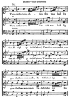
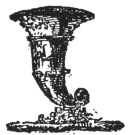
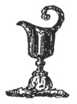

  
[Intangible Textual Heritage](../../index)  [Freemasonry](../index) 
[Index](index)  [Previous](gar63)  [Next](gar65) 

------------------------------------------------------------------------

[Buy this Book at
Amazon.com](https://www.amazon.com/exec/obidos/ASIN/B002AMUDMG/internetsacredte)

------------------------------------------------------------------------

  
*General Ahiman Rezon*, by Daniel Sickels, \[1868\], at Intangible
Textual Heritage

------------------------------------------------------------------------

p. 281

#### LAYING FOUNDATION-STONES

###### OF

#### PUBLIC STRUCTURES.

THIS CEREMONY is conducted by the Grand Master and his officers,
assisted by the members of the Grand Lodge, and such officers and
members of private Lodges as can conveniently attend.

The Chief Magistrate and other civil officers of the place where the
building is to be erected, also generally attend on the occasion.

At the time appointed, the Grand Lodge is convened in some suitable
place.

A band of music is provided, and the brethren appear, dressed in dark
clothes, and white gloves and aprons.

The Lodge is opened by the Grand Master, and the rules for regulating
the procession to and from the place where the ceremony is to be
performed, are read by the Grand Secretary.

The necessary cautions are then given from the Chair, and the Grand
Lodge is called from labor; after which, the procession sets out in the
following order:

Tiler, with drawn sword;

Stewards, with rods;

Master Masons;

Two Deacons, with rods;

Secretary and Treasurer;

Past Wardens;

Two Wardens;

p. 282

Past Masters;

Mark Masters;

Royal Arch Masons;

Knights Templar;  [\*](#fn_39)

Music;

Grand Tiler, with drawn sword;

Grand Stewards, with white rods;

Principal Architect, with Square, Level, and Plumb;

Grand Secretary and Grand Treasurer;

Bible, Square, and Compasses, carried by a Master of a Lodge, supported
by two Stewards;

Grand Chaplains;

The Five Orders of Architecture;

Past Grand Wardens;

Past Deputy Grand Masters;

Past Grand Masters;

Chief Magistrate and Civil Officers of the place;

Junior Grand Warden, carrying the silver vessel with oil;

Senior Grand Warden, carrying the silver vessel with wine;

Deputy Grand Master, carrying the golden vessel with corn;

Master of the oldest Lodge, carrying Book of Constitutions;

GRAND MASTER,

Supported by two Deacons, with rods;

Grand Standard-Bearer;

Grand Sword-Bearer, with drawn sword.

A triumphal arch is usually erected at the place where the ceremony is
to be performed.

The procession, arriving at the arch, opens to the right and left, and,
uncovering, the Grand Master and his officers pass through the lines to
the platform, while the rest of the brethren surround the platform,
forming a hollow square.

p. 283

The Grand Master commands silence, and announces the purposes of the
occasion, when the following or some other appropriate ODE is sung:

 
[  
Click to enlarge](img/28300.jpg)  
Music—*Rule Britannia*.  

When earth's foundations first was laid,  
  By the Almighty Artist's hand,  
’Twas then our perfect, our perfect laws were made,  
Established by p. 284 his strict command.  
  Hail! mysterious, glorious Masonry!  
    That makes us ever great and free.

  [  
Click to enlarge](img/28400.jpg)  
Music, cont.  

In vain mankind for shelter sought,  
  In vain from place to place did roam,  
Until from heaven, from heaven he was taught  
  To plan, to build, to fix his home.  
    Hail! mysterious, etc.

Illustrious hence we date our Art,  
  Which now in beauteous piles appear,  
And shall to endless, to endless time impart,  
  How worthy and how great we are.  
    Hail! mysterious, etc.

Nor we less famed for every tie,  
  By which the human thought is bound;  
Love truth and friendship, and friendship socially,  
  Unite our hearts and hands around.  
    Hail! mysterious, etc. p. 285

Our actions still by Virtue blest,  
  And to our precepts ever true,  
The world, admiring, admiring, shall request  
  To learn, and our bright paths pursue.  
    Hail! mysterious, etc.

The necessary preparations are now made for laying the stone, on which
is engraved the year of Masonry, the name of the Grand Master, and such
other particulars as may be deemed necessary.

The stone is raised up by the means of an engine, erected for that
purpose.

The Grand Chaplain delivers the following or some other appropriate

#### PRAYER:

ALMIGHTY GOD, who hast given us grace at this time with one accord to
make our common supplications unto thee; and dost promise that, where
two or three are gathered together in thy name, thou wilt grant their
requests; fulfill now, O LORD, the desires and petitions of thy
servants, as may be most expedient for them; granting us in this world
knowledge of thy truth, and in the world to come life everlasting.—AMEN.

*Response*.—So mote it be.

The Grand Treasurer, by the Grand Master's command, places under the
stone various sorts of coin and medals, Masonic documents, and such
other matters as may be of interest.

p. 286

Solemn music is introduced, and the stone let down into its place.

The principal Architect then presents the working tools to the Grand
Master, who hands the Square to the Deputy Grand Master, the Level to
the Senior Grand Warden, and the Plumb to the Junior Grand Warden; when
the Grand Master addresses the Grand Officers as follows:

*Grand Master*. R. W. DEPUTY GRAND MASTER: What is the proper jewel of
your office?

*Deputy Grand Master*. The Square.

*G. M*. What are its moral and Masonic uses?

*D. G. M.* To square our actions by the Square of Virtue, and prove our
work.

*G. M.* Apply the implement of your office to that portion of the
foundation-stone that needs to be proved, and make report.

The Deputy applies the Square to the stone, and says:

*D. G. M.* MOST WORSHIPFUL: I find the stone to be square. The Craftsmen
have performed their duty.

*G. M.* R. W. SENIOR GRAND WARDEN: What is the jewel of your office?

*Senior Grand Warden*. The Level.

*G. M.* What is its Masonic use?

*S. G. W.* Morally, it reminds us of equality, and its use is to lay
horizontals.

p. 287

*G. M.* Apply the implement of your office to the foundation-stone, and
make report.

This is done.

*S. G. W.* MOST WORSHIPFUL: I find the stone to be level. The Craftsmen
have performed their duty.

*G. M.* R. W. JUNIOR GRAND WARDEN: What is the proper jewel of your
office?

*Junior Grand Warden*. The Plumb.

*G. M.* What is its Masonic use?

*J. G. W.* Morally, it teaches rectitude of conduct, and we use it to
try perpendiculars.

*G. M.* Apply the implement of your office to the several edges of the
foundation-stone, and make report.

This is complied with.

*J. G. W.* MOST WORSHIPFUL: I find the stone is plumb. The Craftsmen
have performed their duty.

*G. M.* This corner-stone has been tested by the proper implements of
Masonry. I find that the Craftsmen have skillfully and faithfully
performed their duty, and I do declare the stone to

p. 288

be well formed, true, and trusty, and correctly laid, according to the
rules of our ancient Craft.

Let the elements of Consecration now be presented.

 

The Deputy Grand Master comes forward with the vessel of corm, and,
scattering it on the stone, says:

I scatter this corn as an emblem of plenty. May the blessings of
bounteous Heaven be showered upon us and upon all like patriotic and
benevolent undertakings, and inspire the hearts of the people with
virtue, wisdom, and gratitude.

*Response*.—So mote it be.

 

The Senior Grand Warden then comes forward with the vessel of WINE, and
pours it upon the stone; saying,

I pour this wine as an emblem of joy and gladness. May the Great Ruler
of the Universe

p. 289

bless and prosper our national, state, and city governments, preserve
the union of the States, and may it be a bond of Friendship and
Brotherly Love that shall endure through all time.

*Response*.—So mote it be.

 

The Junior Grand Warden then comes forward with a vessel of OIL, which
he pours upon the stone, saying,

I pour this oil as an emblem of peace. May its blessings abide with us
continually, and may the Grand Master of heaven and earth shelter and
protect the widow and orphan, shield and defend them from trials and
vicissitudes of the world, and so bestow his mercy upon the bereaved,
the afflicted, and the sorrowing, that they play know sorrowing and
trouble no more.

*Response*.—So mote it be.

The Grand Master, standing in front of all, and extending his hands,
makes the following

#### INVOCATION.

MAY the all-bounteous Author of Nature bless the inhabitants of this
place with an abundance

p. 290

of the necessaries, conveniences, and comforts of life; assist in the
erection and completion of this building; protect the workmen against
every accident; long preserve the structure from decay; and grant to us
all a supply of the CORN of *nourishment*, the WINE of *refreshment*,
and the OIL of *joy*.—AMEN.

*Response*.—So mote it be.

The Grand Master strikes the stone three times with the gavel, and the
public grand honors are given.

The Grand Master then delivers over to the Architect the implements of
architecture; saying,

WORTHY SIR (or BROTHER): Having thus, as Grand Master of Masons, laid
the foundation-stone of this structure, I now deliver these implements
of your profession into your hands, intrusting you with the
superintendence and direction of the work, having full confidence in
your skill and capacity to conduct the same.

The Grand Master ascends the platform, when an appropriate ANTHEM may be
sung.

The Grand Master then addresses the assembly as follows:

MEN AND BRETHREN HERE ASSEMBLED: Be it known unto you, that we be lawful
Masons, true and faithful to the laws of our country, and

p. 291

engaged, by solemn obligations, to erect magnificent buildings, to be
serviceable to the brethren, and to fear GOD, the Great Architect of the
Universe. We have among us, concealed from the eyes of all men, secrets
which cannot be divulged, and which have never been found out; but these
secrets are lawful and honorable, and not repugnant to the laws of GOD
or man. They were intrusted, in peace and honor, to the Masons of
ancient times, and having been faithfully transmitted to us, it is our
duty to convey them unimpaired to the latest posterity. Unless our Craft
were good, and our calling honorable, we should not have lasted for so
many centuries, nor should we have been honored with the patronage of so
many illustrious men in all ages, who have ever shown themselves ready
to promote our interests and defend us from all adversaries. We are
assembled here to-day in the Pace of you all, to build a house, which we
pray GOD may deserve to prosper, by becoming a place of concourse for
good men, and promoting harmony and brotherly love throughout the world,
till time shall be no more.—AMEN.

*Response*.—So mote it be!

p. 292

A voluntary collection is then made by the Grand Stewards among the
Brethren for the needy workmen, and the sum collected is placed upon the
stone by the Grand Treasurer.

The Grand Chaplain then pronounces the following, or some other suitable

#### BENEDICTION.

GLORY be to GOD on high, and on earth peace, and good-will toward men! O
LORD, we most heartily beseech thee with thy favor to behold and bless
this assemblage; pour down thy mercy, like the dew that falls upon the
mountains, upon thy servants engaged in the solemn ceremonies of this
day. Bless, we pray thee, all the workmen who shall be engaged in the
erection of this edifice; keep them from all forms of accidents and
harm; grant them in health and prosperity to live; and finally, we hope,
after this life, through thy mercy, wisdom, and forgiveness, to attain
everlasting joy and felicity, in thy bright mansion—in thy holy
temple—not made with hands, eternal in the heavens.—AMEN.

*Response*.—So mote it be.

After which, the procession returns in the same order to the place
whence it set out, and the Grand Lodge is closed with the usual
formalities.

------------------------------------------------------------------------

### Footnotes

[282:\*](gar64.htm#fr_39) Whenever Knights
Templar appear in a procession, they should act as an escort or guard of
honor to the Grand Lodge.

------------------------------------------------------------------------

[Next: Dedication of Masonic Halls](gar65)
