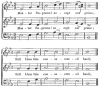
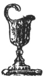
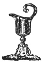
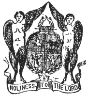

  
[Intangible Textual Heritage](../../index)  [Freemasonry](../index) 
[Index](index)  [Previous](gar64)  [Next](gar66) 

------------------------------------------------------------------------

[Buy this Book at
Amazon.com](https://www.amazon.com/exec/obidos/ASIN/B002AMUDMG/internetsacredte)

------------------------------------------------------------------------

  
*General Ahiman Rezon*, by Daniel Sickels, \[1868\], at Intangible
Textual Heritage

------------------------------------------------------------------------

p. 293

#### DEDICATION OF MASONIC HALLS.

AT the time appointed for the celebration of the ceremony of dedication,
the Grand Master and his officers, accompanied by the members of the
Grand Lodge, meet in a convenient room, near to the place where the
ceremony is to be performed, and the Grand Lodge is opened in ample
form.

The procession is then formed, under direction of the Grand Marshal,
when the Grand Lodge moves to the hall to be dedicated, in the following
order:

MUSIC;

Tiler, with drawn sword;

Stewards, with white rods;

Grand Secretaries;

Grand Treasurers;

A Past Master, bearing the Holy Writings, Square and

Compasses, supported by two Stewards, with rods;

Two Burning Tapers, borne by two Past Masters;

Chaplain and Orator;

Past Grand Wardens;

Past Deputy Grand Masters:

Past Grand Masters

*The Globes;*

Junior Grand Warden, carrying a silver vessel with corn;

Senior Grand Warden, carrying a silver vessel with wine;

Deputy Grand Master, carrying a golden vessel with oil;

THE LODGE,

Covered with white linen, carried by four Brethren;

Master of the oldest Lodge, carrying Book of Constitutions;

p. 294

GRAND MASTER,

Supported by two Deacons, with rods;

Grand Standard-Bearer;

Grand Sword-Bearer, with drawn sword;

Two Stewards, with white rods.

When the Grand Officers arrive at the center of the Lodge-room, the
Grand honors are given.

The Grand Officers then repair to their respective stations.

The LODGE is placed in front of the altar, toward the East, and the gold
and silver vessels and lights are placed around it.

These arrangements being completed, the following or some other
appropriate ODE is sung:

  [  
Click to enlarge](img/29400.jpg)

Master Supreme! accept our praise;  
  Still bless this consecrated band; p. 295  
Parent of light! illume our ways,  
  And guide us by thy sovereign hand.

  [  
Click to enlarge](img/29500.jpg)

May Faith, Hope, Charity, divine,  
  Here hold their undivided reign;  
Friendship and Harmony combine  
  To soothe our cares—to banish pain.

May pity dwell within each breast,  
  Relief attend the suffering poor;  
Thousands by this, our Lodge, be blest,  
  Till worth, distress’d, shall want no more.

The Master of the Lodge to which the hall to be dedicated belongs, then
rises, and addresses the Grand Master as follows:

MOST WORSHIPFUL: The Brethren of ....... Lodge, being animated with a
desire to promote the honor and interest of the Craft, have erected

p. 296

a Masonic Hall, for their convenience and accommodation. They are
desirous that the same should be examined by the Most Worshipful Grand
Lodge; and if it should meet their approbation, that it be solemnly
dedicated to Masonic purposes, agreeably to ancient form and usage.

The Architect or Brother who has had the management of the structure
then addresses the Grand Master as follows:

MOST WORSHIPFUL: Having been intrusted with the superintendence and
management of the workmen employed in the construction of this edifice;
and having, according to the best of my ability, accomplished the task
assigned me, I now return my thanks for the honor of this appointment,
and beg leave to surrender up the implements which were committed to my
care, when the foundation of this fabric was laid, (*presenting to the
Grand Master the Square, Level, and Plumb*), humbly hoping that the
exertions which have been made on this occasion will be crowned with
your approbation, and that of the Most Worshipful Grand Lodge.

To which the Grand Master replies:

BROTHER ARCHITECT: The skill and fidelity displayed in the execution of
the trust reposed

p. 297

in you at the commencement of this undertaking, have secured the entire
approbation of the Grand Lodge; and they sincerely pray that this
edifice may continue a lasting monument of the taste, spirit, and
liberality of its founders.

The Deputy Grand Master then rises, and says:

MOST WORSHIPFUL: The hall in which we are now assembled, and the plan
upon which it has been constructed, having met with your approbation, it
is the desire of the Fraternity that it should be now dedicated,
according to ancient form and usage.

The Lodge is then uncovered, and a procession is made around it in the
following form, during which solemn music is played.

Grand Tiler, with drawn sword;

Grand Sword-Bearer, with drawn sword.

Grand Standard-Bearer;

A Past Master, with light;

A Past Master, with Bible, Square, and Compasses, on a velvet cushion;

Two Past Masters, each with a light;

Grand Secretary and Treasurer, with emblems;

Grand Junior Warden, with vessel of corn;

Grand Senior Warden, with vessel of wine;

Deputy Grand Master, with vessel of oil;

GRAND MASTER;

Two Stewards, with rods.

p. 298

When the procession arrives at the East, it halts; the music ceases, and
the Grand Chaplain makes the following

#### CONSECRATION PRAYER.

ALMIGHTY and ever-glorious and gracious LORD GOD, Creator of all things,
and Governor of every thing thou hast made, mercifully look upon thy
servants, now assembled in thy name and in thy presence, and bless and
prosper all our works begun, continued, and ended in thee. Graciously
bestow upon us *Wisdom*, in all our doings; *Strength* of mind in all
our difficulties, and the *Beauty* of harmony and holiness in all our
communications and work. Let Faith be the foundation of our *Hope*, and
*Charity* the fruit of our obedience to thy revealed will.

May all the proper work of our institution that may be done in this
house be such as thy wisdom may approve and thy goodness prosper. And,
finally, graciously be pleased, O thou Sovereign Architect of the
Universe, to bless the Craft, wheresoever dispersed, and make them true
and faithful to thee, to their neighbor, and to themselves. And when the
time of our labor is drawing near to an end, and the pillar of our
strength is declining to the ground, graciously

p. 299

enable us to pass through the "valley of the shadow of death," supported
by thy rod and thy staff, to those mansions beyond the skies where love,
and peace, and joy forever reign before thy throne.—AMEN.

*Response*.—So mote it be!

All the other Brethren keep their places, and assist in singing the ODE,
which continues during the procession, excepting only at the intervals
of dedication.

#### ODE.

  [  
Click to enlarge](img/29900.jpg)  
  

Genius of Masonry, descend,  
And with thee bring thy spotless train, p.
300  
Constant our sacred rites attend,  
While we adore thy peaceful reign.

  [  
Click to enlarge](img/30000.jpg)  
  

 

The first procession being made around the Lodge, the Grand Master
having reached the East, the Grand Junior Warden presents the vessel of
CORN to the G. Master; saying,

MOST WORSHIPFUL: In the dedications of Masonic Halls, it has been of
immemorial custom to pour corn upon the Lodge, as an emblem of

p. 301

nourishment. I, therefore, present you this vessel of corn, to be
employed by you according to ancient usage.

The Grand Master then, striking thrice with his mallet pours the corn
upon the Lodge; saying,

In the name of the great JEHOVAH, to whom be all honor and glory, I do
solemnly dedicate this hall to FREEMASONRY.

The grand honors are given.

Bring with thee VIRTUE, brightest maid!  
  Bring LOVE, bring TRUTH, bring FRIENDSHIP here;  
While social MIRTH shall lend her aid  
  To soothe the wrinkled brow of CARE.

 

The second procession is then made around the Lodge, and the Grand
Senior Warden presents the vessel of wine to the Grand Master; saying,

MOST WORSHIPFUL: Wine, the emblem of refreshment, having been used by
our ancient brethren in the dedication and consecration of their Lodges,
I present you this vessel of wine,

p. 302

to be used on the present occasion according to ancient Masonic form.

The Grand Master then sprinkles the wine upon the Lodge; saying,

In the name of the holy SAINTS JOHN, I do solemnly dedicate this hall to
VIRTUE.

The grand honors are twice repeated.

Bring CHARITY! with goodness crowned,  
  Encircled in thy heavenly robe!  
Diffuse thy blessings all around,  
  To every corner of the GLOBE!

 

The third procession is then made round the Lodge, and the Deputy Grand
Master presents the vessel of oil to the Grand Master; saying,

MOST WORSHIPFUL: I present you, to be used according to ancient custom,
this vessel of oil, an emblem of that joy which should animate every
bosom on the completion of every important undertaking.

The Grand Master then sprinkles the oil upon the Lodge; saying,

p. 303

In the name of the whole FRATERNITY, I do solemnly dedicate this hall to
UNIVERSAL BENEVOLENCE.

The grand honors are thrice repeated.

To Heaven's high Architect all praise,  
  All praise, all gratitude be given,  
Who deigned the human soul to raise,  
  By mystic secrets, sprung from Heaven.

The Grand Chaplain, standing before the LODGE, then makes the following

#### INVOCATION.

AND may the LORD, the giver of every good and perfect gift, bless the
Brethren here assembled, in all their lawful undertakings, and grant to
each one of them, in needful supply, the corn of nourishment, the wine
of refreshment, and the oil of joy.—AMEN.

*Response*.—So mote it be.

The LODGE is then covered, and the Grand Master retires to his chair.

The following or an appropriate original oration may then be delivered,
and the ceremonies conclude with music:

BRETHREN: The ceremonies we have performed are not unmeaning rites, nor
the amusing pageants of an idle hour, but have a solemn

p. 304

and instructive import. Suffer me to point it out to you, and to impress
upon your minds the ennobling sentiments they are so well adapted to
convey.

This Hall, designed and built by WISDOM, supported by STRENGTH, and
adorned in BEAUTY, we are first to consecrate in the name of the great
JEHOVAH; which teaches us, in all our works, begun and finished, to
acknowledge, adore, and magnify him. It reminds us, also, in his fear to
enter the door of the Lodge, to put our trust in him while passing its
trials, and to hope in him for the reward of its labors.

Let, then, its altar be devoted to his service, and its lofty arch
resound with his praise! May the eye which seeth in secret witness here
the sincere and unaffected piety which withdraws from the engagements of
the world to silence and privacy, that it may be exercised with lese
interruption and less ostentation.

Our march round the Lodge reminds us of the travels of human life, in
which Masonry is an enlightened, a safe, and a pleasant path. Its
tesselated pavement of Mosaic-work intimates to us the chequered
diversity and uncertainty

p. 305

of human affairs. Our step is time; our progression, eternity.

Following our ancient Constitutions, with mystic rites we dedicate this
Hall to the honor of FREEMASONRY.

Our best attachments are due to the Craft. in its prosperity, we find
our joy; and, in paying it honor, we honor ourselves. But its worth
transcends our encomiums, and its glory will outsound our praise.

Brethren: it is our pride that we have our names on the records of
Freemasonry. May it be our high ambition that they should shed a luster
on the immortal page!

The Hall is also dedicated to VIRTUE.

This worthy appropriation will always be duly regarded while the moral
duties which our sublime lectures inculcate, with affecting and
impressive pertinency, are cherished in our hearts . and illustrated in
our lives.

As Freemasonry aims to enliven the spirit of Philanthropy, and promote
the cause of Charity, so we dedicate this Hall to UNIVERSAL BENEVOLENCE;
in the assurance that every brother will dedicate his affections and his
abilities to the

p. 306

same generous purpose; that while he displays a warns and cordial
affection to those who are of the Fraternity, he will extend his
benevolent regards and good wishes to the whole family of mankind.

Such, my brethren, is the significant meaning of the solemn rites we
have just performed, because such are the peculiar duties of every
Lodge. I need not enlarge upon them now, nor show how they diverge, as
rays from a center, to enlighten, to improve, and to cheer the whole
circle of life. Their import and their application is familiar to you
all. In their knowledge and their exercise may you fulfill the high
purposes of the Masonic Institution!

How many pleasing considerations, my brethren, attend the present
interview! While in almost every other association of men, political
animosities, contentions, and wars interrupt the progress of Humanity
and the cause of Benevolence, it is our distinguished privilege to dwell
together in peace, and engage in plans to perfect individual and social
happiness. While in many other nations our Order is viewed by
politicians with suspicion, and by the ignorant with

p. 307

apprehension, in this country, its members are too much respected, and
its principles too well known, to make it the object of jealousy or
mistrust. Our private assemblies are unmolested; and our public
celebrations attract a more general approbation of the Fraternity.
Indeed, its importance, its credit, and, we trust, its usefulness, are
advancing to a height unknown in any former age. The present occasion
gives fresh evidence of the increasing affection of its friends; and
this noble apartment, fitted up in a style of such elegance and
convenience, does honor to Freemasonry, as well as reflects the highest
credit on the respectable Lodge for whose accommodation and at whose
expense it is erected.

We offer our best congratulations to the Worshipful Master, Wardens,
Officers, and Members of ...... Lodge. We commend their zeal, and hope
it will meet with the most ample recompense. May their Hall be the happy
resort of Piety, Virtue, and Benevolence! May it be protected from
accident, and long remain a monument of their attachment to Freemasonry!
May their Lodge continue to flourish; their union to

p. 308

strengthen; and their happiness to abound!—And when they, and we all,
shall be removed from the labors of the earthly Lodge, may we be
admitted to the brotherhood of the perfect, in the building of GOD, the
Hall not made with hands, eternal in the heavens!

The Grand Lodge is again formed in procession, as at first, returns to
the room where it was opened, and is closed in ample form.

 

------------------------------------------------------------------------

[Next: Grand Visitations](gar66)
