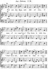

  
[Intangible Textual Heritage](../../index)  [Freemasonry](../index) 
[Index](index)  [Previous](gar67)  [Next](gar69) 

------------------------------------------------------------------------

[Buy this Book at
Amazon.com](https://www.amazon.com/exec/obidos/ASIN/B002AMUDMG/internetsacredte)

------------------------------------------------------------------------

  
*General Ahiman Rezon*, by Daniel Sickels, \[1868\], at Intangible
Textual Heritage

------------------------------------------------------------------------

p. 317

#### SERVICE

###### IN THE

### LODGE-ROOM.

The brethren having assembled at the Lodge-room, the Lodge will be
opened briefly in the third degree; the purpose of the communication
must be stated; and remarks upon the character of the deceased may be
made by the Master and brethren, when the service will commence—all the
brethren to stand:

*Master*. What man is he that liveth, and shall not see death? Shall he
deliver his soul from the hand of the grave?

*Sen. War.* His days are as grass; as a flower of the field, so he
flourisheth.

*Jun. War.* For the wind passeth over it, and it is gone; and the place
thereof shall know it no more.

*Master*. Where is now our departed Brother?

*Sen. War.* He dwelleth in night; he sojourneth in darkness.

*Jun. War.* Man walketh in a vain shadow; he heapeth up riches, and
cannot tell who shall gather them.

*Master*. When he dieth, he shall carry nothing away; his glory shall
not descend after him.

p. 318

*Sen. War.* For he brought nothing into the world, and it is certain he
can carry nothing out.

*Jun. War.* The Lout gave, and the LORD hath taken away; blessed be the
name of the LORD.

*Mater*. The LORD is merciful and gracious, slow to anger, and plenteous
in mercy.

*Sen. War.* GOD is our salvation; our glory, and the rock of our
strength; and our refuge is in GOD.

*Jun. War.* He hath not dealt with us after our sins, nor rewarded us
according to our iniquities.

*Mater*. Can we offer any precious gift acceptable in the sight of the
LORD to redeem our brother?

*Sen. War.* We are poor and needy. We are without gift or ransom.

*Jun. War.* Be merciful unto us, O LORD, be merciful unto us; for we
trust in thee. Our hope and salvation are in thy patience. Where else
can we look for mercy?

*Mater*. Let us endeavor to live the life of the righteous, that our
last end may be like his.

*Sen. War.* The LORD is gracious and righteous; yea, our GOD is
merciful.

p. 319

*Jun. War*. GOD is our GOD for ever and ever; He will be our guide, even
unto death.

*Master*. Shall our brother's name and virtues be lost upon the earth
forever?

*Response by the Brethren*. We will remember and cherish them in our
hearts.

*Master*. I heard a voice from heaven, saying unto me, "Write, from
henceforth blessed are the dead who die in the LORD! Even so, saith the
Spirit; for they rest from their labors."

Here the Master will take the SACRED ROLL, [\*](#fn_40) on which have been inscribed the name,
age, date of initiation or affiliation, date of death, and any matters
that may be interesting to the brethren; and shall read the same aloud,
and shall then say,

ALMIGHTY FATHER! in thy hands we leave, with humble submission, the soul
of our departed brother.

*Response*. Amen! So mote it be!

The grand honors [†](#fn_41) should then be
given three times; the brethren to respond each time—

The will of GOD is accomplished.—AMEN. So mote it be!

p. 320

The Master should then deposit the ROLL in the archives of the Lodge.

The following or some other appropriate HYMN may be sung:

 
[  
Click to enlarge](img/32000.jpg)  
AIR—*Balerma*. C. M.  

Few are thy days, and full of woe,  
O man, of woman born!  
  Thy doom is written,  
"Dust thou art,  
  And to dust return."

p. 321

Behold the emblem of thy state  
  In flowers that bloom and die;  
Or in the shadow's fleeting form,  
  That mocks the gazer's eye.

Determined are the days that fly  
  Successive o’er thy head;  
The number’d hour is on the wing,  
  That lays thee with the dead.

Great GOD, afflict not, in thy wrath,  
  The short allotted span  
That bounds the few and weary days  
  Of pilgrimage to man.

The Master or Chaplain will repeat the following or some other
appropriate PRAYER:

ALMIGHTY AND HEAVENLY FATHER—infinite in wisdom, mercy, and
goodness—extend to us the riches of thy everlasting grace. Thou alone
art a refuge and help in trouble and affliction. In this bereavement we
look to thee for support and consolation. May we believe that death hath
no power over a faithful and righteous soul! May we believe that, though
the dust returneth to the dust as it was, the spirit goeth unto thyself.
As we mourn the departure of a brother beloved from the circle of our
Fraternity, may we trust that he hath entered into a higher brotherhood,
to engage in nobler duties

p. 322

and in heavenly work, to find rest from earthly labor, and refreshment
from earthly care. May thy peace abide within us, to keep us from all
evil! Make us grateful for present benefits, and crown us with immortal
life and honor.—And to thy name shall be all the glory forever.—AMEN.

Response. So mote it be.

A procession should then be formed, which will proceed to the church or
the house of the deceased, in the following order:

 

When the head of the procession arrives at the entrance of the building,
it should halt and open to the right and left, forming two
[parallel](errata.htm#6) lines, when the Marshal, with the Tiler, will
pass through the lines to end, and escort the Master or Grand Officer
into the house, the brethren closing in and following, thus reversing
the order of procession—the brethren with heads uncovered.

------------------------------------------------------------------------

### Footnotes

[319:\*](gar68.htm#fr_40) A sheet of parchment
or paper, prepared for the purpose.

[319:†](gar68.htm#fr_41) See note, p. 886.

------------------------------------------------------------------------

[Next: Service at the Church or the House of the Deceased](gar69)
