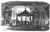
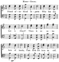

  
[Intangible Textual Heritage](../../index)  [Freemasonry](../index) 
[Index](index)  [Previous](gar71)  [Next](gar73) 

------------------------------------------------------------------------

[Buy this Book at
Amazon.com](https://www.amazon.com/exec/obidos/ASIN/B002AMUDMG/internetsacredte)

------------------------------------------------------------------------

  
*General Ahiman Rezon*, by Daniel Sickels, \[1868\], at Intangible
Textual Heritage

------------------------------------------------------------------------

p. 345

#### RITUAL

###### FOR A

## LODGE OF SORROW.

### BY JOHN W. SIMONS,

PAST GRAND MASTER OF NEW YORK.  
15\*

p. 346 p. 347

### PREFACE.

IN the performance of the ceremonies of a Lodge of Sorrow, it should be
understood that the ritual, although necessarily of a funereal
character, differs essentially from the office for the burial of the
dead.

In the latter case, we are in the actual presence of the deceased, and
engaged in the last rites of affection and respect for one who has been
our companion in life, and whose mortal remains we are about to consign
to the last resting-place, amid the tears of surviving friends, and
under the peculiar influences which attach to the rites of sepulture and
the final earthly farewell to one who, but a few hours previous, could
respond to our questions, and exchange with us the signs of the living.
We are then called to consider the "mattock, the spade, the coffin, and
the melancholy grave," in all their gloomy reality, and to reflect that
the hour must soon be tolled "when we, too, shall be clothed in the
habiliments of death, and deposited in the voiceless tomb."

The Lodge of Sorrow, on the contrary, is intended to celebrate the
memory of our departed brethren; and while we thus recall to our
recollection their virtues, and temper anew our resolutions so to live,
that, when we shall have passed the silent portals, our memories may be
cherished with grateful remembrance, we learn to look upon death from a
more elevated point of view; to see in it the wise and necessary
transition from the trials and imperfections of this world, to the
perfect life for which our transient journey hero has been the school
and the preparation. We thus learn "that the soul is

p. 348

the whole of man; that for it to be born, is really to die; that earth
is but its place of exile, and heaven its native land."

In the preparation of the following ritual, it has been sought to typify
the inevitable necessity of death; the gloom and sorrow that attend the
"last of earth," and surround "the narrow house appointed for all
living," and the consoling fact of the immortality of the soul and the
resurrection to a new and true life, where sorrow and tears have no
place.

Guided by these views in the accomplishment of our task, and aided by
the use of rituals from Germany, France, and England, it is believed
that the work now submitted will supply a want long felt by the brethren
in the United States, and enable them to conduct the solemn exercises of
such occasions with dignity and propriety.

Vocal and instrumental music are indispensable to the proper effect of
the ceremony.

Brethren should wear dark clothing, and no insignia but the white
lambskin apron and white gloves.

Finally, we desire to add, that there is no good reason for any attempt
at secrecy in the ceremonies of Sorrow Lodges; but that, on the other
hand, they may be held in churches or public halls, or in the presence
of friends at the lodge-room, with benefit to all concerned. This,
however, will necessarily be subject to the wishes of the brethren
themselves.

p. 349 p. 350

  [  
Click to enlarge](img/35000.jpg)

p. 351

#### LODGE OF SORROW.

#### PREPARATION OF THE HALL.

I. THE Lodge-room should be appropriately draped in black, and the
several stations covered with the same emblem of mourning.

II\. On the Master's pedestal is a skull and lighted taper.

III\. In the center of the room is placed the catafalque, which consists
of a rectangular platform, about six feet long by four wide, on which
are two smaller platforms, so that three steps are represented. On the
third one should be an elevation of convenient Night, on which is placed
an urn. The platform should be draped in black, and a canopy of black
drapery may he raised over the urn.

IV\. At each corner of the platform will be placed a candlestick,
bearing a lighted taper, and near it, facing the East, will be seated a
brother, provided with an extinguisher, to be used at the proper time.

V. During the first part of the ceremonies the lights in the room should
burn dimly.

VI\. Arrangements should be made to enable the light to be increased to
brilliancy at the appropriate point in the ceremony.

p. 352

VII\. On the catafalque will be laid a pair of white gloves, a lambskin
apron, and, if the deceased brother had been an officer, the appropriate
insignia of his office.

VIII\. Where the Lodge is held in memory of several brethren, shields
bearing their names are placed around the catafalque.

#### OPENING THE LODGE.

The several officers being in their places, and the brethren seated, the
Master will call up the Lodge, and say,

*Master*. Brother Senior Warden: For what purpose are we assembled?

*Senior Warden*. To honor the memory of those brethren whom death hath
taken from us; to contemplate our own approaching dissolution; and, by
the remembrance of immortality, to raise our souls above the
considerations of this transitory existence.

*Master*. Brother Junior Warden: What sentiments should inspire the
souls of Masons on occasions like the present?

*Junior Warden*. Calm sorrow for the absence of our brethren who have
gone before us; earnest solicitude for our own eternal welfare, and a
firm faith and reliance upon the wisdom

p. 353

and goodness of the Great Architect of the Universe.

*Master*. Brethren: Commending these sentiments to your earnest
consideration, and invoking your assistance in the solemn ceremonies
about to take place, I declare this Lodge of Sorrow opened.

The Chaplain or Master will then offer the following or some other
suitable PRAYER:

GRAND ARCHITECT OF THE UNIVERSE, in whose holy sight centuries are but
as days, to whose omniscience the past and the future are but as one
eternal present; look down upon thy children, who still wander among the
delusions of time—who still tremble with dread of dissolution, and
shudder at the mysteries of the future; look down, we beseech thee, from
thy glorious and eternal day into the dark night of our error and
presumption, and suffer a ray of thy divine light to penetrate into our
hearts, that in them may awaken and bloom the certainty of life,
reliance upon thy promises, and assurance of a place at thy right
hand.—AMEN.

*Response*. So mote it be.

p. 354

The following or some other appropriate ODE may here be sung:

  [  
Click to enlarge](img/35400.jpg)  
Music by DE. LOWELL MASON, arranged for four voices, by T. S. NEDHAM.  

Brother, thou art gone to rest;  
  We will not weep for thee;  
For thou art now where oft on earth  
  Thy spirit longed to be.

Brother, thou art gone to rest;  
  Thy toils and cares are o’er;  
And sorrow, pain, and suffering, now,  
  Shall ne’er distress thee more.

Brother, thou art gone to rest;  
  And this shall be our prayer,  
That, when we reach our journey's end,  
  Thy glory we shall share.

p. 355

The Master (taking the skull in his hand) will then say,

BRETHREN: In the midst of life we are in death, and the wisest cannot
know what a day may bring forth. We live but to see those we love
passing away into the silent land.

Behold this emblem of mortality, once the abode of a spirit like our
own: beneath this mouldering canopy once shone the bright and busy eye:
within this hollow cavern once played the ready, swift, and tuneful
tongue; and now, sightless and mute, it is eloquent only in the lessons
it teaches us.

Think of those brethren who, but a few days since, were among us in all
the pride and power of life; bring to your minds the remembrance of
their wisdom, their strength, and their beauty; and then reflect that
"to this complexion have they come at last;" think of yourselves, thus
will you be when the lamp of your brief existence has burned out. Think
how soon death, for you, will be a reality. Man's life is like a flower,
which blooms to-day, and to-morrow is faded, cast aside, and trodden
under foot. The most of us, my brethren, are fast approaching, or have
already passed the meridian of life;

p. 356

our sun is setting in the West; sand, oh! how much more swift is the
passage of our declining years than when we started upon the journey,
and believed—as the young are too apt to believe—that the roseate hues
of the rising sun of our existence were always to be continued. When we
look back upon the happy days of our childhood, when the dawning
intellect first began to exercise its powers of thought, it seems as but
yesterday, and that, by a simple effort of the will, we could put aside
our manhood, and seek again the loving caresses of a mother, or be happy
in the possession of a bauble; and could we now realize the idea that
our last hour had come, our whole earthly life would seem but as the
space of time from yesterday until to-day. Centuries upon centuries have
rolled away behind us; before us stretches out an eternity of years to
come; and on the narrow boundary between the past and the present
flickers the puny taper we term our life. When we came into the world,
we knew naught of what had been before us; but, as we grew up to
manhood, we learned of the past; we saw the flowers bloom as they had
bloomed for centuries;

p. 357

we beheld the orbs of day and night pursuing their endless course among
the stars, as they had pursued it from the birth of light; we learned
what men had thought, and said, and done, from the beginning of the
world to our day; but only through the eye of faith can we behold what
is to come hereafter, and only through a firm reliance upon the Divine
promises can we satisfy the yearnings of an immortal soul. The cradle
speaks to us of remembrance—the coffin of hope, of a blessed trust in a
never-ending existence beyond the gloomy portals of the tomb.

Let these reflections convince us how vain are all the wranglings and
bitterness engendered by the collisions of the world; how little in
dignity above the puny wranglings of ants over a morsel of food or for
the possession of a square inch of soil.

What shall survive us? Not, let us hope, the petty strifes and
bickerings, the jealousies and heart-burnings, the small triumphs and
mean advantages we have gained, but rather the noble thoughts, the words
of truth, the works of mercy and justice, that ennoble and

p. 358

light up the existence of every honest man, however humble, and live for
good when his body, like this remnant of mortality, is mouldering in its
parent dust.

Let the proud and the vain consider how soon the gaps are filled that
are made in society by those who die around them; and how soon time
heals the wounds that death inflicts upon the loving heart; and from
this let them learn humility, and that they are but drops in the great
ocean of humanity.

And when God sends his angel to us with the scroll of death, let us look
upon it as an act of mercy, to prevent many sins and many calamities of
a longer life; and lay down our heads softly and go to sleep, without
wrangling like froward children. For this at least man gets by death,
that his calamities are not immortal. To bear grief honorably and
temperately, and to die willingly and nobly, are the duties of a good
man and true mason.

A solemn piece of music will now be performed, or the following ode may
be sung:

p. 359

  [  
Click to enlarge](img/35900.jpg)  
Music—Naomi. DR. LOWELL MASON.  

When those we love are snatched away,  
By Death's relentless hand,  
Our hearts the mournful tribute pay,  
That Friendship must demand.

While pity prompts the rising sigh,  
With awful power imprest;  
May this dread truth, "I too must die,"  
Sink deep in every breast.

Let this vain world allure no more:  
Behold the opening tomb!  
It bids us use the present hour;  
To-morrow death may come.

p. 360

The voice of this instructive scene  
May every heart obey;  
Nor be the faithful warning vain  
Which calls to watch and pray!

At its conclusion the Chaplain will read the following passages:

Lo, He goeth by me and I see Him not. He passeth on also, but I perceive
Him not. Behold He taketh away, who can hinder Him?

Man that is born of a woman is of few days, and full of trouble. He
cometh forth like a flower, and is cut down; he fleeth also as a shadow,
and continueth not. Seeing his days are determined, the number of his
months are with Thee, Thou hast appointed his bounds that he cannot
pass; turn from him that he may rest, till he shall accomplish, as an
hireling, his day. For there is hope of a tree if it be cut down, that
it will sprout again, and that the tender branch thereof will not cease.
Though the root thereof wax old in the earth, and the stock thereof die
in the ground, yet through the scent of water it will bud and bring
forth boughs like a plant. But man dieth and wasteth away; yea, man
giveth up the ghost, and where is he? As

p. 361

the waters fail from the sea and the flood decayeth and drieth up, so
man lieth down, and riseth not; till the heavens be no more they shall
not awake nor be raised out of their sleep.

My days are passed, my purposes are broken off, even the thoughts of my
heart. If I wait, the grave is mine house, I have made my bed in the
darkness. I have said to corruption, thou art my father. And where is
now thy hope? as for my hope, who shall see it? They shall go down to
the bars of the pit, when our rest together is in the dust.

My bone cleaveth to my skin and to my flesh. Oh, that my words were now
written; oh, that they were printed in a book! That they were graven
with an iron pen and lead in the rock forever! For I know that my
Redeemer liveth, and that He shall stand at the latter day upon the
earth. And though after my skin worms destroy this body, yet in my flesh
shall I see God. Whom I shall see for myself, and mine eyes shall
behold, and not another.

For Thou cast me into the deep, in the midst of the seas; and Thy floods
compassed me about;

p. 362

all Thy billows and Thy waves passed over me Then I said, I am cast out
of Thy sight; yet will I look again toward Thy holy temple. The waters
compassed me about, even to the soul, the depth closed me round about,
the weeds were wrapt about my head.

I said, in the cutting off of my day I shall go to the gates of the
grave; I am deprived of the residue of my years; I said, I shall not see
the Lord, even the Lord in the land of the living; I shall behold man no
more with the inhabitants of the world. Behold, for peace I had great
bitterness; but Thou hast in love to my soul delivered it from the pit
of corruption. For the grave cannot praise Thee, death cannot celebrate
Thee; the living, the living, he shall praise Thee as I do this day.

Are not my days few? Cease, then, and let me alone, that I may take
comfort a little, before I go whence I shall not return, even to the
land of darkness, and the shadow of death. A land oT darkness, as
darkness itself; and of the shadow of death, without any order, and
where the light is as darkness.

p. 363

An interval of profound silence will be observed. The general lights of
the Hall, if there be convenience, will be turned low, and the four
brethren will extinguish the tapers near which they are placed.

#### PRAYER BY THE CHAPLAIN.

OUR FATHER WHO ART IN HEAVEN, it hath pleased thee to take from among us
those who were our brethren. Let time, as it heals the wounds thus
inflicted upon our hearts and on the hearts of those who were near and
dear to them, not erase the salutary lessons engraved there; but let
those lessons always continuing distinct and legible make us and them
wiser and better. And whatever distress or trouble may hereafter come
upon us, may we ever be consoled by the reflection that thy wisdom and
thy love are equally infinite, And that our sorrows are not the
visitations of thy wrath, but the result of the great law of harmony by
which everything is being conducted to a good and perfect issue in the
fullness of thy time. Let the loss of our brethren increase our
affection for those who are yet spared to us, and make us more punctual
in the performance of the duties that Friendship, Love, and Honor
demand.

p. 364

\[paragraph continues\] When it comes to
us also to die, may a firm and abiding trust in thy mercy dispel the
gloom and dread of dissolution. Be with us now, and sanctify the
solemnities of this occasion to our hearts, that we may serve thee in
spirit and understanding. And to thy name shall be ascribed the praise
forever.—AMEN.

*Response*. So mote it be.

The Wardens, Deacons and Stewards, will now approach the East and form a
procession, thus:

Two Stewards, with rods.

Two Wardens, with columns.

<table data-border="0">
<colgroup>
<col style="width: 33%" />
<col style="width: 33%" />
<col style="width: 33%" />
</colgroup>
<tbody>
<tr class="odd">
<td data-valign="top">
Deacon, 
with rod.
</td>
<td data-valign="top">
THE MASTER.
</td>
<td data-valign="top">
Deacon, 
with rod.
</td>
</tr>
</tbody>
</table>

Which will move once round the catafalque to slow and solemn music.

On arriving in the East, the procession will halt and open to the right
and left. The Junior Warden will then advance to the catafalque and
placing upon it a bunch of white flowers will say:

*Junior Warden*. In memory of our departed brethren I deposit these
white flowers, emblematical of that pure life to which they have been
called, and reminding us that as these children of an hour will droop
and fade away, so, too; we shall soon follow those who have gone before
us, and inciting us so to fill the brief span of

p. 365

our existence that we may leave to our survivors a sweet savor of
remembrance.

The Junior Warden will now return to his place, and ah interval of
profound silence will be observed.

The procession will again be formed, and move as before, to the sound of
slow music, twice around the catafalque.

They will open as before, and the Senior Warden approaching the
catafalque will place upon it a wreath of white flowers and say:

*Senior Warden*. As the sun sets in the West, to close the day and
herald the approach of night, so, one by one we lay us down in the
darkness of the tomb to wait in its calm repose for the time when the
heavens shall pass away as a scroll, and man, standing in the presence
of the Infinite, shall realize the true end of his pilgrimage here
below. Let these flowers be to us the symbol of remembrance of all the
virtues of our brethren who have preceded us to the silent land, the
token of that fraternal alliance which binds us while on earth and which
we hope will finally unite us in heaven.

The Senior Warden returns to his place, and an interval of silence will
be observed.

The procession will again be formed, and move three times around the
catafalque to slow music, as before.

p. 366

Arrived in the East, the Master will advance and place upon the urn a
wreath of evergreen, and say:

*Master*. It is appointed unto all men once to die, and after death
cometh the resurrection. The dust shall return to the earth and the
spirit unto God who gave it. In the grave all men are equal; the good
deeds, the lofty thoughts, the heroic sacrifices alone survive and bear
fruit in the lives of those who strive to emulate them.

While, therefore, nature will have it's way, and our tears will fall
upon the graves of our brethren, let us be reminded by the evergreen
symbol of our faith in immortal life that the dead are but sleeping, and
be comforted by the reflection that their memories will not be
forgotten; that they will still be loved by those who are soon to follow
them; that in our archives their names are written, and that in our
hearts there is still a place for them. And so, trusting in the infinite
love and tender mercy of him without whose knowledge not even a sparrow
falls, let us prepare to meet them where there is no parting and where
with them we shall enjoy eternal rest.

p. 367

The Master will return to his place, and a period of silence will
obtain.

The Chaplain will now be conducted to the altar, where he will read:

But some man will say: How are the dead raised up? and with what body do
they come? Thou fool, that which thou sowest is not quickened except it
die: and that which thou sowest thou sowest not that body that shall be,
but bare grain; it may chance of wheat or of some other grain: but God
giveth it a body as it hath pleased him, and to every seed his own body.

All flesh is not the same flesh; but there is one kind of flesh of men,
another flesh of beasts, another of fishes, and another of birds. There
are also celestial bodies, and bodies terrestrial: but the glory of the
celestial is one, and the glory of the terrestrial is another.

There is one glory of the sun, and another glory of the moon, and
another glory of the stars; for one star differeth from another star in
glory. So also is the resurrection of the dead. It is sown in
corruption; it is raised in incorruption: it is sown in dishonor; it is
raised in glory: it is sown in weakness; it is raised in power: it is
sown a natural body; it is raised a

p. 368

spiritual body. There is a natural body, and there is a spiritual body.
And so it is written, The first man Adam was made a living soul, the
last Adam was made a quickening spirit. Howbeit, that was not first
which is spiritual, but that which is natural; and afterward that which
is spiritual. The first man is of the earth, earthy: the second man is
the Lord from heaven. As is the earthy, such are they also that are
earthy; and as is the heavenly, such are they also that are heavenly.
And as we have borne the image of the earthy, we shall also bear the
image of the heavenly.

Now this I say, brethren, that flesh and blood cannot inherit the
kingdom of God; neither doth corruption inherit incorruption. Behold, I
shew you a mystery: we shall not all sleep, but we shall all be changed;
in a moment, in the twinkling of an eye, at the last trump: for the
trumpet shall sound, and the dead shall be raised incorruptible, and we
shall be changed. For this corruptible must put on incorruption, and
this mortal must put on immortality. So when this corruptible shall have
put on incorruption, and this mortal shall have put on im-

p. 369

mortality, then shall be brought to pass the saying that is written,
Death is swallowed up in victory. O death, where is thy sting? O grave,
where is thy victory?

As the Chaplain pronounces the concluding words, "O grave where is thy
victory?" the lights in the Hall will be raised to brilliancy, the four
brethren seated around the catafalque will relight the tapers.

The Chaplain will return to his place in the East, and the following ode
will be sung, to music of a more cheerful character:

 
[  
Click to enlarge](img/36900.jpg)  
Music—Simons.  

Friend after friend departs:  
  Who has not lost a friend?  
There is no union here of hearts,  
  That finds not here an end. p. 370  
Where this frail world our only rest,  
Living or dying, none were blest.

  [  
Click to enlarge](img/37000.jpg)  
Music cont.  

There is a world above  
  Where parting is unknown—  
A whole eternity of love  
  And blessedness alone;  
And faith beholds the dying here  
Translated to that happier sphere.

The Orator will then pronounce the Eulogium.

Then follows an ode:

  [  
Click to enlarge](img/37001.jpg)  
OLD HUNDRED. L. M.  

Once more, O Lord, let grateful praise,  
From every p. 371 heart to thee ascend;  
Thou art the guardian of our days,  
Our first, our best and changeless friend.

Hear, now, our parting hymn of praise,  
And bind our hearts in love divine;  
O, may we walk in wisdom's ways,  
And ever feel that we are thine.

#### CLOSING.

*Master*. Brother Senior Warden, our recollection of our departed
friends has been refreshed, and we may now ask ourselves, were they just
and perfect Masons, worthy men, unwearied toilers in the vineyard, and
possessed of so many virtues as to overcome their faults and
shortcomings? Answer these questions, as Masons should answer.

p. 372

*Sen. War*. Man judgeth not of man. He whose infinite and tender mercy
passeth all comprehension, whose goodness endureth forever, has called
our brethren hence. Let him judge.

In ancient Egypt no one could gain admittance to the sacred asylum of
the tomb until he had passed under the most solemn judgment before a
grave tribunal.

Princes and peasants came there to be judged, escorted only by their
virtues and their vices. A public accuser recounted the history of their
lives, and threw the penetrating light of truth on all their actions. If
it were adjudged that the dead man had led an evil life, his memory was
condemned in the presence of the nation, and his body was denied the
honors of sepulture. But Masonry has no such tribunal to sit in judgment
upon her dead; with her, the good that her sons have done lives after
them, and the evil is interred with their bones. She does require,
however, that whatever is said concerning them shall be the truth; and
should it ever happen that of a Mason, who dies, nothing good can be
truthfully said she will mournfully

p. 373

and pityingly bury him out of her sight in silence.

*Master*. Brethren, let us profit by the admonitions of this solemn
occasion, lay to heart the truths to which we have listened, and resolve
so to walk that when we lay us down to the last sleep it may be the
privilege of the brethren to strew white flowers upon our graves and
keep our memories as a pleasant remembrance.

Brother Senior Warden, announce to the brethren that our labors are now
concluded, and that it is my pleasure that this Lodge of Sorrow be
closed.

*Sen. War.* Brother Junior Warden, the labors of this Lodge of Sorrow
being ended, it is the pleasure of the Master that it be now closed.
Make due announcement to the brethren, and invite them to assist.

*Jun. War.* (Calling up the Lodge.) Brethren, the labors of this Lodge
of Sorrow being ended, it is the pleasure of the Master that it be now
closed.

*Master*. Let us unite with our Chaplain in an invocation to the Throne
of Grace.

\*       \*       \*       \*       \*       \*       \*

 

*Master*. This Lodge of Sorrow is now closed.

p. 374

#### SELECTIONS FOR LODGE OF SORROW.

HYMN—8's & 7's M.

Brother, rest from sin and sorrow!  
Death is o’er, and life is won;  
On thy slumber dawns no morrow:  
Rest! thine earthly race is run.

Brother, wake! the night is waning;  
Endless day is round thee poured:  
Enter thou the rest remaining  
For the people of the LORD.

Fare thee well! tho’ woe is blending  
With the tones of early love,  
Triumph high and joy unending  
Wait thee in the realms above!

HYMN.

Why lament our Brother's dying,  
Why indulge in tears and gloom?  
Calmly on the LORD relying,  
He can greet the opening tomb.

Tho' for him thy soul is mourning,  
Tho' with grief thy heart is riven,  
While his flesh to dust is turning,  
All his soul is filled with heaven.

Scenes seraphic, high and glorious,  
Now forbid his longer stay:  
See him die, o’er death victorious,  
Angels beckon him away.

Hark! The golden harps are ringing,  
Sounds angelic fill his ear:  
Millions now in heaven singing  
Greet his joyful entrance there

------------------------------------------------------------------------

[Next: Service for the Consecration of Masonic Cemeteries](gar73)
