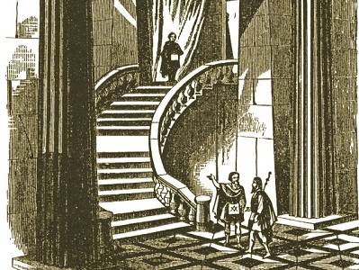

  
[Intangible Textual Heritage](../../index)  [Freemasonry](../index) 

------------------------------------------------------------------------

[Buy this Book at
Amazon.com](https://www.amazon.com/exec/obidos/ASIN/B002AMUDMG/internetsacredte)

------------------------------------------------------------------------

<table width="75%">
<colgroup>
<col style="width: 50%" />
<col style="width: 50%" />
</colgroup>
<tbody>
<tr class="odd">
<td width="50%" data-valign="TOP"> 
(Public Domain Image)</td>
<td width="50%" data-valign="CENTER"><h1 id="general-ahiman-rezon" data-align="CENTER">General Ahiman Rezon</h1>
<h2 id="by-daniel-sickels" data-align="CENTER">by Daniel Sickels</h2>
<h4 id="section" data-align="CENTER">[1868]</h4></td>
</tr>
</tbody>
</table>

------------------------------------------------------------------------

[Contents](#contents)    [Start Reading](gar00)    [Page
Index](pageidx)    [Text \[Zipped\]](gar.txt.gz)

------------------------------------------------------------------------

|                                                                                                                           |
|---------------------------------------------------------------------------------------------------------------------------|
|  |

This is a collection of Masonic rituals, including ceremonies related to
the degrees of the Entered Apprentice, Fellow-craft and Master Mason. It
includes extensive treatment of funeral rituals. There is musical
notation for a number of Masonic hymns. An appendix has a series of
model documents for various masonic situations. While it does not
disclose anything truly secret, the General Ahiman Rezon gives us an
insightful peek behind the veil of 19th century Masonic pomp and
circumstance.

------------------------------------------------------------------------

 [Title Page and Front Matter](gar00)  
[Ahiman Rezon: Signification of the Term](gar01)  
[Explanation of the Frontispiece](gar02)  
[Preface](gar03)  
[Contents](gar04)  

### Introductory

[Introductory](gar05)  
[Origin of Masonry, and Its Advantages](gar06)  
[Government of the Fraternity](gar07)  
[The Lodge and its Government](gar08)  
[Qualifications of Candidates](gar09)  
[Admission of Candidates](gar10)  

 

[Opening and Closing the Lodge](gar11)  

### First Degree: Entered Apprentice

[Illustrations](gar12)  
[Symbolism of the Degree](gar13)  
[Rite of Induction](gar14)  
[Prayer at Initiation](gar15)  
[The Symbolic Pilgrimage](gar16)  
[Obligation of Secrecy](gar17)  
[Rite of Illumination. Investiture of the Candidate](gar18)  
[Charity the Chief Social Value](gar19)  
[The North-East Corner](gar20)  
[Working-Tools of an Entered Apprentice](gar21)  
[Section II. The Preparation. Right Hand. Badge of a Mason](gar22)  
[Section III: The Lodge](gar23)  
[Lodge Meetings—Where Held](gar24)  
[Form and Dimensions and Boundaries of the Lodge](gar25)  
[The Covering of the Lodge](gar26)  
[The Furniture of the Lodge](gar27)  
[The Ornaments of a Lodge](gar28)  
[The Lights of the Lodge. Moveable and Immovable Jewels.](gar29)  
[Situation of the Lodge](gar30)  
[Dedication of Lodges](gar31)  
[Great Tenets of a Freemason](gar32)  
[Charge to the Candidate](gar33)  
[Charge, at the Initiation of a Soldier](gar34)  

### Second Degree: Fellow-Craft

[Illustrations](gar35)  
[Symbolism of the Degree](gar36)  
[Symbolical Jewels](gar37)  
[Working Tools of a Fellow-Craft](gar38)  
[Operative and Speculative Masonry](gar39)  
[Pillars of the Porch](gar40)  
[Symbols of Peace, Unity and Plenty. Of the Globes.](gar41)  
[The Winding Stairs](gar42)  
[Of Order in Architecture](gar43)  
[The Five Senses of Human Nature](gar44)  
[The Seven Liberal Arts and Sciences](gar45)  
[Emblem of Plenty Explained](gar46)  
[Charge to the Candidate](gar47)  
[Lecture on the Legend of the Winding Stairs](gar48)  

### Third Degree: Master Mason

[Illustrations](gar49)  
[Symbolism of the Degree](gar50)  
[Working Tools of the Master Mason](gar51)  
[Twelve Messengers—Acacia Tree—Letter G.](gar52)  
[Funeral Dirge](gar53)  
[Rites of Sepulture—Hebrew Customs](gar54)  
[King Solomon's Temple](gar55)  
[Emblems of Master Mason's Degree](gar56)  
[Charge to the Candidate](gar57)  
[Officers' Clothing and Jewels](gar58)  

### Ancient Ceremonies

[Introduction](gar59)  
[Consecration of a New Lodge](gar60)  
[Dedication and Constitution of a New Lodge](gar61)  
[Installation of the Officers of a Lodge](gar62)  
[Installation of the Officers of a Grand Lodge](gar63)  
[Laying Foundation Stones of Public Structures](gar64)  
[Dedication of Masonic Halls](gar65)  
[Grand Visitations](gar66)  

### Masonic Burial Services

[General Directions](gar67)  
[Service in the Lodge-Room](gar68)  
[Service at the Church or the House of the Deceased](gar69)  
[Service at the Grave](gar70)  

 

[Regulations for Processions](gar71)  
[Ritual for a Lodge of Sorrow](gar72)  
[Service for the Consecration of Masonic Cemeteries](gar73)  
[Masonic Calendar](gar74)  

 

[Appendix—Masonic Documents and Forms of Trials](gar75)  
