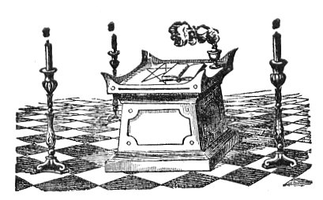

  
[Intangible Textual Heritage](../../index)  [Freemasonry](../index) 

------------------------------------------------------------------------

[Buy this Book at
Amazon.com](https://www.amazon.com/exec/obidos/ASIN/B0022NGNCW/internetsacredte)

------------------------------------------------------------------------

<table width="75%">
<colgroup>
<col style="width: 50%" />
<col style="width: 50%" />
</colgroup>
<tbody>
<tr class="odd">
<td width="50%" data-valign="TOP"></td>
<td width="50%" data-valign="CENTER"><h1 id="morals-and-dogma" data-align="CENTER">Morals and Dogma</h1>
<h2 id="by-albert-pike" data-align="CENTER">by Albert Pike</h2>
<h4 id="section" data-align="CENTER">[1871]</h4></td>
</tr>
</tbody>
</table>

------------------------------------------------------------------------

[Contents](#contents)    [Start Reading](md00)    [Page
Index](pageidx)    [Text \[Zipped\]](md.txt.gz)

------------------------------------------------------------------------

|                                                                                                                           |
|---------------------------------------------------------------------------------------------------------------------------|
|  |

This is Albert Pikes' 861 page volume of 'lectures' on the esoteric
roots of Freemasonry, specifically the 32-degree Scottish Rite. Until
1964, this book was given to every Mason completing the 14th degree in
the Southern jurisdiction of the US Scottish Rite Freemasons. Masonic
lectures are standard oral presentations given during initiation to a
new degree. Lectures provide background material for initiates and the
discuss duties of the degree in general terms. They do not present
details of the rituals, gestures, regalia, etc., for which one must
consult [other books on Masonry](../index).

Pike states right off that half of the text is copied from other works.
Unfortunately none of these quotes are properly cited, and in most cases
it is only a shift in style which allows us to identify a quote. There
are also lapses of fact and logic. So it would be a mistake to use this
work as an authoritative source without additional research and critical
thinking. That said, Morals and Dogma is a huge, rambling treasure-house
of esoteric data, particularly on the Kabalah and ancient Mystery
religions. Whether you just browse these pages or study it from one end
to the other, this is a must-read book for anyone looking for long-lost
knowledge.

This etext uses Unicode extensively, particularly for Greek and Hebrew,
and your browser needs to be [Unicode compliant](../../unicode) to view
it properly.

------------------------------------------------------------------------

 [Title Page](md00)  
[Preface](md01)  
[I. Apprentice](md02)  
[II. The Fellow-Craft](md03)  
[III. The Master](md04)  
[IV. Secret Master](md05)  
[V. Perfect Master](md06)  
[IV. Intimate Secretary](md07)  
[VII. Provost and Judge](md08)  
[VIII. Intendant of the Building](md09)  
[IX. Elect of the Nine](md10)  
[X. Illustrious Elect of the Fifteen](md11)  
[XI. Sublime Elect of the Twelve, or Prince Ameth](md12)  
[XII. Grand Master Architect](md13)  
[XIII. Royal Arch of Solomon](md14)  
[XIV. Grand Elect, Perfect, and Sublime Mason](md15)  

### Chapter of Rose Croix

[XV. Knight of the East or of the Sword](md16)  
[XVI. Prince of Jerusalem](md17)  
[XVII. Knight of the East and West](md18)  
[XVIII. Knight Rose Croix](md19)  

### Council of Kadosh

[XIX. Grand Pontiff](md20)  
[XX. Grand Master of All Symbolic Lodges](md21)  
[XXI. Noachite, or Prussian Knight](md22)  
[XXII. Knight of the Royal Axe, or Prince of Libanus](md23)  
[XXIII. Chief of the Tabernacle](md24)  
[XXIV. Prince of the Tabernacle](md25)  
[XXV. Knight of the Brazen Serpent](md26)  
[XXVI. Prince of Mercy, or Scottish Trinitarian](md27)  
[XXVII. Knight Commander of the Temple](md28)  
[XXVIII. Knight of the Sun, or Prince Adept](md29)  
[XXIX. Grand Scottish Knight of St. Andrew](md30)  
[XXX. Knight Kadosh](md31)  

### Consistory

[XXI. Grand Inspector Inquisitor Commander](md32)  
[XXXII. Sublime Prince of the Royal Secret](md33)  
