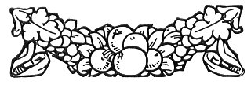

  
[Intangible Textual Heritage](../../index)  [Freemasonry](../index) 
[Index](index)  [Previous](md16)  [Next](md18) 

------------------------------------------------------------------------

[Buy this Book at
Amazon.com](https://www.amazon.com/exec/obidos/ASIN/B0022NGNCW/internetsacredte)

------------------------------------------------------------------------

  
*Morals and Dogma*, by Albert Pike, \[1871\], at Intangible Textual
Heritage

------------------------------------------------------------------------

p. 241

### XVI.

### PRINCE OF JERUSALEM.

WE no longer expect to rebuild the Temple at Jerusalem. To us it has
become but a symbol. To us the whole world is God's Temple, as is every
upright heart. To establish all over the world the New Law and Reign of
Love, Peace, Charity, and Toleration, is to build that Temple, most
acceptable to God, in erecting which Masonry is now engaged. No longer
needing to repair to Jerusalem to worship, nor to offer up sacrifices
and shed blood to propitiate the Deity, man may make the woods and
mountains his Churches and Temples, and worship God with a devout
gratitude, and with works of charity and beneficence to his fellow-men.
Wherever the humble and contrite heart silently offers up its adoration,
under the overarching trees, in the open, level meadows, on the
hill-side, in the glen, or in the city's swarming streets; there is
God's House and the New Jerusalem.

The Princes of Jerusalem no longer sit as magistrates to judge between
the people; nor is their number limited to five. But their duties still
remain substantially the same, and their insignia and symbols retain
their old significance. Justice and Equity are still their
characteristics. To reconcile disputes and heal dissensions, to restore
amity and peace, to soothe dislikes and soften prejudices, are their
peculiar duties; and they know that the peacemakers are blessed.

Their emblems have been already explained. They are part of the language
of Masonry; the same now as it was when Moses learned it from the
Egyptian Hierophants.

Still we observe the spirit of the Divine law, as thus enunciated to our
ancient brethren, when the Temple was rebuilt, and the book of the law
again opened:

"Execute true judgment; and show mercy and compassion every man to his
brother. Oppress not the widow nor the fatherless, the stranger nor the
poor; and let none of you imagine evil against his brother in his heart.
Speak ye every man the truth

p. 242

to his neighbor; execute the judgment of Truth and Peace in your gates;
and love no false oath; for all these I hate, saith the Lord.

"Let those who have power rule in righteousness, and Princes in
judgment. And let him that is a judge be as an hiding-place from the
wind, and a covert from the tempest; as rivers of water in a dry place;
as the shadow of a great rock in a weary land. Then the vile person
shall no more be called liberal; nor the churl bountiful; and the work
of justice shall be peace; and the effect of justice, quiet and
security; and wisdom and knowledge shall be the stability of the times.
Walk ye righteously and speak uprightly; despise the gains of
oppression, shake from your hands the contamination of bribes; stop not
your ears against the cries of the oppressed, nor shut your eyes that
you may not see the crimes of the great; and you shall dwell on high,
and your place of defence be like munitions of rocks."

Forget not these precepts of the old Law; and especially do not forget,
as you advance, that every Mason, however humble, is your brother, and
the laboring man your peer! Remember always that all Masonry is work,
and that the trowel is an emblem of the Degrees in this Council. Labor,
when rightly understood, is both noble and ennobling, and intended to
develop man's moral and spiritual nature, and not to be deemed a
disgrace or a misfortune.

Everything around us is, in its bearings and influences, moral. The
serene and bright morning, when we recover our conscious existence from
the embraces of sleep; when, from that image of Death God calls us to a
new life, and again gives us existence, and His mercies visit us in
every bright ray and glad thought, and call for gratitude and content;
the silence of that early dawn, the hushed silence, as it were, of
expectation; the holy eventide, its cooling breeze, its lengthening
shadows, its falling shades, its still and sober hour; the sultry
noontide and the stern and solemn midnight; and Spring-time, and
chastening Autumn; and Summer, that unbars our gates, and carries us
forth amidst the ever-renewed wonders of the world; and Winter, that
gathers us around the evening hearth:--all these, as they pass, touch by
turns the springs of the spiritual life in us, and are conducting that
life to good or evil. The idle watch-hand often points to something
within us; and the shadow of the gnomon on the dial often falls upon the
conscience.

p. 243

A life of labor is not a state of inferiority or degradation. The
Almighty has not cast man's lot beneath the quiet shades, and amid glad
groves and lovely hills, with no task to perform; with nothing to do but
to rise up and eat, and to lie clown and rest. He has ordained that
*Work* shall be done, in all the dwellings of life, in every productive
field, in every busy city, and on every wave of every ocean. And this He
has done, because it has pleased Him to give man a nature destined to
higher ends than indolent repose and irresponsible profitless
indulgence; and because, for developing the energies of such a nature,
work was the necessary and proper element. We might as well ask why He
could not make two and two be six, as why He could not develop these
energies without the instrumentality of work. They are equally
impossibilities.

This, Masonry teaches, as a great Truth; a great moral land-mark, that
ought to guide the course of all mankind. It teaches its toiling
children that the scene of their daily life is all spiritual, that the
very implements of their toil, the fabrics they weave, the merchandise
they barter, are designed for spiritual ends; that so believing, their
daily lot may be to them a sphere for the noblest improvement. That
which we do in our intervals of relaxation, our church-going, and our
book-reading, are especially designed to prepare our minds for the
*action* of Life. We are to hear and read and meditate, that we may
*act* well; and the *action* of Life is itself the great field for
spiritual improvement. There is no task of industry or business, in
field or forest, on the wharf or the ship's deck, in the office or the
exchange, but has spiritual ends. There is no care or cross of our daily
labor, but was especially ordained to nurture in us patience, calmness,
resolution, perseverance, gentleness, disinterestedness, magnanimity.
Nor is there any tool or implement of toil, but is a part of the great
spiritual instrumentality.

All the relations of life, those of parent, child, brother, sister,
friend, associate, lover and beloved, husband, wife, are moral,
throughout every living tie and thrilling nerve that bind them together.
They cannot subsist a day nor an hour without putting the mind to a
trial of its truth, fidelity, forbearance, and disinterestedness.

A great city is one extended scene of moral action. There is no blow
struck in it but has a purpose, ultimately good or bad,

p. 244

and therefore moral. There is no action performed, but has a motive; and
motives are the special jurisdiction of morality. Equipages, houses, and
furniture are symbols of what is moral, and they in a thousand ways
minister to right or wrong feeling. Everything that belongs to us,
ministering to our comfort or luxury, awakens in us emotions of pride or
gratitude, of selfishness or vanity; thoughts of self-indulgence, or
merciful remembrances of the needy and the destitute.

Everything acts upon and influences us. God's great law of sympathy and
harmony is potent and inflexible as His law of gravitation. A sentence
embodying a noble thought stirs our blood; a noise made by a child frets
and exasperates us, and influences our actions.

A world of spiritual objects, influences, and relations lies around us
all. We all vaguely deem it to be so; but he only lives a charmed life,
like that of genius and poetic inspiration, who communes with the
spiritual scene around him, hears the voice of the spirit in every
sound, sees its signs in every passing form of things, and feels its
impulse in all action, passion, and being. Very near to us lies the
mines of wisdom; unsuspected they lie all around us. There is a secret
In the simplest things, a wonder in the plainest, a charm in the
dullest.

We are all naturally seekers of wonders. We travel far to see the
majesty of old ruins, the venerable forms of the hoary mountains, great
water-falls, and galleries of art. And yet the world-wonder is all
around us; the wonder of setting suns, and evening stars, of the magic
spring-time, the blossoming of the trees, the strange transformations of
the moth; the wonder of the Infinite Divinity and of His boundless
revelation. There is no splendor beyond that which sets its morning
throne in the golden East; no. dome sublime as that of Heaven; no beauty
so fair as that of the verdant, blossoming earth; no place, however
invested with the sanctities of old time, like that home which is hushed
and folded within the embrace of the humblest wall and roof.

And all these are but the symbols of things far greater and higher. All
is but the clothing of the spirit. In this vesture of time is wrapped
the immortal nature: in this show of circumstance and form stands
revealed the stupendous reality. Let man but be, as he is, a living
soul, communing with himself and with

p. 245

\[paragraph continues\] God, and his
vision becomes eternity; his abode, infinity; his home, the bosom of
all-embracing love.

The great problem of Humanity is wrought out in the humblest abodes; no
more than this is done in the highest. A human heart throbs beneath the
beggar's gabardine; and that and no more stirs with its beating the
Prince's mantle. The beauty of Love, the charm of friendship, the
sacredness of Sorrow, the heroism of Patience, the noble Self-sacrifice,
these and their like, alone, make life to be life indeed, and are its
grandeur and its power. They are the priceless treasures and glory of
humanity; and they are not things of condition. All places and all
scenes are alike clothed with the grandeur and charm of virtues such as
these.

The million occasions will come to us all, in the ordinary paths of our
life, in our homes, and by our firesides, wherein we may act as nobly,
as if, all our life long, we led armies, sat in senates, or visited beds
of sickness and pain. Varying every hour, the million occasions will
come in which we may restrain our passions, subdue our hearts to
gentleness and patience, resign our own interest for another's
advantage, speak words of kindness and wisdom, raise the fallen, cheer
the fainting and sick in spirit, and soften and assuage the weariness
and bitterness of their mortal lot. To every Mason there will be
opportunity enough for these. They cannot be written on his tomb; but
they will be written deep in the hearts of men, of friends, of children,
of kindred all around him, in the book of the great account, and, in
their eternal influences, on the great pages of the Universe.

To such a destiny, at least, my Brethren, let us all aspire! These laws
of Masonry let us all strive to obey! And so may our hearts become true
temples of the Living God! And may He encourage our zeal, sustain our
hopes, and assure us of success!

 

 

------------------------------------------------------------------------

[Next: XVII. Knight of the East and West](md18)
