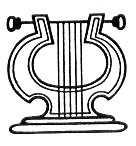

  
[Intangible Textual Heritage](../../index)  [Freemasonry](../index.md) 
[Index](index)  [Previous](md21)  [Next](md23.md) 

------------------------------------------------------------------------

[Buy this Book at
Amazon.com](https://www.amazon.com/exec/obidos/ASIN/B0022NGNCW/internetsacredte.md)

------------------------------------------------------------------------

  
*Morals and Dogma*, by Albert Pike, \[1871\], at Intangible Textual
Heritage

------------------------------------------------------------------------

p. 334

### XXI.

### NOACHITE, OR PRUSSIAN KNIGHT.

You are especially charged in this Degree to be modest and humble, and
not vain-glorious nor filled with self-conceit. Be not wiser in your own
opinion than the Deity, nor find fault with His works, nor endeavor to
improve upon what He has done. Be modest also in your intercourse with
your fellows, and slow to entertain evil thoughts of them, and reluctant
to ascribe to them evil intentions. A thousand presses, flooding the
country with their evanescent leaves, are busily and incessantly engaged
in maligning the motives and conduct of men and parties, and in making
one man think worse of another; while, alas, scarcely one is found that
ever, even accidentally, labors to make man think better of his fellow.

Slander and calumny were never so insolently licentious in any country
as they are this day in ours. The most retiring disposition, the most
unobtrusive demeanor, is no shield against their poisoned arrows. The
most eminent public service only makes their vituperation and invective
more eager and more unscrupulous, when he who has done such service
presents himself as a candidate for the people's suffrages.

The evil is wide-spread and universal. No man, no woman, no household,
is sacred or safe from this new Inquisition. No act is so pure or so
praiseworthy, that the unscrupulous vender of lies who lives by
pandering to a corrupt and morbid public appetite will not proclaim it
as a crime. No motive is so innocent or so laudable, that he will not
hold it up as villainy. Journalism pries into the interior of private
houses, gloats over the details of domestic tragedies of sin and shame,
and deliberately invents and industriously circulates the most
unmitigated and baseless falsehoods, to coin money for those who pursue
it as a trade, or to effect a temporary result in the wars of faction.

We need not enlarge upon these evils. They are apparent to all and
lamented over by all, and it is the duty of a Mason to do all

p. 335

in his power to lessen, if not to remove them. With the errors and even
sins of other men, that do not personally affect us or ours, and need
not our condemnation to be odious, we have nothing to do; and the
journalist has no patent that makes him the Censor of Morals. There is
no obligation resting on us to trumpet forth our disapproval of every
wrongful or injudicious or improper act that every other man commits.
One would be ashamed to stand on the street corners and retail them
orally for pennies.

One ought, in truth, to write or speak against no other one in this
world. Each man in it has enough to do, to watch and keep guard over
himself. Each of us is sick enough in this great Lazaretto: and
journalism and polemical writing constantly re-mind us of a scene once
witnessed in a little hospital; where it was horrible to hear how the
patients mockingly reproached each other with their disorders and
infirmities: how one, who was wasted by consumption, jeered at another
who was bloated by dropsy: how one laughed at another's cancer of the
face; and this one again at his neighbor's lock-jaw or squint; until at
last the delirious fever-patient sprang out of his bed, and tore away
the coverings from the wounded bodies of his companions, and nothing was
to be seen but hideous misery and mutilation. Such is the revolting work
in which journalism and political partisanship, and half the world
outside of Masonry, are engaged.

Very generally, the censure bestowed upon men's acts, by those who have
appointed and commissioned themselves Keepers of the Public Morals, is
undeserved. Often it is not only undeserved, but praise is deserved
instead of censure, and, when the latter is not undeserved, it is always
extravagant, and therefore unjust.

A Mason will wonder what spirit they are endowed withal, that can basely
libel at a man, even, that is fallen. If they had any nobility of soul,
they would with him condole his disasters, and drop some tears in pity
of his folly and wretchedness: and if they were merely human and not
brutal, Nature did grievous wrong to human bodies, to curse them with
souls so cruel as to strive to add to a wretchedness already
intolerable. When a Mason hears of any man that hath fallen into public
disgrace, he should have a mind to commiserate his mishap, and not to
make him more disconsolate. To envenom a name by libels, that already is
openly tainted, is to add stripes with an iron rod to one that is flayed
with

p. 336

whipping; and to every well-tempered mind will seem most in-human and
unmanly.

Even the man who does wrong and commits errors often has a quiet home, a
fireside of his own, a gentle, loving wife and innocent children, who
perhaps do not know of his past errors and lapses--past and long
repented of; or if they do, they love him the better, because, being
mortal, he hath erred, and being in the image of God, he hath repented.
That every blow at this husband and father lacerates the pure and tender
bosoms of that wife and those daughters, is a consideration that doth
not stay the hand of the brutal journalist and partisan: but he strikes
home at these shrinking, quivering, innocent, tender bosoms; and then
goes out upon the great arteries of cities, where the current of life
pulsates, and holds his head erect, and calls on his fellows to laud him
and admire him, for the chivalric act he hath done, in striking his
dagger through one heart into another tender and trusting one.

If you seek for high and strained carriages, you shall, for the most
part, meet with them in low men. Arrogance is a weed that ever grows on
a dunghill. It is from the rankness of that soil that she hath her
height and spreadings. To be modest and unaffected with our superiors is
duty; with our equals, courtesy; with our inferiors, nobleness. There is
no arrogance so great as the proclaiming of other men's errors and
faults, by those who understand nothing but the dregs of actions, and
who make it their business to besmear deserving fames. Public reproof is
like striking a deer in the herd: it not only wounds him, to the loss of
blood, but betrays him to the hound, his enemy.

The occupation of the spy hath ever been held' dishonorable, and it is
none the less so, now that with rare exceptions editors and partisans
have become perpetual spies upon the actions of other men. Their malice
makes them nimble-eyed, apt to note a fault and publish it, and, with a
strained construction, to deprave even those things in which the doer's
intents were honest. Like the crocodile, they slime the way of others,
to make them fall; and when that has happened, they feed their insulting
envy on the life-blood of the prostrate. They set the vices of other men
on high, for the gaze of the world, and place their virtues
under-ground, that none may note them. If they cannot wound upon proofs,
they will do it upon likelihoods: and if not upon them, they

p. 337

manufacture lies, as God created the world, out of nothing; and so
corrupt the fair tempter of men's reputations; knowing that the
multitude will believe them, because affirmations are apter to win
belief, than negatives to uncredit them; and that a lie travels faster
than an eagle flies, while the contradiction limps after it at a snail's
pace, and, halting, never overtakes it. Nay, it is contrary to the
morality of journalism, to allow a lie to be contradicted in the place
that spawned it. And even if that great favor is conceded, a slander
once raised will scarce ever die, or fail of finding many that will
allow it both a harbor and trust.

This is, beyond any other, the age of falsehood. Once, to be suspected
of equivocation was enough to soil a gentleman's escutcheon; but now it
has become a strange merit in a partisan or statesman, always and
scrupulously to tell the truth. Lies are part of the regular ammunition
of all campaigns and controversies, valued according as they are
profitable and effective; and are stored up and have a; market price,
like saltpetre and sulphur; being even more deadly than they.

If men weighed the imperfections of humanity, they would breathe less
condemnation. Ignorance gives disparagement a louder tongue than
knowledge does. Wise men had rather know, than tell. Frequent dispraises
are but the faults of uncharitable wit: and it is from where there is no
judgment, that the heaviest judgment comes; for self-examination would
make all judgments charitable. If we even do know vices in men, we can
scarce show ourselves in a nobler virtue than in the charity of
concealing them: if that be not a flattery persuading to continuance.
And it is the basest office man can fall into, to make his tongue the
defamer of the worthy man..

There is but one rule for the Mason in this matter. If there be virtues,
and he is called upon to speak of him who owns them, let him tell them
forth impartially. And if there be vices mixed with them, let him be
content the world shall know them by some other tongue than his. For if
the evil-doer deserve no pity, his wife, his parents, or his children,
or other innocent persons who love him may; and the bravo's trade,
practised by him who stabs the defenceless for a price paid by
individual or party, is really no more respectable now than it was a
hundred years ago, in Venice. Where we want experience, Charity bids us
think the best, and leave what we know not to the Searcher of Hearts;
for mistakes,

p. 338

suspicions, and envy often injure a clear fame; and there is least
danger in a charitable construction.

And, finally, the Mason should be humble and modest toward the Grand
Architect of the Universe, and not impugn His Wisdom, nor set up his own
imperfect sense of Right against His Providence and dispensations, nor
attempt too rashly to explore the Mysteries of God's Infinite Essence
and inscrutable plans, and of that Great Nature which we are not made
capable to understand.

Let him steer far away from all those vain philosophies, which endeavor
to account for all that is, without admitting that there is a God,
separate and apart from the Universe which is his work: which erect
Universal Nature into a God, and worship it alone: which annihilate
Spirit, and believe no testimony except that of the bodily senses:
which, by logical formulas and dextrous collocation of words, make the
actual, living, guiding, and protecting God fade into the dim mistiness
of a mere abstraction and unreality, itself a mere logical formula.

Nor let him have any alliance with those theorists who chide the delays
of Providence and busy themselves to hasten the slow march which it has
imposed upon events: who neglect the practical, to struggle after
impossibilities: who are wiser than Heaven; know the aims and purposes
of the Deity, and can see a short and more direct means of attaining
them, than it pleases Him to employ: who would have no discords in the
great harmony of the Universe of things; but equal distribution of
property, no subjection of one man to the will of another, no compulsory
labor, and still no starvation, nor destitution, nor pauperism.

Let him not spend his life, as they do, in building a new Tower of
Babel; in attempting to change that which is fixed by an in-flexible law
of God's enactment: but let him, yielding to the Superior Wisdom of
Providence, content to believe that the march of events is rightly
ordered by an Infinite Wisdom, and leads, though we cannot see it, to a
great and perfect result,--let him be satisfied to follow the path
pointed out by that Providence, and to labor for the good of the human
race in that mode in which God has chosen to enact that that good shall
be effected: and above all, let him build no Tower of Babel, under the
belief that by ascending he will mount so high that God will disappear
or be superseded by a great monstrous aggregate of material forces, or
mere glittering, logical formula; but, evermore, standing humbly

p. 339

and reverently upon the earth and looking with awe and confidence toward
Heaven, let him be satisfied that there is a *real* God; a *person*, and
not a formula; a Father and a protector, who loves, and sympathizes, and
compassionates; and that the eternal ways by which He rules the world
are infinitely wise, no matter how far they may be above the feeble
comprehension and limited vision of man.

 

 

------------------------------------------------------------------------

[Next: XXII. Knight of the Royal Axe, or Prince of Libanus](md23.md)
