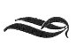

  
[Intangible Textual Heritage](../../index)  [Freemasonry](../index.md) 
[Index](index)  [Previous](md27)  [Next](md29.md) 

------------------------------------------------------------------------

[Buy this Book at
Amazon.com](https://www.amazon.com/exec/obidos/ASIN/B0022NGNCW/internetsacredte.md)

------------------------------------------------------------------------

  
*Morals and Dogma*, by Albert Pike, \[1871\], at Intangible Textual
Heritage

------------------------------------------------------------------------

p. 578

### XXVII.

### KNIGHT COMMANDER OF THE TEMPLE.

THIS is the first of the really Chivalric Degrees of the Ancient and
Accepted Scottish Rite. It occupies this place in the Calendar of the
Degrees between the 26th and the last of the Philosophical Degrees, in
order, by breaking the continuity of these, to relieve what might
otherwise become wearisome; and also to remind you that, while engaged
with the speculations and abstractions of philosophy and creeds, the
Mason is also to continue engaged in the active duties of this great
warfare of life. He is not only a Moralist and Philosopher, but a
Soldier, the Successor of those Knights of the Middle Age, who, while
they wore the Cross, also wielded the Sword, and were the Soldiers of
Honor, Loyalty, and Duty.

Times change, and circumstances; but Virtue and Duty remain the same.
The Evils to be warred against but take another shape, and are developed
in a different form.

There is the same need now of truth and loyalty as in the days of
Frederic Barbarossa.

The characters, religious and military, attention to the sick and
wounded in the Hospital, and war against the Infidel in the field, are
no longer blended; but the same duties, to be performed in another
shape, continue to exist and to environ us all.

The innocent virgin is no longer at the mercy of the brutal Baron or
licentious man-at-arms; but purity and innocence still need protectors.

War is no longer the apparently natural State of Society; and for most
men it is an empty obligation to assume, that they will not recede
before the enemy; but the same high duty and obligation still rest upon
all men.

Truth, in act, profession, and opinion, is rarer now than in the days of
chivalry. Falsehood has become a current coin, and circulates with a
certain degree of respectability; because it has an actual value. It is
indeed the great Vice of the Age--it, and its twin-sister, Dishonesty.
Men, for political preferment, profess

p. 579

whatever principles are expedient and profitable. At the bar, in the
pulpit, and in the halls of legislation, men argue against their own
convictions, and, with what they term *logic*, prove to the satisfaction
of others that which they do not themselves believe, Insincerity and
duplicity are valuable to their possessors, like estates in stocks, that
yield a certain revenue: and it is no longer the *truth* of an opinion
or a principle, but the net *profit* that may be realized from it, which
is the measure of its value.

The Press is the great sower of falsehood. To slander a political
antagonist, to misrepresent all that he says, and, if that be
impossible, to invent for him what he does *not* say; to put in
circulation whatever baseless calumnies against him are necessary to
defeat him,--these are habits so common as to have ceased to excite
notice or comment, much less surprise or disgust.

There was a time when a Knight would die rather than utter a lie, or
break his Knightly word. The Knight Commander of the Temple revives the
old Knightly spirit; and devotes himself to the old Knightly worship of
Truth. No profession of an opinion not his own, for expediency's sake or
profit, Or through fear of the world's disfavor; no slander of even an
enemy; no coloring or perversion of the sayings or acts of other men; no
insincere speech and argument for any purpose, or under any pretext,
must soil his fair escutcheon. Out of the Chapter, as well as in it, he
must speak the Truth, and *all* the Truth, no more and no less; or else
speak not at all.

To purity and innocence everywhere, the Knight Commander owes
protection, as of old; against bold violence, or those, more guilty than
murderers, who by art and treachery seek to slay the soul; and against
that want and destitution that drive too many to sell their honor and
innocence for food.

In no age of, the world has man had better opportunity than now to
display those lofty virtues and that noble heroism that so distinguished
the three great military and religious Orders, in their youth, before
they became corrupt and vitiated by prosperity and power.

When a fearful epidemic ravages a city, and death is inhaled with the
air men breathe; when the living scarcely suffice to bury the
dead,--most men flee in abject terror, to return and live, respectable
and influential, when the danger has passed away. But the old Knightly
spirit of devotion and disinterestedness and contempt

p. 580

of death still lives, and is not extinct in the human heart. Everywhere
a few are found to stand firmly and unflinchingly at their posts, to
front and defy the danger, not for money, or to be honored for it, or to
protect their own household; but from mere humanity, and to obey the
unerring dictates of duty. They nurse the sick, breathing the
pestilential atmosphere of the hospital. They explore the abodes of want
and misery. With the gentleness of woman, they soften the pains of the
dying, and feed the lamp of life in the convalescent. They perform the
last sad offices to the dead; and they seek no other reward than the
approval of their own consciences.

These are the true Knights of the present age: these, and the captain
who remains at his post on board his shattered ship until the last boat,
loaded to the water's edge with passengers and crew, has parted from her
side; and then goes calmly down with her into the mysterious depths of
the ocean:--the pilot who stands at the wheel while the swift flames
eddy round him and scorch away his life:--the fireman who ascends the
blazing walls, and plunges amid the flames to save the property or lives
of those who have upon him no claim by tie of blood, or friendship, or
even of ordinary acquaintance:--these, and others like these:--all men,
who, set at the post of duty, stand there manfully; to die, if need be,
but not to desert their post: for these, too, are sworn not to recede
before the enemy.

To the performance of duties and of acts of heroism like these, you have
devoted yourself, my Brother, by becoming a Knight Commander of the
Temple. Soldier of the Truth and of Loyalty! Protector of Purity and
Innocence! Defier of Plague and Pestilence! Nurser of the Sick and
Burier of the Dead! Knight, preferring Death to abandonment of the Post
of Duty! Welcome to the bosom of this Order!

 

 

------------------------------------------------------------------------

[Next: XXVIII. Knight of the Sun, or Prince Adept](md29.md)
