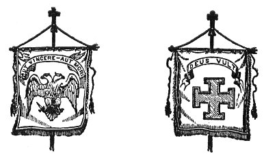
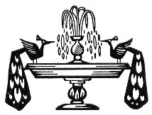

  
[Intangible Textual Heritage](../../index)  [Freemasonry](../index) 
[Index](index)  [Previous](md30)  [Next](md32) 

------------------------------------------------------------------------

[Buy this Book at
Amazon.com](https://www.amazon.com/exec/obidos/ASIN/B0022NGNCW/internetsacredte)

------------------------------------------------------------------------

  
*Morals and Dogma*, by Albert Pike, \[1871\], at Intangible Textual
Heritage

------------------------------------------------------------------------

p. 814

 

### XXX.

### KNIGHT KADOSH.

WE often profit more by our enemies than by our friends. "We support
ourselves only on that which resists," and owe our success to
opposition. The best friends of Masonry in America were the Anti-Masons
of 1826, and at the same time they were its worst enemies. Men are but
the automata of Providence, and it uses the demagogue, the fanatic, and
the knave, a common trinity in Republics, as its tools and instruments
to effect that of which they do not dream, and which they imagine
themselves commissioned to prevent.

The Anti-Masons, traitors and perjurors some, and some mere political
knaves, purified Masonry by persecution, and so proved to be its
benefactors; for that which is persecuted, grows. To them its present
popularity is due, the cheapening of its Degrees, the invasion of its
Lodges, that are no longer Sanctuaries, by the multitude; its pomp and
pageantry and overdone display.

An hundred years ago it had become known that the ‏ו ?Q?D?Sה‎ were the
Templars under a veil, and therefore the Degree was pro-scribed, and,
ceasing to be worked, became a mere brief and formal ceremony, under
another name. Now, from the tomb in which after his murders he rotted,
Clement the Fifth howls against the successors of his victims, in the
Allocution of Pio Nono against the Free-Masons. The ghosts of the dead
Templars

p. 815

haunt the Vatican and disturb the slumbers of the paralyzed Papacy,
which, dreading the dead, shrieks out its excommunications and impotent
anathemas against the living. It is a declaration of war, and was needed
to arouse apathy and inertness to action.

An enemy of the Templars shall tell us the secret of this Papal
hostility against an Order that has existed for centuries in despite of
its anathemas, and has its Sanctuaries and Asyla even in Rome.

It will be easy, as we read, to separate the false from the true, the
audacious conjectures from the simple facts.

"A power that ruled without antagonism and without concurrence, and
consequently without control, proved fatal to the Sacerdotal Royalties;
while the Republics, on the other hand, had perished by the conflict of
liberties and franchises, which, in the absence of all duty
hierarchically sanctioned and enforced, had soon become mere tyrannies,
rivals one of the other. To find a stable medium between these two
abysses, the idea of the Christian Hierophants was to create a society
devoted to abnegation by solemn vows, protected by severe regulations;
which should be recruited by initiation, and which, sole depositary of
the great religious and social secrets, should make Kings and Pontiffs,
without exposing it to the corruptions of Power. In that was the secret
of that kingdom of Jesus Christ, which, without being of this world,
would govern all its grandeurs.

"This idea presided at the foundation of the great religious orders, so
often at war with the secular authorities, ecclesiastical or civil. Its
realization was also the dream of the dissident sects of Gnostics or
Illuminati who pretended to connect their faith with the primitive
tradition of the Christianity of Saint John. It at length became a
menace for the Church and Society, when a rich and dissolute Order,
initiated in the mysterious doctrines of the Kabalah, seemed disposed to
turn against legitimate authority the conservative principle of
Hierarchy, and threatened the entire world with an immense revolution.

"The Templars, whose history is so imperfectly known, were those
terrible conspirators. In 1118, nine Knights Crusaders in the East,
among whom were Geoffroi de Saint-Omer and Hugues de Payens, consecrated
themselves to religion, and took an oath between the hands of the
Patriarch of Constantinople, a See always secretly or openly hostile to
that of Rome from the time of Photius. The avowed object of the Templars
was to protect

p. 816

the Christians who came to visit the Holy Places: their secret object
was the re-building of the Temple of Solomon on the model prophesied by
Ezekiel.

"This re-building, formally predicted by the Judaïzing Mystics of the
earlier ages, had become the secret dream of the Patriarchs of the
Orient. The Temple of Solomon, re-built and consecrated to the Catholic
worship would become, in effect, the Metropolis of the Universe; the
East would prevail over the West, and the Patriarchs of Constantinople
would possess themselves of the Papal power.

"The Templars, or *Poor Fellow-Soldiery of the Holy House of the Temple*
intended to be re-built, took as their models, in the Bible, the
Warrior-Masons of Zorobabel, who worked, holding the sword in one hand
and the trowel in the other. Therefore it was that the Sword and the
Trowel were the insignia of the Templars, who subsequently, as will be
seen, concealed themselves under the name of *Brethren Masons*. \[This
name, *Frères Masons* in the French, adopted by way of secret reference
to the Builders of the Second Temple, was corrupted in English into
*Free*-Masons, as *Pythagore de Crotone* was into *Peter Gower* of
*Groton* in England. *Khairu\_m* or *Khu\_r-u\_m*, (a name mis-rendered
into *Hiram*) from an artificer in brass and other metals, became the
Chief Builder of the *Haikal Kadosh*, the Holy House, of the Temple, the
Ἱερος Δομος; and the words *Bonai* and *Banaim* yet appear in the
Masonic Degrees, meaning Builder and Builders.\]

"The trowel of the Templars is quadruple, and the triangular plates of
it are arranged in the form of a cross, making the Kabalistic pantacle
known by the name of the Cross of the East. The Knight of the East, and
the Knight of the East and West, have in their titles secret allusions
to the Templars of whom they were at first the successors.

"The secret thought of Hugues de Payens, in founding his Order, was not
exactly to serve the ambition of the Patriarchs of Constantinople. There
existed at that period in the East a Sect of Johannite Christians, who
claimed to be the only true Initiates into the real mysteries of the
religion of the Saviour. They pretended to know the real history of
YESUS the ANOINTED, and, adopting in part the Jewish traditions and the
tales of the Talmud, they held that the facts recounted in the Evangels
are but allegories, the key of which Saint John gives, in saying that
the

p. 817

world might be filled with the books that could be written upon the
words and deeds of Jesus Christ; words which, they thought, would be
only a ridiculous exaggeration, if he were not speaking of an allegory
and a legend, that might be varied and prolonged to infinity.

"The Johannites ascribed to Saint John the foundation of their Secret
Church, and the Grand Pontiffs of the Sect assumed the title of
*Christos*, *Anointed*, or *Consecrated*, and claimed to have succeeded
one another from Saint John by an uninterrupted succession of pontifical
powers. He who, at the period of the foundation of the Order of the
Temple, claimed these imaginary prerogatives, was named THEOCLET; he
knew HUGUES DE PAYENS, he initiated him into the Mysteries and hopes of
his pretended church, he seduced him by the notions of Sovereign
Priesthood and Supreme royalty, and finally designated him as his
successor.

"Thus the Order of Knights of the Temple was at its very origin devoted
to the cause of opposition to the tiara of Rome and the crowns of Kings,
and the Apostolate of Kabalistic Gnosticism was vested in its chiefs.
For Saint John himself was the Father of the Gnostics, and the current
translation of his polemic against the heretical of his Sect and the
pagans who denied that Christ was the Word, is throughout a
misrepresentation, or misunderstanding at least, of the whole Spirit of
that Evangel.

"The tendencies and tenets of the Order were enveloped in profound
mystery, and it externally professed the most perfect orthodoxy. The
Chiefs alone knew the aim of the Order: the Subalterns followed them
without distrust.

"To acquire influence and wealth, then to intrigue, and at need to
fight, to establish the Johannite or Gnostic and Kabalistic dogma, were
the object and means proposed to the initiated Brethren. The Papacy and
the rival monarchies, they said to them, are sold and bought in these
days, become corrupt, and to-morrow, perhaps, will destroy each other.
All that will become the heritage of the Temple: the World will soon
come to us for its Sovereigns and Pontiffs. We shall constitute the
equilibrium of the Universe, and be rulers over the Masters of the
World.

"The Templars, like all other Secret Orders and Associations, had two
doctrines, one concealed and reserved for the Masters, which was
Johannism; the other public, which was the *Roman Catholic*. Thus they
deceived the adversaries whom they sought

p. 818

to supplant. Hence Free-Masonry, vulgarly imagined to have begun with
the Dionysian Architects or the German Stone-workers, adopted Saint John
the Evangelist as one of its patrons, associating with him, in order not
to arouse the suspicions of Rome, Saint John the Baptist, and thus
covertly proclaiming itself the child of the Kabalah and Essenism
together."

\[For the Johannism of the Adepts was the Kabalah of the earlier
Gnostics, degenerating afterward into those heretical forms which
Gnosticism developed, so that even Manes had his followers among them.
Many adopted his doctrines of the two Principles, the recollection of
which is perpetuated by the handle of the dagger and the tesserated
pavement or floor of the Lodge, stupidly called "*the Indented Tessel*,"
and represented by great hanging *tassels*, when it really means a
*tesserated* floor (from the Latin *tessera*) of white and black
lozenges, with a necessarily denticulated or indented border or edging.
And wherever, in the higher Degrees, the two colors white and black, are
in juxtaposition, the two Principles of Zoroaster and Manes are alluded
to. With others the doctrine became a mystic Pantheism, descended from
that of the Brahmins, and even pushed to an idolatry of Nature and
hatred of every revealed dogma.

\[To all this the absurd reading of the established Church, taking
literally the figurative, allegorical, and mythical language of a
collection of Oriental books of different ages, directly and inevitably
led. The same result long after followed the folly of regarding the
Hebrew books as if they had been written by the unimaginative, hard,
practical intellect of the England of James the First and the bigoted
stolidity of Scottish Presbyterianism.\]

"The better to succeed and win partisans, the Templars sympathized with
regrets for dethroned creeds and encouraged the hopes of new worships,
promising to all liberty of conscience and a new orthodoxy that should
be the synthesis of all the persecuted creeds."

\[It is absurd to suppose that men of intellect adored a monstrous idol
called Baphomet, or recognized Mahomet as an inspired prophet. Their
symbolism, invented ages before, to conceal what it was dangerous to
avow, was of course misunderstood by those who were not adepts, and to
their enemies seemed to be pantheistic. The calf of gold, made by Aaron
for the Israelites, was but one of the oxen under the laver of bronze,
and the Karobim on the Propitiatory, misunderstood. The symbols of the
wise always become

p. 819

the idols of the ignorant multitude. What the Chiefs of the Order really
believed and taught, is indicated to the Adepts by the hints contained
in the high Degrees of Free-Masonry, and by the symbols which only the
Adepts understand.

\[The Blue Degrees are but the outer court or portico of the Temple.
Part of the symbols are displayed there to the Initiate, but he is
intentionally misled by false interpretations. It is not intended that
he shall understand them; but it is intended that he shall imagine he
understands them. Their true explication is reserved for the Adepts, the
Princes of Masonry. The whole body of the Royal and Sacerdotal Art was
hidden so carefully, centuries since, in the High Degrees, as that it is
even yet impossible to solve many of the enigmas which they contain. It
is well enough for the mass of those called Masons, to imagine that all
is contained in the Blue Degrees; and whoso attempts to undeceive them
will labor in vain, and without any true reward violate his obligations
as an Adept. Masonry is the veritable Sphinx, buried to the head in the
sands heaped round it by the ages.\]

"The seeds of decay were sown in the Order of the Temple at its origin.
Hypocrisy is a mortal disease. It had conceived a great work which it
was incapable of executing, because it knew neither humility nor
personal abnegation, because Rome was then invincible, and because the
later Chiefs of the Order did not comprehend its mission. Moreover, the
Templars were in general uneducated, and capable only of wielding the
sword, with no qualifications for governing, and at need enchaining,
that queen of the world called Opinion." \[The doctrines of the Chiefs
would, if expounded to the masses, have seemed to them the babblings of
folly. The symbols of the wise are the idols of the vulgar, or else as
meaningless as the hieroglyphics of Egypt to the nomadic Arabs. There
must always be a common-place interpretation for the mass of Initiates,
of the symbols that are eloquent to the Adepts.\]

"Hughes de Payens himself had not that keen and far-sighted intellect
nor that grandeur of purpose which afterward distinguished the military
founder of another soldiery that became formidable to kings. The
Templars were unintelligent and therefore unsuccessful Jesuits.

"Their watchword was, to become wealthy, in order to buy the world. They
became so, and in 1312 they possessed in Europe

p. 820

alone more than nine thousand seignories. Riches were the shoal on which
they were wrecked. They became insolent, and unwisely showed their
contempt for the religious and social institutions which they aimed to
overthrow. Their ambition was fatal to them. Their projects were divined
and prevented. \[Rome, more intolerant of heresy than of vice and crime,
came to fear the Order, and fear is always cruel. It has always deemed
philosophical truth the most dangerous of heresies, and has never been
at a loss for a false accusation, by means of which to crush free
thought.\] Pope Clement V. and King Philip le Bel gave the signal to
Europe, and the Templars, taken as it were in an immense net, were
arrested, disarmed, and cast into prison. Never was a *Coup d’Etat*
accomplished with a more formidable concert of action. The whole world
was struck with stupor, and eagerly waited for the strange revelations
of a process that was to echo through so many ages.

"It was impossible to unfold to the people the conspiracy of the
Templars against the Thrones and the Tiara. It was impossible to expose
to them the doctrines of the Chiefs of the Order. \[This would have been
to initiate the multitude into the secrets of the Masters, and to have
uplifted the veil of Isis. Recourse was therefore had to the charge of
magic, and denouncers and false witnesses were easily found. When the
temporal and spiritual tyrannies unite to crush a victim they never want
for serviceable instruments.\] The Templars were gravely accused of
spitting upon Christ and denying God at their receptions, of gross
obscenities, conversations with female devils, and the worship of a
monstrous idol.

"The end of the drama is well known, and how Jacques de Molai and his
fellows perished in the flames. But before his execution, the Chief of
the doomed Order organized and instituted what afterward came to be
called the Occult, Hermetic, or Scottish Masonry. In the gloom of his
prison, the Grand Master created four Metropolitan Lodges, at Naples for
the East, at Edinburg for the West, at Stockholm for the North, and at
Paris for the South." \[The initials of his name, J∴ B∴ M∴ found in the
same order in the first three Degrees, are but one of the many internal
and cogent proofs that such was the origin of modern Free-Masonry. The
legend of Osiris was revived and adopted, to symbolize the destruction
of the Order, and the resurrection of

p. 821

\[paragraph continues\] Khu\_ru\_m, slain
in the body of the Temple, of KHU\_RU\_M ABAI, the Master, as the martyr
of fidelity to obligation, of Truth and Conscience, prophesied the
restoration to life of the buried association.\]

"The Pope and the King soon after perished in a strange and sudden
manner. Squin de Florian, the chief denouncer of the Order, died
assassinated. In breaking the sword of the Templars, they made of it a
poniard; and their proscribed trowels thence-forward built only tombs."

\[The Order disappeared at once. Its estates and wealth were
confiscated, and it seemed to have ceased to exist. Nevertheless it
lived, under other names and governed by unknown Chiefs, revealing
itself only to those who, in passing through a series of Degrees, had
proven themselves worthy to be entrusted with the dangerous Secret. The
modern Orders that style themselves Templars have assumed a name to
which they have not the shadow of a title.\]

"The Successors of the Ancient Adepts Rose-Croix, abandoning by degrees
the austere and hierarchial Science of their Ancestors in initiation,
became a Mystic Sect, united with many of the Templars, the dogmas of
the two intermingling, and believed themselves to be the sole
depositaries of the secrets of the Gospel of St. John, seeing in its
recitals an allegorical series of rites proper to complete the
initiation.

"The Initiates, in fact, thought in the eighteenth century that their
time had arrived, some to found a new Hierarchy, others to overturn all
authority, and to press down all the summits of the Social Order under
the level of Equality."

The mystical meanings of the Rose as a Symbol are to be looked for in
the Kabalistic Commentaries on the Canticles.

The Rose was for the Initiates the living and blooming symbol of the
revelation of the harmonies of being. It was the emblem of beauty, life,
love, and pleasure. Flamel, or the Book of the Jew Abraham, made it the
hieroglyphical sign of the accomplishment of the great Work. Such is the
key of the Roman de la Rose. The Conquest of the Rose was the problem
propounded to Science by Initiation, while Religion was laboring to
prepare and establish the universal triumph, exclusive and definitive,
of the Cross.

To unite the Rose to the Cross, was the problem proposed by the High
Initiation; and in fact the Occult philosophy being the

p. 822

\[paragraph continues\] Universal
Synthesis, ought to explain all the phenomena of Being. Religion,
considered solely as a physiological fact, is the revelation and
satisfaction of a necessity of souls. Its existence is a scientific
fact; to deny it, would be to deny humanity itself.

The Rose-Croix Adepts respected the dominant, hierarchical, and revealed
religion. Consequently they could no more be the enemies of the Papacy
than of legitimate Monarchy; and if they conspired against the Popes and
Kings, it was because they considered them personally as apostates from
duty and supreme favorers of anarchy.

What, in fact, is a despot, spiritual or temporal, but a crowned
anarchist?

One of the magnificent pantacles that express the esoteric and
unutterable part of Science, is a Rose of Light, in the centre of which
a human form extends its arms in the form of a cross.

Commentaries and studies have been multiplied upon the *Divine Comedy*,
the work of DANTE, and yet no one, so far as we know, has pointed out
its especial character. The work of the great Ghibellin is a declaration
of war against the Papacy, by bold revelations of the Mysteries. The
Epic of Dante is Johannite and Gnostic, an audacious application, like
that of the Apocalypse, of the figures and numbers of the Kabalah to the
Christian dogmas, and a secret negation of every thing absolute in these
dogmas. His journey through the supernatural worlds is accomplished like
the initiation into the Mysteries of Eleusis and Thebes. He escapes from
that gulf of Hell over the gate of which the sentence of despair was
written, *by reversing the positions of his head and feet, that is to
say, by accepting the direct opposite of the Catholic dogma*; and then
he reascends to the light, by using the Devil himself as a monstrous
ladder. Faust ascends to Heaven, by stepping on the head of the
vanquished Mephistopheles. Hell is impassable for those only who know
not how to turn back from it. We free ourselves from its bondage by
audacity.

His Hell is but a negative Purgatory. His Heaven is composed of a series
of Kabalistic circles, divided by a cross, like the Pantacle of Ezekiel.
In the centre of this cross blooms a rose, and we see the symbol of the
Adepts of the Rose-Croix for the first time publicly expounded and
almost categorically explained.

For the first time, because Guillaume de Lorris, who died in 1260, five
years before the birth of Alighieri, had not completed

p. 823

his *Roman de la Rose*, which was continued by Chopinel, a half century
afterward. One is astonished to discover that the Roman de la Rose and
the Divina Commedia are two opposite forms of one and the same work,
initiation into independence of spirit, a satire on all contemporary
institutions, and the allegorical formula of the great Secrets of the
Society of the Roses-Croix.

The important manifestations of Occultism coincide with the period of
the fall of the Templars; since Jean de Meung or Chopinel, contemporary
of the old age of Dante, flourished during the best years of his life at
the Court of Philippe le Bel. The Roman de la Rose is the Epic of old
France. It is a profound book, under the form of levity, a revelation as
learned as that of Apuleius, of the Mysteries of Occultism. The Rose of
Flamel, that of Jean de Meung, and that of Dante, grew on the same stem.

Swedenborg's system was nothing else than the Kabalah, minus the
principle of the Hierarchy. It is the Temple, without the keystone and
the foundation.

Cagliostro was the Agent of the Templars, and therefore wrote to the
Free-Masons of London that the time had come to begin the work of
re-building the Temple of the Eternal. He had introduced into Masonry a
new Rite called the *Egyptian*, and endeavored to resuscitate the
mysterious worship of Isis. The three letters L∴ P∴ D∴ on his seal, were
the initials of the words "*Lilia pedibus destrue*;" *tread under foot
the Lilies* \[of France\], and a Masonic medal of the sixteenth or
seventeenth century has upon it a sword cutting off the stalk of a lily,
and the words "*talem dabit ultio messem*," such harvest revenge will
give.

A Lodge inaugurated under the auspices of Rousseau, the fanatic of
Geneva, became the centre of the revolutionary movement in France, and a
Prince of the blood-royal went thither to swear the destruction of the
successors of Philippe le Bel on the tomb of Jacques de Molai. The
registers of the Order of Templars attest that the Regent, the Duc
d’Orleans, was Grand Master of that formidable Secret Society, and that
his successors were the Duc de Maine, the Prince of Bourbon-Condé, and
the Duc de Cossé-Brissac.

The Templars compromitted the King; they saved him from the rage of the
People, to exasperate that rage and bring on the catastrophe prepared
for centuries; it was a scaffold that the vengeance of the Templars
demanded. The secret movers of the

p. 824

\[paragraph continues\] French Revolution
had sworn to overturn the Throne and the Altar upon the Tomb of Jacques
de Molai. When Louis XVI. was executed, half the work was done; and
thenceforward the Army of the Temple was to direct all its efforts
against the Pope.

Jacques de Molai and his companions were perhaps martyrs, but their
avengers dishonored their memory. Royalty was regenerated on the
scaffold of Louis XVI., the Church triumphed in the captivity of Pius
VI., carried a prisoner to Valence, and dying of fatigue and sorrow, but
the successors of the Ancient Knights of the Temple perished,
overwhelmed in their fatal victory.

 

 

------------------------------------------------------------------------

[Next: XXI. Grand Inspector Inquisitor Commander](md32)
