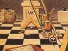

  
[Intangible Textual Heritage](../../index)  [Masonry](../index.md) 
[Index](index)  [Next](mom01.md) 

------------------------------------------------------------------------

[Buy this Book at
Amazon.com](https://www.amazon.com/exec/obidos/ASIN/0517331942/internetsacredte.md)

------------------------------------------------------------------------

[Buy this Book on
Kindle](https://www.amazon.com/exec/obidos/ASIN/B002J9HH2O/internetsacredte.md)

------------------------------------------------------------------------

  
*The Meaning of Masonry*, by W.L. Wilmshurst, \[1922\], at Intangible
Textual Heritage

------------------------------------------------------------------------

# THE MEANING OF

# MASONRY

## W.L. WILMSHURST

### P.M. 275; PAST PROVINCIAL

### GRAND REGISTRAR

### (WEST YORKS.)

#### P. Lund, Humphries & Co.; W. Rider & Son: London

#### \[1922\]

Scanned, proofed and formatted at Intangible Textual Heritage, December
2006, by John Bruno Hare. This text is in the public domain in the US
because it was published prior to 1923.

------------------------------------------------------------------------

[Next: Contents](mom01.md)
