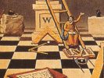

  
[Intangible Textual Heritage](../../index)  [Masonry](../index) 
[Index](index)  [Previous](mom00)  [Next](mom02) 

------------------------------------------------------------------------

[Buy this Book at
Amazon.com](https://www.amazon.com/exec/obidos/ASIN/0517331942/internetsacredte)

------------------------------------------------------------------------

[Buy this Book on
Kindle](https://www.amazon.com/exec/obidos/ASIN/B002J9HH2O/internetsacredte)

------------------------------------------------------------------------

  
*The Meaning of Masonry*, by W.L. Wilmshurst, \[1922\], at Intangible
Textual Heritage

------------------------------------------------------------------------

### CONTENTS

<table data-border="0">
<colgroup>
<col style="width: 50%" />
<col style="width: 50%" />
</colgroup>
<tbody>
<tr class="odd">
<td data-valign="top">
 
INTRODUCTION
</td>
<td data-valign="top">
 
</td>
</tr>
<tr class="even">
<td data-valign="top">
The Position and Possibilities of the Masonic Order
</td>
<td data-valign="top">
<a href="mom02.htm#page_5">5</a>
</td>
</tr>
<tr class="odd">
<td data-valign="top">
 
CHAPTER I
</td>
<td data-valign="top">
 
</td>
</tr>
<tr class="even">
<td data-valign="top">
The Deeper Symbolism of Masonry
</td>
<td data-valign="top">
<a href="mom03.htm#page_19">19</a>
</td>
</tr>
<tr class="odd">
<td data-valign="top">
 
CHAPTER II
</td>
<td data-valign="top">
 
</td>
</tr>
<tr class="even">
<td data-valign="top">
Masonry as a Philosophy
</td>
<td data-valign="top">
<a href="mom04.htm#page_54">54</a>
</td>
</tr>
<tr class="odd">
<td data-valign="top">
 
CHAPTER III
</td>
<td data-valign="top">
 
</td>
</tr>
<tr class="even">
<td data-valign="top">
Further Notes on Craft Symbolism
</td>
<td data-valign="top">
<a href="mom05.htm#page_87">87</a>
</td>
</tr>
<tr class="odd">
<td data-valign="top">
 
CHAPTER IV
</td>
<td data-valign="top">
 
</td>
</tr>
<tr class="even">
<td data-valign="top">
The Holy Royal Arch
</td>
<td data-valign="top">
<a href="mom06.htm#page_138">138</a>
</td>
</tr>
<tr class="odd">
<td data-valign="top">
 
CHAPTER V
</td>
<td data-valign="top">
 
</td>
</tr>
<tr class="even">
<td data-valign="top">
The Relation of Masonry to the Ancient Mysteries
</td>
<td data-valign="top">
<a href="mom07.htm#page_170">170</a>
</td>
</tr>
</tbody>
</table>

------------------------------------------------------------------------

[Next: Introduction](mom02)
