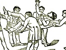

  
[Intangible Textual Heritage](../../index)  [Freemasonry](../index.md) 
[Index](index)  [Previous](morg06)  [Next](morg08.md) 

------------------------------------------------------------------------

[Buy this Book at
Amazon.com](https://www.amazon.com/exec/obidos/ASIN/B002E9II90/internetsacredte.md)

------------------------------------------------------------------------

  
*Illustrations of Masonry*, by William Morgan, \[1827\], at Intangible
Textual Heritage

------------------------------------------------------------------------

### SECTION SECOND OF THE LECTURE ON THE FIRST DEGREE.

"Why was you divested of all metals when you was made a Mason?"

Ans. "Because Masonry regards no man on account of his worldly wealth or
honors; it is, therefore, the internal and not the external
qualifications that recommend a man to Masonry."

"A second reason?"

Ans. "There was neither the sound of an axe, hammer, or any other metal
tool heard at the building of King [Solomon's](errata.htm#3.md) temple."

"How could so stupendous a fabric be erected without the sound of axe,
hammer, or any other metal tool?"

Ans. "All the stones were hewed, squared and numbered in the quarries
where they were raised, all the timbers felled and prepared in the
forests of Lebanon, and carried down to Joppa on floats, and taken from
thence up to Jerusalem, and set up with wooden mauls, prepared for that
purpose; which, when completed, every part thereof fitted with that
exact nicety, that it had more the resemblance of the hand workmanship
of the Supreme Architect of the Universe, than that of human hands."

"Why was you neither naked nor clothed?"

Ans. "As I was an object of distress at that time, it was to remind me,
if ever I saw a friend, more especially a brother, in a like distressed
situation, that I should contribute as liberally to his relief as his
situation required, and my abilities would admit, without material
injury to myself or family."

"Why were you neither barefoot or shod?"

Ans. "It was an ancient Israelitish custom, adopted among Masons; and we
read, in the book of Ruth, concerning

p. 41

their mode and manner of changing and redeeming, 'and to confirm all
things, a brother plucked off his shoe and gave it to his neighbor, and
that was testimony in Israel.' This, then, therefore, we do in
confirmation of a token and as a pledge of our fidelity; thereby
signifying that we will renounce our own wills in all things, and become
obedient to the laws of our ancient institutions."

"Why were you hoodwinked?"

"That my heart might conceive before my eyes beheld the beauties of
Masonry."

"A second reason?"

Ans. "As I was in darkness at that time, it was to remind me that I
should keep the whole world so respecting Masonry."

"Why had you a Cable Tow about your neck?"

Ans. "In case I had not submitted to the manner and mode of my
initiation, that I might have been led out of the lodge without seeing
the form and beauties thereof."

"Why did you give three distinct knocks at the door?"

Ans. "To alarm the lodge, and let the Worshipful Master, Wardens and
brethren know that a poor blind candidate prayed admission."

"What does those three distinct knocks allude to?"

Ans. "A certain passage in Scripture, wherein it says, 'Ask and it shall
be given, seek and ye shall find, knock and it shall be opened unto
you.'"

"How did you apply this to your then case in Masonry?"

Ans. "I asked the recommendations of a friend to become a Mason, I
sought admission through his recommendations, and knocked, and the door
of Masonry opened unto me."

"Why was you caused to enter on the point of some sharp instrument
pressing your naked left breast in the name of the Lord?"

Ans. "As this was a torture to my flesh, so might the recollection of it
ever be to my heart and conscience, if ever I attempted to reveal the
secrets of Masonry unlawfully."

"Why was you conducted to the center of the lodge, and there caused to
kneel for the benefit of a prayer?"

p. 42

Ans. "Before entering on this, or any other great and important
undertaking, it is highly necessary to implore a blessing from Deity."

"Why was you asked in whom you put your trust?"

Ans. "Agreeable to the laws of our ancient institution, no atheist could
be made a Mason, it was therefore necessary that I should believe in
Deity; otherwise no oath or obligation could bind me."

"Why did the Worshipful Master take you by the right hand and bid you
arise, follow your leader and fear no danger?"

Ans. "As I was in darkness at that time, and could neither foresee nor
avoid danger, it was to remind me that I was in the hands of an
affectionate friend, in whose fidelity I might with safety confide."

"Why was you conducted three times regularly round the lodge?"

Ans. "That the Worshipful Master, Wardens and brethren might see that I
was duly and truly prepared."

"Why did you meet with those several obstructions on the way?"

Ans. "This and every lodge is, or ought to be, a true representation of
King Solomon's Temple, which, when completed, had guards stationed at
the east, west and south gates."

"Why had they guards stationed at those several gates?"

Ans. "To prevent any one from passing or repassing that was not duly
qualified."

"Why did you kneel on your left knee and not on your right, or both?"

Ans. "The left side has ever been considered the weakest part of the
body; it was therefore to remind me that the part I was then taking upon
me was the weakest part of Masonry, it being that only of an Entered
Apprentice."

"Why was your right hand placed on the Holy Bible, Square and Compass,
and not your left, or both?"

Ans. "The right hand has ever been considered the Seat of fidelity, and
our ancient brethren worshiped Deity under the name of Fides, which has sometimes been represented

p. 43

by two right hands joined together; at others, by two human figures
holding each by other by the right hand; the right hand, therefore, we
use in this great and important undertaking to signify, in the strongest
manner possible, the sincerity of our intentions in the business we are
engaged.

"Why did the Worshipful Master present you with a lambskin or white
apron?"

Ans. "The lambskin has, in all ages, been deemed an emblem of innocence;
he, therefore, who wears the lambskin, as a badge of a Mason, is thereby
continually reminded of that purity of life and rectitude of conduct
which is so essentially necessary to our gaining admission into the
celestial lodge above, where the Supreme Architect of the Universe
presides."

"Why did the Master make a demand of you of something of a metallic
nature?"

Ans. "As I was in a poor and pennyless situation at that time, it was to
remind me if ever I saw a friend, but more especially a brother, in the
like poor and pennyless situation, that I should contribute as liberally
to his relief as my abilities would admit and his situation required,
without injuring myself or family."

"Why was you conducted to the northeast corner of the lodge, and there
caused to stand upright like a man, your feet forming a square,
receiving at the same time a solemn charge ever to walk and act upright
before God and man?"

Ans. "The first stone in every Masonic edifice is, or ought to be placed
at the northeast corner, that being the place where an Entered
Apprentice Mason receives his first instructions to build his future
Masonic edifice upon."

------------------------------------------------------------------------

[Next: Third Section of the Lecture on the First Degree](morg08.md)
