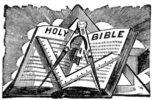
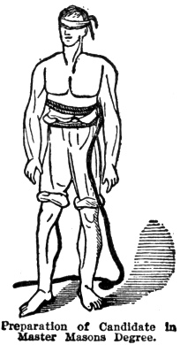
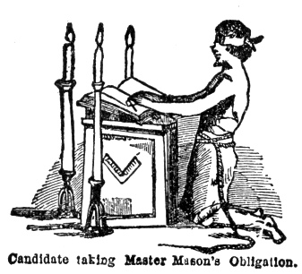
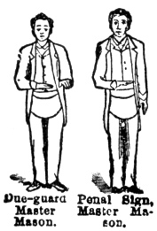
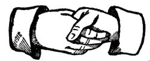
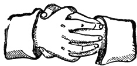
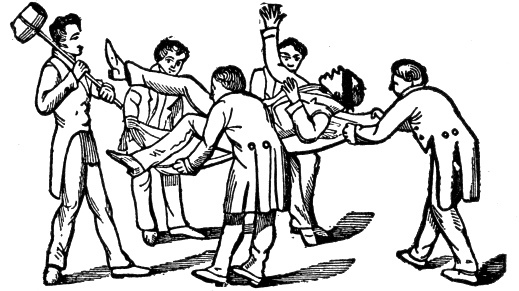

  
[Intangible Textual Heritage](../../index)  [Freemasonry](../index.md) 
[Index](index)  [Previous](morg17.md) 

------------------------------------------------------------------------

[Buy this Book at
Amazon.com](https://www.amazon.com/exec/obidos/ASIN/B002E9II90/internetsacredte.md)

------------------------------------------------------------------------

  
*Illustrations of Masonry*, by William Morgan, \[1827\], at Intangible
Textual Heritage

------------------------------------------------------------------------

### MASTER MASON'S DEGREE.

|                    |
|--------------------|
|  |

The Holy Bible ought to be opened at the 12th chapter of Ecclesiastes
and both points of the compass elevated above the square.

|                    |
|--------------------|
|  |

Preparation of Candidate Master Mason's
Degree.—He is conducted into the preparation room as in the
preceding degree. All his clothing is removed as before; both legs of
the drawers are tucked up above the knees, both sleeves of the shirt are
tucked up above the elbows, both breasts of the shirt are turned, making
both breasts bare. The hoodwink is again fastened over both eyes and the
cable-tow is put three times around his body. No slipper is used in this
degree. Should the shirt be closed in front, it must be taken off or
turned front backwards, as both breasts must be bare. An apron is then
tied on and worn as a Fellow Craft, and thus he is "duly and truly
prepared."

p. 109

|                    |
|--------------------|
|  |

Worshipful Master to Candidate, "You will advance to the altar, kneel
upon both your naked knees, both hands resting n the Holy Bible, square
and compass in which due form you will say, "I," with your name in full
and repeat after me"

|                    |
|--------------------|
|  |

Due-Guard of a Master Mason.—Extend both
hands in front of the body on a line with the lower button of the vest
with the palms open and turned downward, both hands being close
together, thumbs nearly touching.

Sign of a Master Mason.—Made from the due
guard by dropping the left hand carelessly and drawing the right across
the body from left to right side on a line with the lower button of the
vest, the hand being open as before, palm down. ward and the thumb
towards the body. Then drop the hand perpendicularly to the side.

Sign without Due-guard.—(Ordinary manner
outside the lodge.) Simply draw the right hand as above described,
carelessly across the body and drop it by the side.

|                    |
|--------------------|
|  |

Pass-Grip of a Master Mason—Take hold of
each other's hands as in ordinary hand shaking and press the top of your
thumb hard against the space between the second and third knuckles.
Should the man whose hand you shake be a Mason he may return or give any
previous grip.

Pass of Master Mason—Tubal Cain. It is
the name of this grip.

p. 110

|                    |
|--------------------|
|  |

Strong Grip of a Master Mason or Lion's
Paw.—Grasp each other's right hands very firmly, the spaces
between the thumb and first finger being interlocked and the tops of the
fingers being pressed hard against each other's wrist where it joins the
hand, the fingers of each being somewhat spread.

 

Candidate as Hiram Abiff falling into the
Canvas, having been struck in the forehead by the setting maul of
the supposed third ruffian, Jubelum.

Five Points of Fellowship.

Worshipful Master:—Which are the five points of fellowship?

|                    |
|--------------------|
|  |

Senior Deacon:—Foot to foot (Master and candidate extend their right
feet, placing the inside of one against that of the other). Knee to knee
(they bring their right knees together); breast to breast (they bring
their right breasts together); hand to back (Master places his left hand
on the candidate's back, the candidate's is placed by the Deacon on the
Master's back); cheek to cheek or mouth to ear (Master puts his mouth to
candidate's right ear thus bringing the right cheek of each together.
See figure).

Master's Words— (whispered in the ear of
the candidate), *Mah-hah bone*, after which the candidate whispers the
same word in the Master's ear.

 

 

 

 
