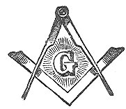

  
[Intangible Textual Heritage](../../index)  [Freemasonry](../index) 
[Index](index)  [Next](omtx01) 

------------------------------------------------------------------------

p. 1

# THE OFFICIAL MONITOR

##### of the

#### Grand Lodge of Ancient Free and Accepted Masons

#### State of Texas

 

#### Adopted December, 1921

###### GAYLE PRINTING CO. WACO

p. 2

###### COPYRIGHT

###### BY THE

###### GRAND LODGE OF TEXAS

###### A.F.&A.M.

#### 1922

###### NOTICE OF ATTRIBUTION scanned at Intangible Textual Heritage, December 2004. John Bruno Hare, redactor. This text is in the public domain in the United States because it was published in or before 1922. These files may be used for any non-commercial purpose, provided this notice of attribution is retained intact in all copies.

------------------------------------------------------------------------

[Next: Approval of Revision](omtx01)
