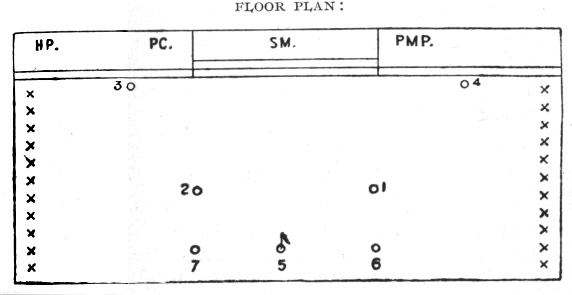
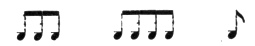
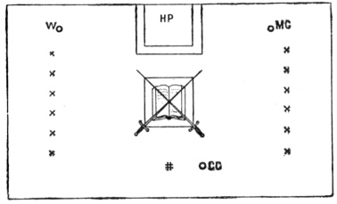

  
[Intangible Textual Heritage](../../index)  [Freemasonry](../index) 
[Index](index)  [Previous](shib05)  [Next](shib07) 

------------------------------------------------------------------------

[Buy this Book at
Amazon.com](https://www.amazon.com/exec/obidos/ASIN/0766158284/internetsacredte)

------------------------------------------------------------------------

  
*Shibboleth: A Templar Monitor*, by George Cooper Connor, \[1894\], at
Intangible Textual Heritage

------------------------------------------------------------------------

p. 15

### TO OPEN A COUNCIL OF THE RED CROSS.

The Council Chamber is suitably arrayed
under the direction of the Prince Master of the Palace.

 

 

 

#### RECEPTION OF SOVEREIGN MASTER.

 

##### PRAYER.

Almighty and Eternal Jehovah, the only
living and true God whose throne is in the heavens, yet who regardest
alike the princes and the people that dwell upon earth, we

p. 16

desire to thank thee for the many mercies and blessings with which thou
hast been pleased to crown our lives. We thank thee for this social and
fraternal intercourse with our Companions. Be mercifully near us at all
times, and give us the aid of thy Holy Spirit to guide us into all Truth. Grant us thy grace to cheer and
strengthen us in our journey through life, and deliverance from the
snares and pitfalls of the Evil One. Incline our hearts to seek thy
favor and protection, as our rightful Sovereign, that we may not be
impeded in the great work of erecting a spiritual edifice that shall
endure forever. Pardon all our sins, we beseech thee, and finally admit
us into the presence of the King of Kings, as members of his eternal
household. Amen! Response, Amen!

\_\_\_\_\_\_\_\_\_

##### or this:

Merciful Father, have mercy upon us, we
beseech thee; put understanding in our minds, enlighten our eyes, and
cause our hearts to cleave to thy law. Because we have trusted in thy
Name we will rejoice and be glad in thy salvation, and in thy mercies, O
Lord, our God. Cause us to cleave unto thy great Name forever, and bring
upon us from the four corners of the earth the blessing of peace,
harmony and prosperity. Blessed art thou, O Lord God, who hast chosen
thy people in love. And when we have accomplished thy will upon earth
receive us to thyself, and unto thy great and holy Name shall be the
glory for ever and ever. Amen! Response,
Amen.

 

##### SIGNS.

 

p. 17

##### REHEARSAL OF DUTIES.

In this rehearsal each Officer, when addressed, will arise and Salute. \* \* \* The Officer will come to Carry
Swords, and stand firm until the close of the Ceremonial, or until a
subsequent order issued to him \* \* \*

\_\_\_\_\_\_\_\_\_\_\_\_\_

#### THE WORK.

\_\_\_\_\_\_

The Council of the Illustrious Order of the Red Cross being open, and
the Council Hall being properly equipped
for the formation of the Grand Council.

 

 

#### HIGH PRIEST'S ADDRESS.

 

------------------------------------------------------------------------

[Next: The Records of our Fathers](shib07)
