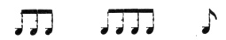

  
[Intangible Textual Heritage](../../index)  [Freemasonry](../index.md) 
[Index](index)  [Previous](shib07)  [Next](shib09.md) 

------------------------------------------------------------------------

[Buy this Book at
Amazon.com](https://www.amazon.com/exec/obidos/ASIN/0766158284/internetsacredte.md)

------------------------------------------------------------------------

  
*Shibboleth: A Templar Monitor*, by George Cooper Connor, \[1894\], at
Intangible Textual Heritage

------------------------------------------------------------------------

p. 21

#### THE JOURNEY.

The road from Jerusalem to Susa, the chief treasury of Persia, and one
of the favorite cities of the Persian kings, lay in part through the
country restored to the Jews by the decree of Cyrus, but after crossing
the Euphrates it was entirely in the domain of King Darius. Indeed, a
more cautious statement would limit the Jewish country to west of the
Jordan.

The Jews attempted, in an embarrassed way, to picket their own country,
and to provide passes with which to distinguish their friends. The
domain of the Persian monarch was under strict military surveillance,
and countersigns were absolutely necessary to travel therein with
safety.

Darius lived in daily dread of spies and secret enemies front among the
defeated, though not destroyed, Magians. The discipline of the empire
was sternly strict, and the slightest suspicion of disloyalty led to
captivity and death.

 

##### IN THE PRESENCE OF THE KING.

 

 

 

p. 22

 

 

------------------------------------------------------------------------

[Next: The Immemorial Discussion](shib09.md)
