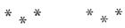

  
[Intangible Textual Heritage](../../index)  [Freemasonry](../index.md) 
[Index](index)  [Previous](shib16)  [Next](shib18.md) 

------------------------------------------------------------------------

[Buy this Book at
Amazon.com](https://www.amazon.com/exec/obidos/ASIN/0766158284/internetsacredte.md)

------------------------------------------------------------------------

  
*Shibboleth: A Templar Monitor*, by George Cooper Connor, \[1894\], at
Intangible Textual Heritage

------------------------------------------------------------------------

p. 45

### TO OPEN A COMMANDERY.

\_\_\_\_\_\_\_\_\_\_\_\_\_\_\_\_\_\_

Knights templar begin the duties of their
Asylums with quiet manner and subdued spirit. At the conclusion there
should be only pathetic memories of solemn ceremonials. Levity, loud
speech, military drill, are not to be encouraged in the ceremonies of
Knighthood.

The Asylum is suitably arrayed under the direction of the Captain
General, who is responsible to the Commander that everything is in
readiness, both for the transaction of business and the reception of
candidates.

 

 

 

#### RECEPTION OF EMINENT COMMANDER.

Each Jurisdiction will conduct this ceremonial according to the Tactics
it may have adopted.

p. 46

##### COMMUNICATIONS.

Across the Lines.—      \*   \*   \*

This ceremony admits of very little variation. Nevertheless the Grand
Encampment permits each Grand Jurisdiction to conduct the same according
to the Tactics it may have adopted for its government.

The ceremony should be conducted with dignity and precision. A knowledge
of the use of the sword is necessary to that dignity and precision;
therefore the Sword Exercise should not be neglected by the
Commanderies.

Commanders will discover a greater precision when the numbers are called
by the Captain General.

 

Through the Lines.—Care is necessary to
make this ceremony effective.

 

p. 47

Through Both Lines Simultaneously.—

 

##### FIRST ANNUNCIATION.

Behold, a virgin shall be with child, and shall bring forth a son, and
they shall call his name (or his name shall be called) Emmanuel, which
being interpreted is, God With Us. Matt.
i: 23.

 

 

##### INSPECTION AND REVIEW,

 

If the Commander should desire to have Inspection and Review he will
order them here. They will be conducted according to the Tactics of the
Jurisdiction.

 

##### PRAYER.

Almighty and Most Merciful Father, send
down upon us at this time the dew of thy heavenly grace; forgive our
many transgressions; refresh us with the sweetness of thy love, and
enrich our hearts with patience and hope. May

p. 48

we bear each other's burdens here, and may we live together hereafter in
that blessed kingdom to which thy glorified Son will

|                    |
|--------------------|
|  |

welcome his disciples. And to thy great and matchless Name shall be all
the glory through Jesus Christ, Emmanuel. Amen.

Our Father which art in heaven, Hallowed be thy name. Thy kingdom come.
Thy will be done in earth, as *it is* in heaven. Give us this day our
daily bread. And forgive us our debts, as we forgive our debtors.

And lead us not into temptation, but deliver us from evil: For thine is
the kingdom, and the power; and the glory, forever. Amen.

Other devotional exercises may occur at this point
in the opening.

 

The S—s should be given by the entire Commandery, hence it is proper to
give them *after* the Triangle is reduced.

 

##### REHEARSAL OF DUTIES.

Each officer being in his station, it is eminently fit and proper that
he should rehearse aloud the duties that appertain to his office. He
should do so in an attitude of dignified respect.

When an officer is addressed he will arise, and salute as directed in
the Ritual. After he has replied he will stand fast until the conclusion
of the opening ceremonial, or until addressed again.

 

##### SENTINEL INFORMED.

p. 49

 

 

##### IN SHORT FORM.

A Commandery should always be opened in Full Form. What is worth doing
at all is worth doing well. Commanders should not gratify a mere desire
to shirk formality. But if circumstances render abbreviation
imperatively necessary, then there is a Form that must be observed. Under no circumstances shall
less than that Essential Form be observed. Commanders will not overlook
that Ritual requirement.

------------------------------------------------------------------------

[Next: The Work](shib18.md)
