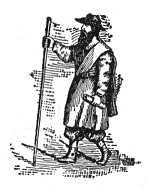

  
[Intangible Textual Heritage](../../index)  [Freemasonry](../index.md) 
[Index](index)  [Previous](shib17)  [Next](shib19.md) 

------------------------------------------------------------------------

[Buy this Book at
Amazon.com](https://www.amazon.com/exec/obidos/ASIN/0766158284/internetsacredte.md)

------------------------------------------------------------------------

  
*Shibboleth: A Templar Monitor*, by George Cooper Connor, \[1894\], at
Intangible Textual Heritage

------------------------------------------------------------------------

\_\_\_\_\_\_\_\_\_\_\_\_\_\_\_\_\_\_\_\_\_

##### THE WORK.

The Asylum in suitable array; the Guards ready to take their stations;
the Escort selected and conveniently seated; the Chambers properly
equipped, and the Questions on the pedestal of the Commander. The
reception of a Candidate begins.

 

During the period that immediately succeeded the Crusades a civil Knight
made a vow to visit the Sepulchre of his Lord and Master. Attracted by
the chivalrous deeds of the Templars,—for their deeds of charity and
pure beneficence had spread their fame both far and wide,—he sought
admission to their ranks, the better to fulfill his vow.

The Commander of the House of the Temple to which he made application,
finding that he came "under the tongue of good report," and that he was
upright in character and moral of conduct, was moved to grant his
prayer, but as a trial of his worthiness to be enrolled among the
members of the Valiant and Magnanimous Order of the Temple enjoined upon
him Seven Years of Preparation. These began with an unarmed pilgrimage
towards the Holy Sepulchre.

 

p. 50

##### THE CHAMBER.

The first impressions are almost indelible. How important that they
should be solemnized by proper discourse in the sombre surroundings of
Reflection.

 

Sincerity of desire and purity of intention are absolutely necessary to
the beginning of a pilgrimage to the Shrine of Emmanuel.

#### THE ASYLUM.

 

The Report includes the necessary answers, and the avouchment of the
sincerity of desire, and the purity of motive. This made, the Seven
Years of Preparation begin.

 

##### THE PILGRIMAGE.

|                    |
|--------------------|
|  |

Three years were passed by the petitioning civil Knight in his weary,
unarmed pilgrimage, mostly in a friendly country, in which he received
from pious Hermits bread and water; coarse diet, but such as he stood
sadly in need of. From these pious anchorites he also received lessons
of comfort and consolation.

Day after day the manhood of this gallant Knight asserted itself, and he
yearned to cast off the pilgrim's garb and take up the sword in defense
of his fellow pilgrims *en route* to the Holy Shrine. Thus yearning and
pleading with his Templar escort, he reached, at the end of three years,
another House of the Templars.

 

First Hermit.—

Let the brother of low degree rejoice in that he is exalted.

Come unto me, all ye that labor and are heavy laden, and I will give you
rest.

p. 51

Christ also suffered for us, leaving us an example, that ye should
follow his steps.

For ye were as sheep going astray; but are now returned unto the
Shepherd and Bishop of your souls.

Let brotherly love continue.

 

Second Hermit.—

To do good and to communicate forget not: for with such sacrifices God
is well pleased.

Be not forgetful to entertain strangers: for thereby some have
entertained angels unawares.

Remember them that are in bonds, as bound with them; and them which
suffer adversity, as being yourselves also in the body.

Let us not be weary in well doing: for in due season we shall reap, if
we faint not.

 

Third Hermit.—

Charity shall cover the multitude of sins.

If a brother or sister be naked, and destitute of daily food, and one of
you say unto them, Depart in peace, be ye warmed and filled;
notwithstanding ye give them not those things which are needful to the
body; what doth it profit?

Be thou faithful unto death, and I will give thee a crown of life.

 

Three years of his Preparation being ended, another House of the
Templars was reached.

------------------------------------------------------------------------

[Next: Second House of the Templars](shib19.md)
