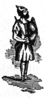
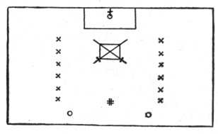

  
[Intangible Textual Heritage](../../index)  [Freemasonry](../index) 
[Index](index)  [Previous](shib18)  [Next](shib20) 

------------------------------------------------------------------------

[Buy this Book at
Amazon.com](https://www.amazon.com/exec/obidos/ASIN/0766158284/internetsacredte)

------------------------------------------------------------------------

  
*Shibboleth: A Templar Monitor*, by George Cooper Connor, \[1894\], at
Intangible Textual Heritage

------------------------------------------------------------------------

p. 52

### SECOND HOUSE OF THE TEMPLARS.

 

|                    |
|--------------------|
|  |

The escort pleaded that the four remaining years might be devoted to
deeds of more exalted usefulness. He vouched for the sincerity of the
suppliant.

The prayer of the suppliant was granted, and he was admitted to the
Vows.

 

The laying aside of the pilgrim's garb, and the sandals, staff, and
scrip, was followed by the taking up of the sword and buckler, and the
consecrating of the sword to the noblest of uses.

##### THE VOW.

 

 

The gallant Knight sallied forth, armed with sword and buckler, ready to
defend the Christian religion, or any pilgrim, or devotee, whether the
same should be innocent maiden, destitute widow, or helpless orphan.
Onward he pressed, with fortitude undaunted, accepting the duty of
clothing the naked, feeding the hungry, and binding up the wounds of the
afflicted; thus giving ample proof that he was worthy of drawing the
sword he had so solemnly consecrated.

Pride and selfishness came with the accomplishment of valorous deeds,
and he began to yearn for those honors and rewards that awaited the
valiant Knights Templar, whom he found guarding the dangerous passes. No
rewards, and no permanent honors awaited unorganized warfare. He had
traveled on during three years with patience and perseverance, and
during the three years last past he had given ample proofs of his
courage and constancy. "Why should I longer be preparing?" he asked of
his warrior escort. While he thus pleaded six years of his Preparation
were accomplished, and they reached a third House of the

p. 53

\[paragraph continues\] Templars. Then he
pleaded with his Templar companion to beseech the Commander of that
House to remit the remaining year of his Preparation.

Naturally his Templar companion hesitated to make such a request, and
carefully interrogated his ward. At last it was agreed that if the
suppliant could declare in truth and soberness that his heart was right
with man, and before God, he would vouch for him to the Commander, and
present his petition for remission.

------------------------------------------------------------------------

[Next: Third House of the Templars](shib20)
