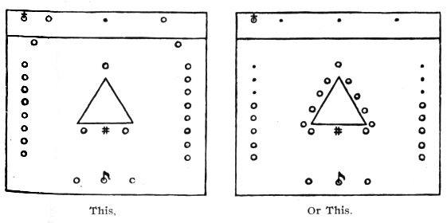
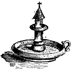
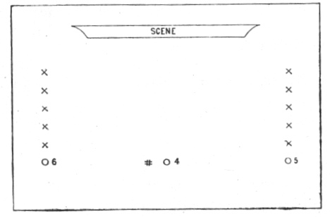

  
[Intangible Textual Heritage](../../index)  [Freemasonry](../index.md) 
[Index](index)  [Previous](shib19)  [Next](shib21.md) 

------------------------------------------------------------------------

[Buy this Book at
Amazon.com](https://www.amazon.com/exec/obidos/ASIN/0766158284/internetsacredte.md)

------------------------------------------------------------------------

  
*Shibboleth: A Templar Monitor*, by George Cooper Connor, \[1894\], at
Intangible Textual Heritage

------------------------------------------------------------------------

#### THIRD HOUSE OF THE TEMPLARS.

 

 

There is a legend told beyond seas to this effect: When the Papacy
decided to suppress the Templars it sent out spies to apply to the Order
as neophytes, and if admitted, to betray the secrets to the Church.
Absolution from vows so taken was promised.

The Templars sought to protect themselves from treason of every kind,
and it is said that when a neophyte was not absolutely above suspicion
the Commander directed that he be tested by a solemn imprecation,
accompanied by a draft from a cup containing blood taken from his veins
at that moment, and mingled with wine. This in imitation of the blood
and water that flowed from the Saviour's side. That ceremony was truly
appalling in those days of superstition; it would have small influence
were it practiced in this age of intelligence.

 

##### THE ENTRANCE.

 

p. 54

 

1\. Fear God and keep his commandments.

2\. Embalm in acts of charity, and deeds of pure beneficence.

3\. Yield up life rather than forfeit integrity.

 

First Lesson.—Then one of the twelve,
called Judas Iscariot, went unto the chief priests,

And said *unto them*, What will ye give me, and I will deliver him unto
you? And they covenanted with him for thirty pieces of silver.

And from that time he sought opportunity to betray him.

Now, the first *day* of the *feast of* unleavened bread the disciples
came to Jesus, saying unto him, Where wilt thou that we prepare for thee
to eat the passover?

And he said, Go into the city to such a man, and say unto him, The
Master saith, My time is at hand; I will keep the passover at thy house
with my disciples.

And the disciples did as Jesus had appointed them; and they made ready
the passover.

Now when the even was come, he sat down with the twelve.

And as they did eat, he said, Verily I say unto you, that one of you
shall betray me.

And they were exceeding sorrowful, and began every one of them to say
unto him, Lord, is it I?

p. 55

And he answered and said, He that dippeth *his* hand with me in the
dish, the same shall betray me.

The Son of man goeth as it is written of him: but woe unto that man by
whom the Son of man is betrayed! it had been good for that man if he had
not been born. Then Judas, which betrayed him, answered and said,
Master, is it I? He said unto him, Thou hast said. Matt. xxvi: 14-25.

 

|                    |
|--------------------|
|  |

The number of the Apostles of our Saviour while on earth was Twelve. One
of them betrayed his Lord and Master. His light was extinguished as the
symbol of direst condemnation.

 

The extinguishment of light was the ancient symbol of the direst
punishment for crime. Ezekiel xxxii: 7, says: "And when I shall put thee
out (extinguish), I will cover the heaven, and make the stars thereof
dark." How forcibly is this thought brought to the mind of the neophyte
in this ceremonial.

Second Lesson.—Then cometh Jesus with
them unto a place called Gethsemane, and saith unto the disciples, Sit
ye here, while I go and pray yonder.

And he took with him Peter and the two sons of Zebedee, and began to be
sorrowful and very heavy.

Then saith he unto them, My soul is exceeding sorrowful, even unto
death: tarry ye here, and watch with me.

And he went a little farther, and fell on his face, and prayed, saying,
O my Father, if it be possible, let this cup pass from me: nevertheless,
not as I will, but as thou *wilt*.

And he cometh unto the disciples, and findeth them asleep, and saith
unto Peter, What, could ye not watch with me one hour?

p. 56

The lowering of the l—s alludes to the allegory
related by Ezekiel, in regard to covering the heavens, and making the
stars thereof dark.

Watch and pray, that ye enter not into temptation: the spirit indeed
*is* willing, but the flesh *is* weak.

He went away again the second time, and prayed, saying, O my Father, if
this cup may not pass away from me, except I drink it, thy will be done.

And he came and found them asleep again: for their eyes were heavy.

And he left them, and went away again, and prayed the third time, saying
the same words.

Then cometh he to his disciples, and saith unto them, Sleep on now, and
take *your* rest: behold, the hour is at hand, and the Son of man is
betrayed into the hands of sinners.

Rise, let us be going: behold, he is at hand that Both betray me.

And while he yet spake, lo, Judas, one of the twelve, came, and with him
a great multitude with swords and staves, from the chief priests and
elders of the people.

Now he that betrayed him gave them a sign, saying, Whomsoever I shall
kiss, that same is he: hold him fast.

And forthwith he came to Jesus, and said, Hail, Master; and kissed him.
Matt. xxvi: 41-49.

 

Uncovering with great solemnity, and with soft music, desirable.

 

It is the creed of the Templar that all the hopes of his poor perishing
body rest upon the truths revealed in the Word of God; and that amid all
the vicissitudes of life an unswerving faith in those truths can alone
afford him that strong consolation which the world can neither give nor
take away.

 

p. 57

Third Lesson.—    \*   \*   \*

When Pilate saw that he could prevail nothing, but *that* rather a
tumult was made, he took water, and washed *his* hands before the
multitude, saying, I am innocent of the blood of this just person: see
ye *to it*.

Then answered all the people, and said, His blood *be* on us, and on our
children.

Then released he Barabbas unto them: and when he had scourged Jesus, he
delivered *him* to be crucified.

Then the soldiers of the governor took Jesus into the common hall, and
gathered unto him the whole band *of soldiers*.

And they stripped him, and put on him a scarlet robe.

And when they had platted a crown of thorns, they put *it* upon his
head, and a reed in his right hand: and they bowed the knee before him,
and mocked him, saying, Hail, King of the Jews!

And they spit upon him, and took the reed, and smote him on the head.

And after that they had mocked him, they took the robe off from him, and
put his own raiment on him, and led him away to crucify *him*.

And as they came out, they found a man of Cyrene, Simon by name: him
they compelled to bear his cross.

And when they were come unto a place called Golgotha, that is to say, a
place of a skull,

They gave him vinegar to drink, mingled with gall: and when he had
tasted *thereof*, he would not drink.

And they crucified him, and parted his garments, casting lots: that it
might be fulfilled which was spoken by the prophet, They parted my
garments among them, and upon my vesture did they cast lots.

And sitting down, they watched him there;

And set up over his head his accusation written, This is Jesus, the King of the Jews. Matt.
xxvii: 24-37.

p. 58

 

 

Let each so wear the cross as to be deemed worthy to wear the crown.

 

The ecclesiastical legend that Simon of Cyrene was the "early friend and
companion of our Saviour," and that "he fell a martyr to his faith," is
not accepted by the Order of the Temple. It is probable that Simon was a
chance spectator of the procession to Calvary, and that the Romans,
scorning to burden themselves with the cross of execution, impressed
this foreigner, and forced him to bear the fatal tree after Jesus had
fallen under its weight. There appears to be some proof that Simon
afterwards became a member of the Christian community.

 

Well might the suppliant, now more haughty than humble, be required to
meditate upon the uncertainty of all things earthly. O death! who shall
resist thy imperious mandate; who shall bid thee defiance!

 

The petitioning Knight was now required to devote the remaining year of
Preparation to penitence and self-abnegation. Clothed in an emblem of
innocence, and bearing symbols of Faith and Humility, he was enjoined to
so let his light shine before men that they might glorify his Father
which is in heaven.

 

#### "WHERE THE LORD LAY."

 

In the end of the sabbath, as it began to dawn toward the first *day* of
the week, came Mary Magdalene and the other

p. 59

\[paragraph continues\] Mary to see the
sepulchre. And, behold, there was a great earthquake: for the angel of
the Lord descended from heaven,

and came and rolled back the stone from the door, and sat upon it. His
countenance was like lightning, and his raiment white as snow: And for
fear of him the keepers did shake, and became as dead men. And the angel
answered and said unto the women, Fear not ye: for I know that ye seek
Jesus, which was crucified. He is not here: for he is risen, as he said.
Come, see the place where the Lord lay. Matt. xxviii: i-6.

 

And as it is appointed unto men once to die, but after this the
judgment: So Christ was once offered to bear the, sins of many; and unto
them that look for him shall he appear the second time without sin unto
salvation. Heb. ix: 27, 28.

And go quickly, and tell his disciples that he is risen from the dead;
and, behold, he goeth before you into Galilee; there shall ye see him:
lo, I have told you.

And they departed quickly from the sepulchre with fear and great joy;
and did run to bring his disciples word. And as they went to tell his
disciples, behold, Jesus met them, saying, All hail. And they came and
held him by the feet, and worshipped him. Then said Jesus unto them, Be
not afraid: go tell my brethren that they go into Galilee, and there
shall they see me. Matt. xxviii: 7-10.

 

#### TOWARDS BETHANY.

 

I am the resurrection, and the life: he that believeth in me, though he
were dead, yet shall he live. And whosoever

p. 60

liveth and believeth in me shall never die. John xi: 25, 26.

And he led them out as far as to Bethany, and he lifted up his hands,
and blessed them. And it came to pass, while he blessed them, he was
parted from them, and carried up into heaven. Luke xxiv: 50, 51.

 

### HYMNS.

AIR, *Old Hundred*.
L. M.

The rising God forsakes the tomb!  
  Up to his Father's court he flies;  
Cherubic legions guard him home,  
  And shout him welcome to the skies.

Break off your tears, ye saints, and tell  
  How high our great deliv’rer reigns,  
Sing how he spoil’d the hosts of hell,  
  And led the tyrant, death, in chains.

AIR, *Hendon*.
7s.

Lo! the heavens its Lord receives,  
Yet he loves the earth he leaves;  
Though returning to his throne,  
Still he calls mankind his own.

p. 61

Lord, though parted from our  
Far above the starry height, sight,  
Grant our hearts may thither rise,  
Seeking thee above the skies.

------------------------------------------------------------------------

[Next: Close of Seven Years of Preparation](shib21.md)
