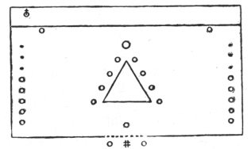
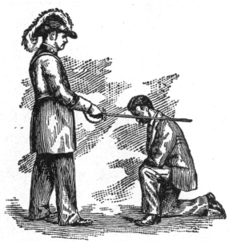

  
[Intangible Textual Heritage](../../index)  [Freemasonry](../index) 
[Index](index)  [Previous](shib20)  [Next](shib22) 

------------------------------------------------------------------------

[Buy this Book at
Amazon.com](https://www.amazon.com/exec/obidos/ASIN/0766158284/internetsacredte)

------------------------------------------------------------------------

  
*Shibboleth: A Templar Monitor*, by George Cooper Connor, \[1894\], at
Intangible Textual Heritage

------------------------------------------------------------------------

 

#### CLOSE OF SEVEN YEARS OF PREPARATION.

 

One mode of entrance is thus accomplished. Silence reigns.

 

 

Another mode of entrance is thus secured. Silence reigns.

 

Plaintive music touches the heart of the neophyte while gazing at the
solemn observance of Prayer and Meditation. The memorial of the betrayal
before him, he laments the disloyalty of the one so fully trusted.
Thrilled by the surroundings, he craves admission, that he, too, might
seal his faith, never to be renounced.

 

His allotted year of Penitence had ended, but his need of penitence had
not, since all men err, and erring need repentance.

 

p. 62

Alas! men are born to die! Can man be too frequently reminded of this.

 

 

Why should the humble follower of Jesus loiter in his footsteps, or fall
by the wayside? Is not Jesus sufficient? He is, and should temptation
assail; should misfortune befall; should all the world seem to forsake
the true Soldier of Christ, he will nevertheless remain faithful to his
vows. And he will never bring disgrace upon himself, or reproach upon
the name of Him under whose banner he has enlisted.

 

The casting of lots was an ancient custom, and is frequently mentioned
in the Scriptures. Several methods of casting the lots were practiced.
Solomon says, Proverbs xvi: 33, "The lot is cast into the lap," That is,
the pebble is cast into the *bechif*,—lap, or bottom of an urn. Perhaps
a literal rendering of the verse quoted above will cast some light on
that one method.

"In a lot-vase the lots are shaken in all directions; nevertheless, from
the Lord is their whole decision,—judgment."

The Order of the Temple has adopted a method of "casting lots" peculiar
to itself.

 

And in those days Peter stood up in the midst of the disciples, and
said, (the number of names together were about an hundred and twenty,)

Men *and* brethren, the scripture must needs have been fulfilled, which
the Holy Ghost by the mouth of David spake before concerning Judas,
which was guide to them that took Jesus.

For he was numbered with us, and had obtained part of this ministry.

p. 63

Now this man purchased a field with the reward of iniquity; and falling
headlong, he burst asunder in the midst, and all his bowels gushed out.

And it was known unto all the dwellers at Jerusalem; insomuch as that
field is called in their proper tongue, Aceldama, that is to say, The
field of blood.

For it is written in the book of Psalms, Let his habitation be desolate,
and let no man dwell therein: and his bishopric let another take.

Wherefore of these men which have companied with us all the time that
the Lord Jesus went in and out among us,

Beginning from the baptism of John, unto that same day that he was taken
up from us, must one be ordained to be a witness with us of his
resurrection.

And they appointed two, Joseph called Barsabas, who was surnamed Justus,
and Matthias. And they prayed, and said, Thou, Lord, which knowest the
hearts of all *men*, show whether of these two thou hast chosen,

That he may take part of this ministry and apostleship, from which Judas
by transgression fell, that he might go to his own place.

And they gave forth their lots; and the lot fell upon Matthias; and he
was numbered with the eleven apostles. Acts i: 15-26.

 

When Judas betrayed his Lord and Master his light became darkness in the
college of Apostles. When the divine wisdom selected Matthias to fill
the vacancy that light was restored. Sin puts out the divine light in
the heart, but it is restored when the heart elects to serve the Master
unto death.

 

p. 64

 

It was the custom of the Grand Master to put his arm about the neck of
the initiate, and thus make him a Templar. Anciently kings conferred
knighthood in the same way.

The word Accolade is front *ad*, to, and *collum*, the neck. The embrace
has long passed out of use, and the single blow on the candidate's left
shoulder with the blade of the sword has been adopted.

 

It is generally held that the one blow with the blade of the Sword had
its origin in the single blow which the slave of the Romans received at
his manumission.

 

p. 65

##### THE BALDRIC.

Such Grand Commanderies as have discarded the Baldric are excused from
the ceremony of its investiture.

 

##### THE SWORD.

The investiture of the Sword is an imposing and an imperative
ceremonial.

 

##### THE SPUR.

The investiture of the Spur is left to the discretion of the Grand
Commanderies, and of Commanders where Grand Commanderies have taken no
action thereon.

 

##### MEANS OF RECOGNITION.

 

------------------------------------------------------------------------

[Next: The Banners](shib22)
