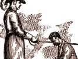

  
[Intangible Textual Heritage](../../index)  [Freemasonry](../index.md) 
[Index](index)  [Previous](shib46)  [Next](shib48.md) 

------------------------------------------------------------------------

[Buy this Book at
Amazon.com](https://www.amazon.com/exec/obidos/ASIN/0766158284/internetsacredte.md)

------------------------------------------------------------------------

  
*Shibboleth: A Templar Monitor*, by George Cooper Connor, \[1894\], at
Intangible Textual Heritage

------------------------------------------------------------------------

p. 165

# THIRD APPENDIX.

p. 166 p. 167

### RECEPTION OF GRAND VISITORS.

The following
suggestions will aid Subordinate Commanderies in receiving Grand
Visitors:

#### THE GRAND MASTER.

The Grand Master is to be received in the Asylum with the highest honors
of the Order.

The Grand Master is received by a Committee, and escorted to the
quarters of the Eminent Commander.

The Asylum is put in suitable array, Banners unfurled, and the Organist
at his post. All Knights in full uniform.

The Lines are formed according to the Tactics of the Jurisdiction, ready
to form the Arch of Steel at the proper moment. All Officers in their
stations.

The announcement, by the Grand Warder, if present, if not, by one of the
Committee attending the Grand Master, is made at the door of the desire
of the Grand Master to officially visit the Commandery, whereupon the
Warder salutes the Eminent Commander, and says:

W.—Eminent Commander, Most Eminent the Grand Master has arrived, and
desires to visit this Commandery officially.

EC.—Sir Knights Generalissimo and Captain General (*these Officers
arise, draw and salute*), repair to the quarters

of the Most Eminent the Grand Master and escort him hither.

When the Grand Master and suite reach the open door
of the Asylum—

W.—THE GRAND MASTER OF TEMPLARS!

Immediately the Organist will play "Hail to the
Chief," the Banners will be drooped, and the Officers will
salute.

p. 168

EC.—Form Arch of Steel.

The Grand Master enters, and passes down the avenue,
the Generalissimo and Captain General one pace in rear of him, under the
Arch of Steel, to the East, where the Eminent Commander receives him,
standing on the lowest step of the Dais. He welcomes him in appropriate
words, and hands him the Gavel. The Grand Master ascends to the
Commander's station, the Eminent Commander, the Generalissimo and
Captain General remain standing on the lowest step, and on the
floor.

GM.—Sir Knights, *Carry* Swords!

He will then make such remarks as he desires, after
which the Captain General will dismiss the Lines, and all are
seated.

#### ARRAY OF ASYLUM DURING RECEPTION OF GRAND MASTER.

The following diagrams illustrate formations at two periods of the
reception of the Grand Master:

  [  
Click to enlarge](img/16800.jpg.md)  
Diagram 1.  

p. 169

  [  
Click to enlarge](img/16900.jpg.md)  
Diagram 2.  

In the first diagram the Grand Master is seen moving towards the East
under the Arch of Steel, the Generalissimo and Captain General one step
in his rear, and the Eminent Commander awaiting his arrival on the
lowest step of the Dais. The Prelate is in his station, standing, and
the Senior Warden, the Junior Warden, the Treasurer and Recorder are
saluting. The Standard is drooped, and the Senior Warden and the Warder
are saluting.

In the second diagram the Grand Master has reached the East, and, Gavel
in hand, is about to command "Carry Swords."

#### THE GRAND COMMANDER.

The Grand Commander is received under the Arch of Steel, Banners
drooping, and Officers saluting. Organ plays a March. He is conducted to
the Asylum by an escort under command of the Generalissimo. The Grand
Commander passes under the Arch of Steel to the East, where the Eminent
Commander receives him, standing on the second step of the Dais, the
Captain General on the lowest step.

p. 170

The Warder will announce—

The Grand Commander of ————— !

\_\_\_\_\_\_\_\_\_\_\_\_\_\_\_\_\_\_\_\_

The Grand Master and the Grand Commander, and their representatives, are
the only visitors that are to be received under the Arch of Steel, or
that are to be recognized by any descent from the official positions on
the Dais.

The Deputy Grand Master is received like
the Grand Master, except the Arch of Steel, the "Hail to the Chief," and
the descent from the Dais. The Knights forming the avenue present
Swords, the Officers salute, and the organ plays a March.

The Deputy Grand Commander is received
like the Deputy Grand Master, except the organ plays three flourishes.

All Other Grand Officers are received
with the Officers and members in their regular stations, Officers
saluting, members at Present, and Banners drooping. Organ will play one
flourish when the visitor enters, and before the Knight escorting him
begins his words of introduction. The visitor will stand in the West
during the presentation, the Officers and members remaining at Salute
and Present until the visitor reaches the East, when the Captain General
will bring all to a Carry.

The Eminent Commander will welcome the visitor and assign him a seat.

------------------------------------------------------------------------

[Next: Hints to Eminent Commanders](shib48.md)
