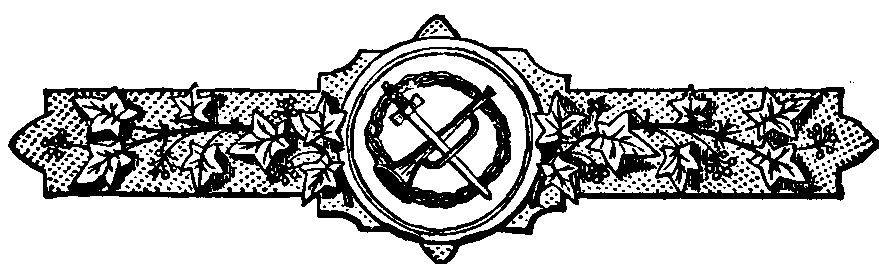

  
[Intangible Textual Heritage](../../index)  [Freemasonry](../index) 
[Index](index)  [Previous](sof03)  [Next](sof05) 

------------------------------------------------------------------------

 

## II.

### The Noachidæ.

I proceed, then, to inquire into the historical origin of Freemasonry,
as a necessary introduction to any inquiry into the character of its
symbolism. To do this, with any expectation of rendering justice to the
subject, it is evident that I shall have to take my point of departure
at a very remote era. I shall, however, review the early and antecedent
history of the institution with as much brevity as a distinct
understanding of the subject will admit.

Passing over all that is within the antediluvian history of the world,
as something that exerted, so far as our subject is concerned, no
influence on the new world which sprang forth from the ruins of the old,
we find, soon after the cataclysm, the immediate descendants of Noah in
the possession of at least two religious truths, which they received
from their common father, and which he must have derived from the line
of patriarchs who preceded him. These truths were the doctrine of the
existence of a Supreme Intelligence, the Creator, Preserver, and Ruler
of the Universe, and, as a necessary corollary, the belief in the
immortality of the soul [1](sof37.htm#xref_1), which, as an emanation
from that primal cause, was to be distinguished, by a future and eternal
life, from the vile and perishable dust which forms its earthly
tabernacle.

The assertion that these doctrines were known to and recognized by Noah
will not appear as an assumption to the believer in divine revelation.
But any philosophic mind must, I conceive, come to the same conclusion,
independently of any other authority than that of reason.

The religious sentiment, so far, at least, as it relates to the belief
in the existence of God, appears to be in some sense innate, or
instinctive, and consequently universal in the human
mind [2](sof37.htm#xref_2). There is no record of any nation, however
intellectually and morally debased, that has not given some evidence of
a tendency to such belief. The sentiment may be perverted, the idea may
be grossly corrupted, but it is nevertheless there, and shows the source
whence it sprang [3](sof37.htm#xref_3).

Even in the most debased forms of fetichism, where the negro kneels in
reverential awe before the shrine of some uncouth and misshapen idol,
which his own hands, perhaps, have made, the act of adoration, degrading
as the object may be, is nevertheless an acknowledgment of the longing
need of the worshipper to throw himself upon the support of some unknown
power higher than his own sphere. And this unknown power, be it what it
may, is to him a God. [4](sof37.htm#xref_4)

But just as universal has been the belief in the immortality of the
soul. This arises from the same longing in man for the infinite; and
although, like the former doctrine, it has been perverted and corrupted,
there exists among all nations a tendency to its acknowledgment. Every
people, from the remotest times, have wandered involuntarily into the
ideal of another world, and sought to find a place for their departed
spirits. The deification of the dead, man-worship, or hero-worship, the
next development of the religious idea after fetichism, was simply an
acknowledgment of the belief in a future life; for the dead could not
have been deified unless after death they had continued to live. The
adoration of a putrid carcass would have been a form of fetichism lower
and more degrading than any that has been discovered.

But man-worship came after fetichism. It was a higher development of the
religious sentiment, and included a possible hope for, if not a positive
belief in, a future life.

Reason, then, as well as revelation, leads us irresistibly to the
conclusion that these two doctrines prevailed among the descendants of
Noah, immediately after the deluge. They were believed, too, in all
their purity and integrity, because they were derived from the highest
and purest source.

These are the doctrines which still constitute the creed of Freemasonry;
and hence one of the names bestowed upon the Freemasons from the
earliest times was that of the "*Noachidae*" or "*Noachites*" that is to
say, the descendants of Noah, and the transmitters of his religious
dogmas.

------------------------------------------------------------------------

[Next: III. The Primitive Freemasonry of Antiquity](sof05)

