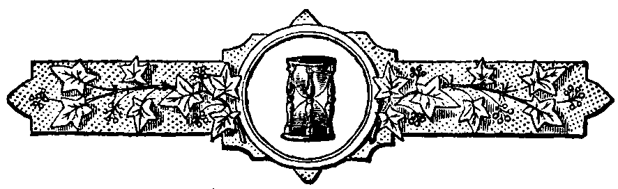

  
[Intangible Textual Heritage](../../index)  [Freemasonry](../index) 
[Index](index)  [Previous](sof16)  [Next](sof18) 

------------------------------------------------------------------------

 

## XV.

### The Point Within a Circle.

The point within a Circle is another symbol of great importance in
Freemasonry, and commands peculiar attention in this connection with the
ancient symbolism of the universe and the solar orb. Everybody who has
read a masonic "Monitor" is well acquainted with the usual explanation
of this symbol. We are told that the point represents an individual
brother, the circle the boundary line of his duty to God and man, and
the two perpendicular parallel lines the patron saints of the order--St.
John the Baptist and St. John the Evangelist.

Now, this explanation, trite and meagre as it is, may do very well for
the exoteric teaching of the order; but the question at this time is,
not how it has been explained by modern lecturers and masonic
system-makers, but what was the ancient interpretation of the symbol,
and how should it be read as a sacred hieroglyphic in reference to the
true philosophic system which constitutes the real essence and character
of Freemasonry?

Perfectly to understand this symbol, I must refer, as a preliminary
matter, to the worship of the *Phallus*, a peculiar modification of
sun-worship, which prevailed to a great extent among the nations of
antiquity.

The Phallus was a sculptured representation of the *membrum virile*, or
male organ of generation, [76](sof37.htm#xref_76) and the worship of it
is said to have originated in Egypt, where, after the murder of Osiris
by Typhon, which is symbolically to be explained as the destruction or
deprivation of the sun's light by night, Isis, his wife, or the symbol
of nature, in the search for his mutilated body, is said to have found
all the parts except the organs of generation, which myth is simply
symbolic of the fact, that the sun having set, its fecundating and
invigorating power had ceased. The Phallus, therefore, as the symbol of
the male generative principle, was very universally venerated among the
ancients, [77](sof37.htm#xref_77) and that too as a religious rite,
without the slightest reference to any impure or lascivious
application. [78](sof37.htm#xref_78) He is supposed, by some
commentators, to be the god mentioned under the name of Baal-peor, in
the Book of Numbers, [79](sof37.htm#xref_79) as having been worshipped
by the idolatrous Moabites. Among the eastern nations of India the same
symbol was prevalent, under the name of "Lingam." But the Phallus or
Lingam was a representation of the male principle only. To perfect the
circle of generation it is necessary to advance one step farther.
Accordingly we find in the *Cteis* of the Greeks, and the *Yoni* of the
Indians, a symbol of the female generative principle, of co-extensive
prevalence with the Phallus. The *Cteis* was a circular and concave
pedestal, or receptacle, on which the Phallus or column rested, and from
the centre of which it sprang.

The union of the Phallus and Cteis, or the Lingam and Yoni, in one
compound figure, as an object of adoration, was the most usual mode of
representation. This was in strict accordance with the whole system of
ancient mythology, which was founded upon a worship of the prolific
powers of nature. All the deities of pagan antiquity, however numerous
they may be, can always be reduced to the two different forms of the
generative principle--the active, or male, and the passive, or female.
Hence the gods were always arranged in pairs, as Jupiter and Juno,
Bacchus and Venus, Osiris and Isis. But the ancients went farther.
Believing that the procreative and productive powers of nature might be
conceived to exist in the same individual, they made the older of their
deities hermaphrodite, and used the term ἀῤῥενοθέλυς, or *man-virgin*,
to denote the union of the two sexes in the same divine
person. [80](sof37.htm#xref_80)

Thus, in one of the Orphic Hymns, we find this line:--

> "Ζεὺς ἄρσην γένετο, Ζεὺς ἄμβροτος ἔπλετο νύμφη."
>
> Jove was created a male and an unspotted virgin.

And Plutarch, in his tract "On Isis and Osiris," says, "God, who is a
male and female intelligence, being both life and light, brought forth
another intelligence, the Creator of the World."

Now, this hermaphrodism of the Supreme Divinity was again supposed to be
represented by the sun, which was the male generative energy, and by
nature, or the universe, which was the female prolific
principle. [81](sof37.htm#xref_81) And this union was symbolized in
different ways, but principally by *the point within the circle*, the
point indicating the sun, and the circle the universe, invigorated and
fertilized by his generative rays. And in some of the Indian
cave-temples, this allusion was made more manifest by the inscription of
the signs of the zodiac on the circle.

So far, then, we arrive at the true interpretation of the masonic
symbolism of the point within the circle. It is the same thing, but
under a different form, as the Master and Wardens of a lodge. The Master
and Wardens are symbols of the sun, the lodge of the universe, or world,
just as the point is the symbol of the same sun, and the surrounding
circle of the universe.

But the two perpendicular parallel lines remain to be explained. Every
one is familiar with the very recent interpretation, that they represent
the two Saints John, the Baptist and the Evangelist. But this modern
exposition must be abandoned, if we desire to obtain the true ancient
signification.

In the first place, we must call to mind the fact that, at two
particular points of his course, the sun is found in the zodiacal signs
of Cancer and Capricorn. These points are astronomically distinguished
as the summer and winter solstice. When the sun is in these points, he
has reached his greatest northern and southern declination, and produces
the most evident effects on the temperature of the seasons, and on the
length of the days and nights. These points, if we suppose the circle to
represent the sun's apparent course, will be indicated by the points
where the parallel lines touch the circle, or, in other words, the
parallels will indicate the limits of the sun's extreme northern and
southern declination, when he arrives at the solstitial points of Cancer
and Capricorn.

But the days when the sun reaches these points are, respectively, the
21st of June and the 22d of December, and this will account for their
subsequent application to the two Saints John, whose anniversaries have
been placed by the church near those days.

------------------------------------------------------------------------

[Next: XVI. The Covering of the Lodge](sof18)

