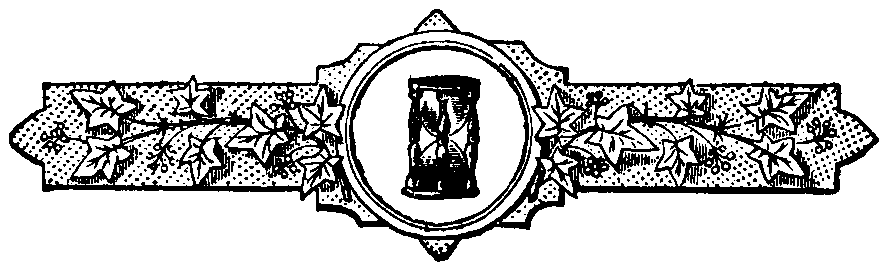

  
[Intangible Textual Heritage](../../index)  [Freemasonry](../index) 
[Index](index)  [Previous](sof21)  [Next](sof23) 

------------------------------------------------------------------------

 

## XX.

### The Symbolism of the Gloves.

The investiture with the gloves is very closely connected with the
investiture with the apron, and the consideration of the symbolism of
the one naturally follows the consideration of the symbolism of the
other.

In the continental rites of Masonry, as practised in France, in Germany,
and in other countries of Europe, it is an invariable custom to present
the newly-initiated candidate not only, as we do, with a white leather
apron, but also with two pairs of white kid gloves, one a man's pair for
himself, and the other a woman's, to be presented by him in turn to his
wife or his betrothed, according to the custom of the German masons, or,
according to the French, to the female whom he most esteems, which,
indeed, amounts, or should amount, to the same thing.

There is in this, of course, as there is in everything else which
pertains to Freemasonry, a symbolism. The gloves given to the candidate
for himself are intended to teach him that the acts of a mason should be
as pure and spotless as the gloves now given to him. In the German
lodges, the word used for *acts* is of course *handlungen*, or
*handlings*, "the works of his hands," which makes the symbolic idea
more impressive.

Dr. Robert Plott--no friend of Masonry, but still an historian of much
research--says, in his "Natural History of Staffordshire," that the
Society of Freemasons, in his time (and he wrote in 1660), presented
their candidates with gloves for themselves and their wives. This shows
that the custom still preserved on the continent of Europe was formerly
practised in England, although there as well as in America, it is
discontinued, which is, perhaps, to be regretted.

But although the presentation of the gloves to the candidate is no
longer practised as a ceremony in England or America, yet the use of
them as a part of the proper professional clothing of a mason in the
duties of the lodge, or in processions, is still retained, and in many
well-regulated lodges the members are almost as regularly clothed in
their white gloves as in their white aprons.

The symbolism of the gloves, it will be admitted, is, in fact, but a
modification of that of the apron. They both signify the same thing;
both are allusive to a purification of life. "Who shall ascend," says
the Psalmist, "into the hill of the Lord? or who shall stand in his holy
place? He that hath clean hands and a pure heart." The apron may be said
to refer to the "pure heart," the gloves to the "clean hands." Both are
significant of purification--of that purification which was always
symbolized by the ablution which preceded the ancient initiations into
the sacred Mysteries. But while our American and English masons have
adhered only to the apron, and rejected the gloves as a Masonic symbol,
the latter appear to be far more important in symbolic science, because
the allusions to pure or clean hands are abundant in all the ancient
writers.

"Hands," says Wemyss, in his "Clavis Symbolica," "are the symbols of
human actions; pure hands are pure actions; unjust hands are deeds of
injustice." There are numerous references in sacred and profane writers
to this symbolism. The washing of the hands has the outward sign of an
internal purification. Hence the Psalmist says, "I will wash my hands in
innocence, and I will encompass thine altar, Jehovah."

In the ancient Mysteries the washing of the hands was always an
introductory ceremony to the initiation, and, of course, it was used
symbolically to indicate the necessity of purity from crime as a
qualification of those who sought admission into the sacred rites; and
hence on a temple in the Island of Crete this inscription was placed:
"Cleanse your feet, wash your hands, and then enter."

Indeed, the washing of hands, as symbolic of purity, was among the
ancients a peculiarly religious rite. No one dared to pray to the gods
until he had cleansed his hands. Thus Homer makes Hector say,--

> "Χερσὶ δ' ἀνίπτοισιν Διῒλείβειν Ἃζομαι."--*Iliad*, vi. 266.
>
> "I dread with unwashed hands to bring  
> My incensed wine to Jove an offering."

In a similar spirit of religion, Æneas, when leaving burning Troy,
refuses to enter the temple of Ceres until his hands, polluted by recent
strife, had been washed in the living stream.

> "Me bello e tanto digressum et cæde recenti,  
> Attrectare nefas, donec me flumine vivo  
> Abluero."--*Æn.* ii. 718.
>
> "In me, now fresh from war and recent strife,  
> 'Tis impious the sacred things to touch  
> Till in the living stream myself I bathe."

The same practice prevailed among the Jews, and a striking instance of
the symbolism is exhibited in that well-known action of Pilate, who,
when the Jews clamored for Jesus, that they might crucify him, appeared
before the people, and, having taken water, washed his hands, saying at
the same time, "I am innocent of the blood of this just man. See ye to
it." In the Christian church of the middle ages, gloves were always worn
by bishops or priests when in the performance of ecclesiastical
functions. They were made of linen, and were white; and Durandus, a
celebrated ritualist, says that "by the white gloves were denoted
chastity and purity, because the hands were thus kept clean and free
from all impurity."

There is no necessity to extend examples any further. There is no doubt
that the use of the gloves in Masonry is a symbolic idea borrowed from
the ancient and universal language of symbolism, and was intended, like
the apron, to denote the necessity of purity of life.

We have thus traced the gloves and the apron to the same symbolic
source. Let us see if we cannot also derive them from the same historic
origin.

The apron evidently owes its adoption in Freemasonry to the use of that
necessary garment by the operative masons of the middle ages. It is one
of the most positive evidences--indeed we may say, absolutely, the most
tangible evidence--of the derivation of our speculative science from an
operative art. The builders, who associated in companies, who traversed
Europe, and were engaged in the construction of palaces and cathedrals,
have left to us, as their descendants, their name, their technical
language, and that distinctive piece of clothing by which they protected
their garments from the pollutions of their laborious employment. Did
they also bequeath to us their gloves? This is a question which some
modern discoveries will at last enable us to solve.

M. Didron, in his "Annales Archeologiques," presents us with an
engraving, copied from the painted glass of a window in the cathedral of
Chartres, in France. The painting was executed in the thirteenth
century, and represents a number of operative masons at work. *Three* of
them are adorned with laurel crowns. May not these be intended to
represent the three officers of a lodge? All of the Masons wear gloves.
M. Didron remarks that in the old documents which he has examined,
mention is often made of gloves which are intended to be presented to
masons and stone-cutters. In a subsequent number of the "Annales," he
gives the following three examples of this fact:--

In the year 1331, the Chatelan of Villaines, in Duemois, bought a
considerable quantity of gloves, to be given to the workmen, in order,
as it is said, "to shield their hands from the stone and lime."

In October, 1383, as he learns from a document of that period, three
dozen pairs of gloves were bought and distributed to the masons when
they commenced the buildings at the Chartreuse of Dijon.

And, lastly, in 1486 or 1487, twenty-two pair of gloves were given to
the masons and stone-cutters who were engaged in work at the city of
Amiens.

It is thus evident that the builders--the operative masons--of the
middle ages wore gloves to protect their hands from the effects of their
work. It is equally evident that the speculative masons have received
from their operative predecessors the gloves as well as the apron, both
of which, being used by the latter for practical uses, have been, in the
spirit of symbolism, appropriated by the former to "a more noble and
glorious purpose."

------------------------------------------------------------------------

[Next: XXI. The Rite of Circumambulation](sof23)

