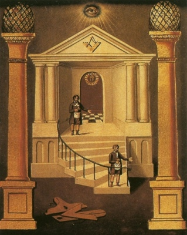

  
[Intangible Textual Heritage](../../index)  [Freemasonry](../index) 

------------------------------------------------------------------------

[Buy this Book on
Kindle](https://www.amazon.com/exec/obidos/ASIN/B002J9HE6I/internetsacredte)

------------------------------------------------------------------------

<table width="75%">
<colgroup>
<col style="width: 50%" />
<col style="width: 50%" />
</colgroup>
<tbody>
<tr class="odd">
<td width="50%" data-valign="TOP"> 
J. Bowring, Second Degree Board (Detail) [1819] (Public Domain Image)</td>
<td width="50%" data-valign="CENTER"><h1 id="symbolical-masonry" data-align="CENTER">Symbolical Masonry</h1>
<h2 id="by-h.l.-haywood" data-align="CENTER">by H.L. Haywood</h2>
<h4 id="section" data-align="CENTER">[1923]</h4></td>
</tr>
</tbody>
</table>

------------------------------------------------------------------------

[Contents](#contents)    [Start Reading](syma00)    [Page
Index](pageidx)    [Text \[Zipped\]](syma.txt.gz)

------------------------------------------------------------------------

|                                                                                                                           |
|---------------------------------------------------------------------------------------------------------------------------|
|  |

Symbolical Masonry is a treasure-house of Masonic lore, including
discussions of key concepts of the first three degrees, along with an
extensive study guide. Haywood goes into details about such mysteries as
the Letter 'G', the two pillars, and the legend of Hiram Abiff. Not
merely a rote discussion of the rituals and regalia of the lodge,
Haywood attempts to get the reader to think critically about the
background of these topics, enhancing their understanding of the rich
history of Freemasonry.--J.B. Hare

------------------------------------------------------------------------

 [Title Page](syma00)  
[The M. S.A. National Masonic Library](syma01)  
[Preface](syma02)  
[Contents](syma03)  
[Introduction](syma04)  

### Part One: The First Step

[Chapter I. An Introduction to the First Step](syma05)  
[Chapter II. The Petition for Membership](syma06)  
[Chapter III. The Ballot](syma07)  
[Chapter IV. Worthy and Well-Qualified](syma08)  
[Chapter V. The Hoodwink](syma09)  
[Chapter VI. The Cable Tow](syma10)  
[Chapter VII. The Lodge](syma11)  
[Chapter VIII. The Entrance](syma12)  
[Chapter IX. The Sharp Instrument](syma13)  
[Chapter X. Invoking the Blessing of Deity](syma14)  
[Chapter XI. Circumambulation](syma15)  
[Chapter XII. Approaching the East](syma16)  
[Chapter XIII. The Altar](syma17)  
[Chapter XIV. The Obligation](syma18)  
[Chapter XV. The Three Great Lights](syma19)  
[Chapter XVI. The Lesser Lights](syma20)  
[Chapter XVII. Lux e Tenebris](syma21)  
[Chapter XVIII. Words, Grips and Tokens](syma22)  
[Chapter XIX. The Rite of Salutation](syma23)  
[Chapter XX. The Apron](syma24)  
[Chapter XXI. Destitution](syma25)  
[Chapter XXII. The Northeast Corner](syma26)  
[Chapter XXIII. Working Tools of an Entered Apprentice](syma27)  

### Part Two: The Second Step

[Chapter XXIV. An Introduction to the Second Step](syma28)  
[Chapter XXV. Passing](syma29)  
[Chapter XXVI. Square on the Breast](syma30)  
[Chapter XXVII. The Scripture Reading From Amos](syma31)  
[Chapter XXVIII. The Oblong Square](syma32)  
[Chapter XXIX. Due Form](syma33)  
[Chapter XXX. Working Tools of a Fellow Craft](syma34)  
[Chapter XXXI. The Ashlars](syma35)  
[Chapter XXXII. The Middle Chamber](syma36)  
[Chapter XXXIII. Operative and Speculative](syma37)  
[Chapter XXXIV. The Two Great Pillars](syma38)  
[Chapter XXXV. The Globes](syma39)  
[Chapter XXXVI. The Ascent](syma40)  
[Chapter XXXVII. The Builders](syma41)  
[Chapter XXXVIII. The Five Senses](syma42)  
[Chapter XXXIX. The Liberal Arts and Sciences](syma43)  
[Chapter XL. The Ephraimitish War, and Corn, Wine and Oil](syma44)  
[Chapter XLI. The Letter G](syma45)  

### Part Three: The Third Step

[Chapter XLII. An Introduction to the Third Step](syma46)  
[Chapter XLIII. The Vital Parts of the Breast](syma47)  
[Chapter XLIV. The Golden Bowl and the Silver Cord](syma48)  
[Chapter XLV. That Which Was Lost](syma49)  
[Chapter XLVI. The Trowel](syma50)  
[Chapter XLVII. The Hiramic Legend](syma51)  
[Chapter XLVIII. Eternal Life](syma52)  
[Chapter XLIX. The Lion's Paw](syma53)  
[Chapter L. The Emblems](syma54)  
[Chapter LI. The Emblems (Continued)](syma55)  
[Chapter LII. The Emblems (Continued)](syma56)  
[Chapter LIII. The Emblems (Continued)](syma57)  
[Chapter LIV. Conclusion](syma58)  

 

[Appendix: Questions for Discussion](syma59)  
[Index](syma60)  
