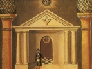

  
[Intangible Textual Heritage](../../index)  [Freemasonry](../index) 
[Index](index)  [Previous](syma51)  [Next](syma53) 

------------------------------------------------------------------------

[Buy this Book on
Kindle](https://www.amazon.com/exec/obidos/ASIN/B002J9HE6I/internetsacredte)

------------------------------------------------------------------------

  
*Symbolical Masonry*, by H.L. Haywood, \[1923\], at Intangible Textual
Heritage

------------------------------------------------------------------------

p. 274

### CHAPTER XLVIII

### ETERNAL LIFE

#### I

That which I believe to be the central idea in the whole Hiram Abiff
drama, and consequently the profoundest interpretation of it, is that
embodied in the term used as the title of this section. I have chosen to
consider it in a section apart, not only because its importance is
deserving of such emphasis, but also because the truth of Eternal Life
is so confused, so mingled with other very different ideas in the minds
of men, that we have need of a careful analysis of the matter.

By Eternal Life we do not mean quite the same thing as we meant by a
Future Life. Future Life, by virtue of the very words used to describe
it, is a life that is supposed to lie in the future, beginning after
death; Eternal Life will be lived in the great future, true enough, but
is something more than that.

Nor is Eternal Life the same as Immortality, for Immortality means
deathlessness that is, an existence of endless duration. It suggests a
picture of life lived on a level line, of which line there is no end.
Eternal Life includes this conception of infinite duration but it also
includes much besides.

Again, Eternal Life is not to be identified with Resurrection. According
to this latter hope the man who dies will be raised from the dead and
will be the same man that he was before death. This also may be true, in
some sense doubtless is true, but the idea is not the same as that meant
by Eternal Life.

p. 275

#### II

What, then, do we mean by Eternal Life? Briefly it may be put thus—there
is something in every man, call it spirit, soul, a divine spark, or what
you will, which even now belongs to another order of reality, and is not
to be numbered among the things that go "into that utter passing away
from which there is nothing to return." It is possible for a man to
discover in himself those things that are most akin to God, and to keep
these things at the centre of his being: and it is possible for him to
do this here and now, and under the very conditions which seem to us so
broken and so unfavourable to high living, and not wait until after
death. All of God, and all of the Universe, and all of the powers of
human life—these are present with us now, and it is not necessary to
postpone real life until after death.

#### III

It is the great tragedy in the life of many men that they so entirely
devote themselves to the body's needs that they forget, or neglect, the
spirit's needs. Giving themselves up to the search for temporalities,
they leave the divinest cravings in them to go unsatisfied; as a result
they become materialistic, self-centred, vain, greedy, and animalistic;
the soul becomes dissatisfied, God becomes unreal, and the future life
uncertain; and they even fall into the fatal habit of making such
Goodness, Truth and Beauty as they do find in themselves or others into
a mere means to temporal gains. Such a man's whole life revolves about
himself; he becomes his own world and his own God, and out of such a
state grow the fears, doubts, superstitions, quarrellings, graspings,
prejudices, envyings, and hatreds, which so often

p. 276

make life a mere scramble after the things of self. In other words,
small things are set at the centre of existence so that all the man's
life is made up of temporalities.

The one remedy for this condition is to change the centre of gravity so
that the spirit is master, and body is servant, so that search is made
for the eternal things instead of wholly for the things that pass away.
When this occurs, selfishness, envy, and materialism, vanish; the soul
becomes the great reality; God draws very near and becomes very certain;
the perspective of life is changed, and its scale of values is reversed.
To be honourable and true, to love others, to live in pity, charity, and
kindliness, to know eternity as present and the present existence as a
brief phase of an endless life, all this becomes for such a man the
great ideal toward which all his energies are bent. Loss and disease may
be serious but they are not fatal; even death is robbed of its terrors
because the man's treasures are out of the reach of destruction.

This is Eternal Life. This is the "life of God in the soul of man,"
eternity in the midst of time, a divine-human experience possible in the
Here and Now. To reach such an existence is in the power of every man;
nay, it is the birthright, the God-intended plan, of every child of the
race.

Herein, it seems to me, we have the reality of which the Lost Word is
the mystic symbol; and he who has found that word within himself is
victorious always, whatever betide. If he is betrayed by the friends in
whom he has trusted, waylaid by ruffians, put to death in the midst of
his creative and benignant work, and thrown into an unmarked grave, he
is not defeated or destroyed; the God-like spirit within him, dedicated
to the Eternal Values, raises him up from the level of death to the
perpendicular of the life that is endless.

p. 277

#### IV

If this be the true interpretation of the Raising, we can no longer
agree with those who see in it merely a ceremony in witness to the
Future Life of the soul. How could it be? The Raising is not
accomplished on the other side of the grave but on this; out of the very
disaster that overwhelmed him, out of the midst of that dreadful
"masterful negation which men call death," the master is lifted up and
made victorious. The Spirit is conqueror even Here.

Furthermore, and as I have already hinted, this interpretation makes
void the theory which would have us believe that the Lost Word must be
sought outside the Blue Lodge Ritual. When is the Master raised? Is it
not in the Third Degree? Is not the very Power that raises him itself
the thing we mean by the word? It is true that no word of a certain
number of letters is given us; it is true that the secret is elaborated
and made plain in a higher degree, but the power, the actual upraising
energy of which such a word must be a symbol, is present, and does its
work, inside the limits of the Degree!

As this understanding came home to me, and opened up within my mind, the
whole of the Blue Lodge Ritual, nay, the whole of Masonry itself, became
transfigured. Dark places filled with light, and obscure symbols, often
so cryptic and dim, became eloquent with endless meanings. I found that
every ceremony, from the first simple acts of the preparation room to
the climax of the tragedy of the Third Degree, arranged itself in a
solemn order that moved easily to its predestined goal. Freemasonry rose
in my vision to the most divine heights, and I saw that it has in its
heart an Eternal Gospel which gives it a place among the great witnesses
to religion, and among

p. 278

the noblest of all the philosophies wherethrough men have sought for
light on the brief, broken, bewildering mystery of existence; and
strength to live, unconquered and unashamed in the midst of so many
enemies and defeats.

------------------------------------------------------------------------

[Next: Chapter XLIX. The Lion's Paw](syma53)
