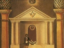

  
[Intangible Textual Heritage](../../index)  [Freemasonry](../index.md) 
[Index](index)  [Previous](syma55)  [Next](syma57.md) 

------------------------------------------------------------------------

[Buy this Book on
Kindle](https://www.amazon.com/exec/obidos/ASIN/B002J9HE6I/internetsacredte.md)

------------------------------------------------------------------------

  
*Symbolical Masonry*, by H.L. Haywood, \[1923\], at Intangible Textual
Heritage

------------------------------------------------------------------------

p. 295

### CHAPTER LII

### THE EMBLEMS (Continued)

#### I

The Anchor and Ark. Simple as it is, the Ark and Anchor symbol is very,
very old, and around it clusters a cloud of associations drawn from many
lands and times. The Anchor's significance is self-revealing and needs
no interpreter; it is a type of that security which holds a man fast and
prevents his drifting with the winds. Nor is it difficult to learn what
is this security, for mankind, with an almost unanimous consent, has
found it in Deity who, while all else changes, changes not but
overarches the drift of the years with His Eternal Purpose, unyielding
Will and everlasting Love. Mrs. Jameson, in her "Sacred Art and Legend,"
says of the Anchor that it was among early Christians "the symbol of
immovable firmness, hope and patience" in which sense it is often
displayed in the Catacombs and on ancient Christian gems, and Lundy says
that among the same Christians it was also used as a symbol of Christ's
divinity, for in that, as the first believers held, was man's one stay
against sin and human overthrow.

### II

Of the Ark it is somewhat more difficult to speak. Laurence Dermott, the
erratic but brilliant Grand Secretary of the Ancients, saw in it an
allusion to the Ark of the Covenant, but this is most certainly an
error. In

p. 296

company with the Hermeticists with whom it was a familiar emblem, our
Ritual sees in it a reminder of the Ark, wherein, according to the old
legend, Noah found refuge for himself and family when all else was given
over to the Deluge. But the story of Noah's Ark itself rests on more
ancient traditions, as any reader of such a work as Dr. Ellwood
Worcester's "Genesis in the Light of Modern Knowledge" will remember.
Long before that story was conceived the Ancient Mysteries were
repeating the story of how some hero god, such as Osiris, was slain, and
how his mutilated body was placed in a box, and set adrift upon the
waters. The Greeks called such a chest an "ark," a word having the
meaning of "containing that which was sacred."

#### III

Among the first Christians the Ark was used as a symbol of the church,
not only because it was a place of refuge for bruised and hunted souls,
but also because the church was then thought of as a home for all the
family of man. In that great household of faith the individual found
security and fellowship and protection from enemies, spiritual or
otherwise. This faith found expression in an old, old hymn:

"Behold the Ark of God,  
   Behold the open door;  
 Hasten to gain that dear abode,  
   And rove, my soul, no more."

Those Christians found their Ark in their brotherhood of believers; is
it not the same with us? Is not our Masonic ark the great Brotherhood
itself? In that world-embracing fellowship the individual, often so
harassed

p. 297

and lonely, finds help, inspiration and companionship, and many a man on
whom disaster "followed fast and followed faster" has found the Order an
Ark of quiet and protection. Shall we not believe that even in the
future life such privileges will be granted? Eternity would grow a
solitary place without the "dear love of comrades" and the binding
closer "of man to man."

------------------------------------------------------------------------

[Next: Chapter LIII. The Emblems (Continued)](syma57.md)
