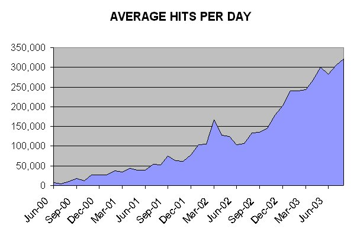

 [Index](index)  [About](about.md) 
[Bibliography](stbib)  [Books](books)  [Copyrights](cnote.md) 
[Contact](contact)  [Donate](donate.md)   
[FAQ](faq)  [Links](links)  [Map](map)  **Message**  [Press](press.md) 
[Privacy](privacy)  [Search](search)  [Abuse](abuse.md)  [Terms of
Service](tos)  [Standards](stand)  [Translate](xlat.md) 
[Unicode](unicode)  [Volunteer](volun.md)   
[World](world)  [Mysteries](myst)  [Traditions](trad.md)  [What's
New?](new.md)   
[Buy CD-ROM](index)  [Bookshop](books/index.md)  

------------------------------------------------------------------------

# Thanks for your support

 

*August 26, 2003.*

------------------------------------------------------------------------

  

Thanks to your support and continued readership, sacred-texts continues
to be a success. The chart above shows the growth of hits per day at
Intangible Textual Heritage since July 2000. Currently the site gets
about 300,000 hits, 50,000 page views, and 10,000 unique visitors per
day. The site uses in excess of 120 Gb of high speed bandwidth per
month.

This growth has not come without costs. This site now costs about $2000
per quarter in hosting fees alone. There are numerous other expenses,
such as the cost of conducting copyright searches, legal fees, and the
cost of purchasing books to scan. It costs money to deliver this amount
of bandwidth; and it also costs money to add new content to the site.

I don't want to add banner advertising, or worse still, charge
subscription fees. So, to keep the site free of advertising, and able to
continue its mission of delivering free texts, I have added a number of
commercial features to this site. This is so that I can continue to
produce and freely distribute high quality extexts of significant public
domain books.

The Sacred Texts CD-ROM now in its fifth version, is the primary source
of revenue for the site. Thanks to everyone who has purchased the
CD-ROM, and if you haven't checked out this magnificent resource, please
do so. Files at this site also available on the CD-ROM are indicated by
the CD-ROM icon. You can click on this icon to buy the CD-ROM:

.

All of the proceeds from this CD-ROM go to support the site. It is
crucial if you want to see sacred-texts stay online, and you can afford
it, to help out by purchasing a copy.

The [Amazon.com links](books/index) and [donations](donate.md) generate a
small amount of revenue as well.

I want to particularly assure all visitors that they will continue to be
able to access *all* of this sites' content for free. Intangible Textual
Heritage is still committed to distributing freely accessible HTML and
text versions of these files. However, to ensure this free access for
the future, it is necessary to build a revenue stream so that the site
can become self-sustaining. Hence the additional e-commerce options at
the site.

Thanks to everyone who visited the sacred-texts in this year. I hope
that the site will continue to be of use in the future.

J.B. Hare

------------------------------------------------------------------------

 

[Collection copyright](sect103.md) © 1997-2004 J.B. Hare. All HTML markup
Copyright © 1997-2004 J.B. Hare except where noted. All images ©
copyright J.B. Hare, 1997-2004 except where noted. All files at this
site named **index.htm** or **index.html** are Copyright © 1997-2004
J.B. Hare except where noted. All graphics Copyright © 1997-2004 J.B.
Hare, all rights reserved (except where noted). Site powered by
.
