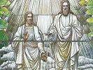

  
[Intangible Textual Heritage](../../index)  [Mormonism](../index) 
[Index](index)  [Previous](hou13)  [Next](hou15) 

------------------------------------------------------------------------

[Buy this Book at
Amazon.com](https://www.amazon.com/exec/obidos/ASIN/B002ECE8AA/internetsacredte)

------------------------------------------------------------------------

  
*History of Utah, 1540-1886*, by Hubert Howe Bancroft, \[1889\], at
Intangible Textual Heritage

------------------------------------------------------------------------

p. 275

### CHAPTER XI. IN THE VALLEY OF THE GREAT SALT LAKE. 1848.

Food and Raiment—Houses—Home
Manufactures—the Fort—Wild Beasts—Cannon From Sutter's Fort—Indian
Children for Sale—Measles—Population—Mills and Farming Machinery—the
Plague of Crickets—They Are Destroyed By Gulls—Scarcity of
Provisions—the Harvest Feast—Immigration—Five Thousand Saints Gathered
in the Valley—Fencing and Farming—Distribution of Lots—Organization of
County Government—Association for the Extermination of Wild
Beasts.

    At the opening of January 1848, the
saints were housed, clad, and fed in moderate comfort, and general
content prevailed. [1](#fn_380) The season was
exceptionally mild; there were occasional light falls of snow, but not
enough to interfere with ploughing and sowing, [2](#fn_381) and a large tract of land was partially
enclosed and planted with wheat and vegetables.

    So many people were now in the valley that notwithstanding the
abundant crops food at length became scarce. Families weighed out their
flour and allowed themselves so much a day. The wheat was ground at a
mill on City Creek, but as there was no bolting-cloth, the shorts and
bran could not be separated. The beef was very poor, [3](#fn_382) as most of the cattle

p. 276

had been worked hard while driven to the valley and after their arrival,
while those turned out to range did not fatten quickly. Butter and
tallow were needed. One wild steer, well fattened, was brought in from
Goodyear's rancho. A herd of deer crossing from one range of mountains
to another was startled by the unexpected obstruction of the fort, and
one sprang into the enclosure and was killed. Wild sago and parsnip
roots constituted the vegetable food of the settlers. A few deaths
occurred from poisonous roots. The bracing air and hard work stimulated
appetite as stores decreased. For coffee parched barley and wheat were
used, and as their sugar gave out, they substituted some of home
manufacture. [4](#fn_383) In the spring thistle
tops were eaten, and became an important article of diet. [5](#fn_384)

    Anxiety began to be felt about clothing, and the hand-looms were now
busily at work, although wool was scarce. [6](#fn_385) As shoes wore out, moccasins were
substituted, and goat, deer, and elk skins were manufactured into
clothing for men and women, though most unsuitable for use in rain and
snow.

    At the time of Parley P. Pratt's arrival, the city of Great Salt
Lake consisted of a fort enclosing a block of ten acres, the walls of
part of the buildings being of adobes and logs. There were also some
tents. [7](#fn_386) As additional companies
came in, they extended

p. 277

the south divisions, which were connected with the old fort by gates.
Wagon-boxes were also brought into line, and served for habitations
until better accommodations were provided. The houses were built of
logs, and were placed close together, the roofs slanting inward, and all
the doors and windows being on the inside, with a loop-hole to each room
on the outside. As everything indicated a dry climate, the roofs were
made rather flat, and great inconvenience resulted. In March the rains
were very heavy, and umbrellas were used to protect women and children
while cooking, and even in bed. The clay found in the bottoms near the
fort made excellent plaster, but would not stand exposure to rain, and
quickly melted. All breadstuffs were carefully gathered into the centre
of the rooms, and protected with buffalo skins obtained from the
Indians. The rooms in the outer lines all adjoined, and many of the
families had several rooms. On the interior cross-lines rooms were built
on both sides, the streets being eight rods wide.

  [  
Click to enlarge](img/27700.jpg)  
FORT, GREAT SLT LAKE CITY, 1848.  

    There were serious depredations committed by wolves, foxes, and
catamounts, and great annoyance occasioned by the howling of some of
these animals. [8](#fn_387) Further discomfort
was caused by innumerable swarms of mice. Digging cavities and running
about under the earthen floor, they caused the ground to tremble, and
when the rain loosened the stones of the roofs,

p. 278

scampered off in hordes. Frequently fifty or sixty had to be caught and
killed before the family could sleep. [9](#fn_388)

    The furniture was home-made, and very little of it at that. The
table was a chest, and the bedstead was built into the corner of the
house, which formed two of its sides, rails or poles forming the
opposite sides; pegs were driven into the walls and rails, and the
bed-cord tightly wound around them. [10](#fn_389) The chimneys were of adobe, and
sometimes there was a fireplace in the corner with a clay hearth.

    In the early part of the year two brass cannon were purchased at
Sutter's Fort for the church, by the battalion brethren. [11](#fn_390)

    During the winter of 1847-8, some Indian children were brought to
the fort to be sold. At first two were offered, but the settlers
peremptorily refused to buy them. The Indian in charge said that the
children were captured in war, and would be killed at sunset if the
white men did not buy them. Thereupon they purchased one of them, and
the one not sold was shot. Later, several Indians came in with two more
children, using the same threat; they were bought and brought up at the
expense of the settlers. [12](#fn_391)

    Measles now appeared for the first time among the natives, who did
not know where the disease came from or what to do. They assembled in
large numbers at the warm springs, bathed in the waters, and died. [13](#fn_392)

p. 279

    Public meetings were generally held near the liberty-pole in the
centre of the fort; religious and secular meetings were also held in
private houses. In March 1848 the population of the city was reported at
1,671, and the number of houses 423. [14](#fn_393) Bridges were built over Mill Creek and
Jordan River. Daniel Spencer was appointed road-master, and authorized
to call on men to assist in making roads. In order that the burden might
fall equally on all, a poll and property tax were instituted.

    There were several mills soon in working order. A small grist-mill
on City Creek was built by Charles Crismon near the pioneer garden; then
there were Chase's saw-mill and Archibald and Robert Gardiner's on Mill
Creek, and Nebeker, Riter, and Wallace's in a cañon ten miles north of
the city. A carding machine was erected near Gardiner's saw-mill by
Amasa Russell, and a flouring mill during the summer by John Neff.
Leffingwell constructed a threshing machine and fanning mill on City
Creek, with a capacity of two hundred bushels per day. Mill-stones cut
out of the basalt in the valley were of very good quality. Millions,
mill-stones, printing-presses, type, paper, and the carding machine were
brought by the first bands of emigrants in 1848. [15](#fn_394)

 

    The spring saw everybody busy, and soon there were many flourishing
gardens, containing a good variety of vegetables. In the early part of
March ploughing commenced. The spring was mild and rain plentiful, and
all expected an abundant harvest. But in the latter part of May, when
the fields had put on their brightest green, there appeared a visitation
in the form of vast swarms of crickets, black and baleful as the locust
of the Dead Sea. [16](#fn_395) In their track

p. 280

they left behind them not a blade or leaf, the appearance of the country
which they traversed in countless and desolating myriads being that of a
land scorched by fire. [17](#fn_396) They came
in a solid phalanx, from the direction of Arsenal Hill, darkening the
earth in their passage. Men, women, and children turned out en masse to
combat this pest, driving them into ditches or on to piles of reeds,
which they would set on fire, striving in every way, until strength was
exhausted, to beat back the devouring host. But in vain they toiled, in
vain they prayed; the work of destruction ceased not, and the havoc
threatened to be as complete as was that which overtook the land of
Egypt in the last days of Israel's bondage. "Think of their condition,"
says Mr Cannon—"the food they brought with them almost exhausted, their
grain and other seeds all planted, they themselves 1,200 miles from a
settlement or place where they could get food on the east, and 800 miles
from California, and the crickets eating up every green thing, and every
day destroying their sole means of subsistence for the months and winter
ahead." [18](#fn_397)

    I said in vain they prayed. Not so. For when everything was most
disheartening and all effort spent, behold, from over the lake appeared
myriads of snow-white gulls, their origin and their purpose alike
unknown to the new-comers! Was this another scourge God was sending them
for their sins? Wait and see. Settling upon all the fields and every
part of them, they pounced upon the crickets, seizing and swallowing
them. They gorged themselves. Even after their stomachs were filled they
still devoured them. On Sunday the people, full of thankfulness, left
the fields to the birds, and on the morrow found on the edges of the
ditches great piles of dead crickets that had been swallowed and thrown
up by the

p. 281

greedy gulls. Verily, the Lord had not forgotten to be gracious!

    To escape the birds, the crickets would rush into the lake or river,
and thus millions were destroyed. Toward evening the gulls took flight
and disappeared beyond the lake, but each day returned at sunrise, until
the scourge was past. [19](#fn_398) Later
grasshoppers seem to have taken the place of crickets. They were of a
kind popularly called iron-clad, and did much mischief. [20](#fn_399)

    Though the crops of this year of 1848 were thus saved from total
destruction, fears were entertained that there would not be food enough
for those already in the valley, and the expected arrival of large
additional numbers was looked upon as a calamity. [21](#fn_400) The stock of provisions was therefore
husbanded with care, many living principally on roots and

p. 282

thistles, to which fare was sometimes added a little flour or milk. The
wheat crop, however, turned out better than was expected, and pumpkins,
melons, and corn yielded good returns. [22](#fn_401)

    On the 10th of August, however, the harvest being then gathered, a
feast was held in the bowery, at which the tables were loaded with a
variety of viands, vegetables, beef, and bread, butter and cheese, with
cakes and pastry. Sheaves of wheat and other grain were hoisted on
harvest poles; "and," says Parley, "there was prayer and thanksgiving,
congratulations, songs, speeches, music, dancing, smiling faces, and
merry hearts."

 

    The rendezvous for westward-bound brethren in the spring of 1848 was
the Elkhorn River, and thither at the end of May came the president, who
organized the people and gave them instructions to be observed on the
way. Good order was to be preserved in camp; there must be no shouting;
prayers were to be attended to, and lights put out at 9 o'clock. Drivers
of teams must walk beside their oxen, and not leave them without
permission. Brigham was general superintendent of the emigrating
companies, with Daniel H. Wells as aide-de-camp, H. S. Eldredge marshal,
and Hosea Stout captain of the night-guard. Moving west early in June,
on the 14th the emigrants were fired on by Indians, two being wounded.
At this time also there was sickness in the camp. To secure grass and
water, the emigration was separated into divisions, of which there were
two principal

p. 283

ones, under Brigham Young and H. C. Kimball, with several
subdivisions. [23](#fn_402)

    The first letters received at Great Salt Lake City from Brigham came
twelve months after his departure from the valley, and were sent on in
advance from the encampments. The excitement was great as Taylor and
Green rode into the city and distributed the letters, without envelopes,
tied round and round with buckskin thongs, and bearing the cheering news
that a large body of brethren was on the way, and bringing plenty of
food. [24](#fn_403)

    In June and July two small parties left the city to meet the
immigration, and another in August. In September Brigham and the first
companies arrived; and under the organization of the president and his
two counsellors, Willard Richards and Heber C. Kimball, during the
autumn months most of the brethren from Winter Quarters and other camps
reached the valley. [25](#fn_404)

    Before the expiration of the year, there were nearly

p. 284

three thousand, [26](#fn_405) and including the
pioneers, the battalion men, and the companies that arrived under
Parley, at least five thousand of the saints assembled in the valley.

    Thus about one fourth of the exiles from Nauvoo were for the present
beyond reach of molestation. That five thousand persons, including a
very large proportion of women and children, almost without money,
almost without provisions, excepting the milk of their kine and the
grain which they had raised near their own camps, should, almost without
the loss of a life, have accomplished this journey of more than twelve
hundred miles, crossing range after range of mountains, bridging rivers,
and traversing deserts, while liable at any moment to be attacked by
roaming bands of savages, is one of the marvels that this century has
witnessed. To those who met them on the route, the strict order of their
march, their coolness and rapidity in closing ranks to repel assault,
their method in posting sentries around camp and corral, suggested
rather the movements of a well-organized army than the migration of a
people; and in truth, few armies have been better organized or more ably
led than was this army of the Lord. [27](#fn_406) To the skill of their leaders, and
their own concert of purpose and action, was due their preservation. And
now, at length, they had made good their escape from the land of their
bondage to the promised land of their freedom, in which, though a
wilderness, they rejoiced to dwell.

    In a private letter written in September 1848, Parley writes' "How
quiet, how still, how free from excitement we live! The legislation of
our high council, the decision of some judge or court of

p. 285

the church, a meeting, a dance, a visit, an exploring tour, the arrival
of a party of trappers and traders, a Mexican caravan, a party arrived
from the Pacific, [28](#fn_407) from the
States, from Fort Bridger, a visit of Indians, or perhaps a mail from
the distant world once or twice a year, is all that breaks the monotony
of our busy and peaceful life…Here, too, we all are rich—there is no
real poverty; all men have access to the soil, the pasture, the timber,
the water power, and all the elements of wealth, without money or
price." [29](#fn_408)

    On his arrival in the autumn, Brigham stirred up the people to the
greatest activity. Fencing material being scarce, and the city lands all
appropriated, it was proposed that a large field for farming purposes
adjoining the city should be selected and fenced in common. By October
there were 863 applications for lots, amounting to 11,005 acres.

    A united effort was made to fence the city, which was done by
enclosing each ward in one field, and requiring the owner of every lot
to build his proportion of the fence. [30](#fn_409) No lots were allowed to be held for
speculation, the intention, originally, being to assign them only to
those who would occupy and improve them. The farming land nearest the
city was surveyed in five-acre lots to accommodate the mechanics and
artisans; next beyond were ten-acre lots, followed by forty and eighty
acres, where farmers could build and reside. All these farms were
enclosed in one Common fence, constituting what was called the 'big
field,' before mentioned. [31](#fn_410)

p. 286

    The streets were kept open, but were barely wide enough for travel,
as the owners cultivated the space in front of their houses. At a
meeting on the 24th of September, permission was granted to build on the
lots immediately, all buildings to be at least twenty feet from the
sidewalk; and a few days later it was voted "that a land record should
be kept, and that $1.50 be paid for each lot; one dollar to the surveyor
and fifty cents to the clerk for recording." A council-house was ordered
to be built by tithing labor; and it was suggested that water from the
Big Cottonwood be brought into the city; the toll for grinding grain was
to be increased, [32](#fn_411) and a resolution
was passed against the sale or use of ardent spirits. That all might be
satisfied, the lots were to be distributed "by ballot, or casting lots,
as Israel did in days of old." [33](#fn_412)

 

    On the 1st of October Brigham called the battalion brethren
together, blessed them, and thanked them for the service they had
rendered. "The plan of raising a battalion to march to California," he
said, "by a call from the war department, was devised with a view to the
total overthrow of this kingdom, and the destruction of every man,
woman, and child." [34](#fn_413)

    Winter was now at hand, and there was sore need that the saints
should bestir themselves. The president

p. 287

and others of the church dignitaries worked indefatigably with their
people, carrying mortar and making adobes, hauling timber and sawing it.
There were but 450 log cabins within the stockade, and one thousand more
well-filled wagons had arrived this season.

    A county government was organized, and John D. Barker elected
sheriff, Isaac Clark judge of probate, and Evan M. Green recorder and
treasurer. [35](#fn_414) Two hunting companies
in December were formed, under the leadership of John D. Lee and John
Pack, for the extermination of wild beasts. There were eighty-four men
in all, and their efforts were successful. [36](#fn_415) From the 1st of December until the end
of February there were heavy snow-storms. On the coldest day the mercury
fell below zero, [37](#fn_416) and on the
warmest marked 21° of Fahrenheit. On account of the snow in the cañons
it was difficult to bring in the necessary fuel. As the previous winter
had been warm, the settlers were unprepared for such cold weather, and
there was much suffering. [38](#fn_417)

------------------------------------------------------------------------

### Footnotes

[275:1](hou14.htm#fr_380) Parley P. Pratt says:
'Here life was as sweet as the holidays, as merry as in the Christian
palaces and mansions of those who had driven us to the mountains.'

[275:2](hou14.htm#fr_381) 'It was a strange
sight to see sometimes furrows on one side and snow on the other. In
Feb. men worked out of doors in their shirt sleeves.' *Horne's
Migrations*, MS., 24.

[275:3](hou14.htm#fr_382) 'It was so tough that
Brother Taylor suggested we must grease the saw to make it work.'
*Horne's Migrations*, MS., 26.

[276:4](hou14.htm#fr_383) 'We manufactured our
own sugar and molasses from beets, corn-stalks, and watermelons, and
made preserves for winter, which were excellent, by boiling the rinds of
the melons in this molasses.' *Horne's Migrations*, MS., 30. 'I
attempted to make sugar out of corn. A rude apparatus was made to
squeeze the corn stalks, but the manufacture was not altogether a
success. After this, beet molasses followed. The boiler I used this time
I made out of some stove piping and lumber. Brother Cannon and I
assisted to saw our lumber.' *Taylor's Reminiscences*, MS., 16.

[276:5](hou14.htm#fr_384) Geo. Q. Cannon, in
*Juv. Inst*., xix. no. 5, 68.

[276:6](hou14.htm#fr_385) 'They collected the
hair of the buffalo from the sage brush as they travelled, and used also
the hair of cows.' *Horne's Migrations*, MS., 35. From this blankets
were woven and used in exchange with the Indians. Mrs Horne remarks that
'in Nauvoo there was a man dressed throughout in a suit made from the
curly hair of his dog, which was sheared annually.'

[276:7](hou14.htm#fr_386) It stood on what was
later known as the 6th Ward Square.

[277:8](hou14.htm#fr_387) 'One night soon after
our arrival I spread some strychnine about, and in the morning found
fourteen white wolves dead.' *Lorenzo Young's Ex*., MS., 8.

[278:9](hou14.htm#fr_388) 'One contrivance for
catching them was a bucketful of water with a board sloping at each end,
greased and balanced on the edge. The first eat and her progeny were
invaluable. The green timber from the mountains was full of bed-bugs,
another serious trouble.' *Horne's Migrations*, MS., 31.

[278:10](hou14.htm#fr_389) This describes the
furniture of the first house occupied in the fort by Brigham Young's
family. *Mrs Clara Young's Pioneer Ex*., MS., 8.

[278:11](hou14.htm#fr_390) Forty-five of the
battalion brethren contributing $512 for the purpose. *Hist. B. Young*,
MS., 1848, 35.

[278:12](hou14.htm#fr_391) 'Charles Decker
bought one of the prisoners, a girl, who was afterward brought up in
President Young's family. She married an Indian chief named Kanosh.'
*Wells’ Narr.*, MS., 48.

[278:13](hou14.htm#fr_392) 'Some they buried,
but not all. We buried thirty-six in one grave. They killed their dogs
when their masters died.' *Nebeker's Early Justice*, MS., 2.

[279:14](hou14.htm#fr_393) *Juv. Inst*., ix.
no. 1, 9.

[279:15](hou14.htm#fr_394) *Hist. B. Young*,
MS.; *Horne's Migrations*, MS.; Geo. Q. Cannon, in *Juv. Inst*.;
*Taylor's Reminiscences*, MS.; *Woodruff's Journal*, MS.; *Young's Ex*.,
MS.; *Wells’ Narr.*, MS.; *Richards’ Narr*., MS.; *Nebeker's Early
Justice*, MS.; *Jenning's Material Progress*, MS., passim.

[279:16](hou14.htm#fr_395) *Utah Early
Records*, MS., 29-30.

[280:17](hou14.htm#fr_396) *Autobiog. P. P.
Pratt*, 405; *Smith's Rise, Progress, and Travels*, 17.

[280:18](hou14.htm#fr_397) *Juv. Inst*., ix.
no. 2, 22.

[281:19](hou14.htm#fr_398) Kane says that the
gulls soon grew to be as tame as poultry, and that the children called
them their pigeons. They had clear, dark eyes, small feet, and large
wings that arched in flight. *The Mormons*, 67. 'No one is allowed to
kill a gull in Utah, and they are consequently very tame.' *Jenning's
Material Progress*, MS., 7. 'I am sure that the wheat was in head, and
that it averaged two or three crickets on every head, bending them down.
One couldn't step without crushing under foot as many as the foot could
cover.' *Mrs Clara Young's Experiences of a Pioneer*, MS., 9. 'Channels
were dug and filled with water to prevent their travel, but they would
throw themselves across; it was impossible to fight them back.'
*Nebeker's Early Justice*, MS., 2. 'In the spring, when thousands of
young trees had been started and were several inches in height, came the
crickets. The wheat, too, was well in head.' *Horne's Migrations*, MS.,
p. 28.

[281:20](hou14.htm#fr_399) Says Mr Jennings:
'They would devastate hundreds of acres, and as they would rise and fly
high in the air, the air would be darkened with them. They seemed to be
massed together, and to take but one direction, flying eight or ten
miles perhaps, then settling upon another field…The only exterminator
seems to be the sea-gulls. They gorge themselves on this rich diet; they
suddenly appear in the wake of the grasshoppers, and will swallow them,
throw them up, and swallow them again…Sometimes the grasshoppers come
like a cloud, and apparently alighting not knowing where; on one
occasion a quarter of their number perhaps dropped rate the lake, and
were blown on shore by the wind, in rows of sometimes two feet deep for
a distance of two miles.' *Material Progress*, MS., 6-7.

[281:21](hou14.htm#fr_400) 'Word was sent back
that probably no crops could be raised that year, and advising that no
further emigrations should come in that season.' *Mrs Clara Young's
Experiences of a Pioneer* MS., 9. John Young wished to send an express
to his brother, the president, advising him not to bring any more people
to the valley, as there was danger of starvation. *Utah Early Records*,
MS., 30-2. Parley P. Pratt writes; 'I had a good harvest of wheat and
rye without irrigation, but those who irrigated had double the quantity.
Wheat harvest commenced early in July…Oats do extremely well, yielding
sixty bushels for one.' *Hist. B. Young*, MS., 1848, 54.

[282:22](hou14.htm#fr_401) 'Wheat harvest good.
Corn crop good. The worms ate some in the ear. Price of wheat, $2 a
bushel. Population, 1,800; main fence, 12 miles long. Had a surplus of
bread-stuff this year.' *Hist. B. Young*, MS., Aug. 1, 1848, 52. Parley
states that he and his family, in common with many others, suffered much
for want of food. He had ploughed and planted, in grain and vegetables,
nearly 40 acres, nearly every women and child in his family toiling in
the field so far as their age and strength would permit. *Autobiog*.,
405. 'One family had nothing but milk to live upon;…they would let a
portion thicken, and then mix it with new milk and eat it for bread.
They lived upon it for six weeks, and thrived.' Eliza Snow, in *Utah
Notes*, MS., 6.

[283:23](hou14.htm#fr_402) The first division
consisted of 1,229 persons, with 397 wagons, 74 horses, 91 mules, 1,275
oxen, 699 cows, 184 loose cattle, 411 sheep, 141 pigs, 605 chickens, 37
eats, 82 dogs, 3 goats, 10 geese, 2 hives of bees, 8 doves, and 1 crow;
the second of 662 persons, with 226 wagons, 57 horses, 25 mules, 737
oxen, 284 cows, 150 loose cattle, 243 sheep, 96 pigs, 299 chickens, 17
eats, 52 dogs, 3 hives of bees, 3 doves, 5 ducks, and 1 squirrel.

[283:24](hou14.htm#fr_403) As recorded in Mrs
Clara Decker Young's very valuable manuscript. She shows now the first
letter received, still tied with buckskin thongs.

[283:25](hou14.htm#fr_404) The first companies
under Brigham arrived on Sept. 20th; Kimball's party reached the valley
a few days later. At the beginning of August Lorenzo Snow, A. O. Smoot,
and others, with 47 wagons and 124 yoke of oxen, were sent from Salt
Lake City to assist the emigrants. On the 28th of the same month a party
well supplied with wagons and cattle was sent back to Winter Quarters
from the camp of the president, then on the Sweet-water. *Utah Early
Records*, MS., 33. The companies under Richards reached their
destination toward the end of October. *Richards’ Narr*., MS., 38. In
relating the incidents of his journey, Richards states that his was the
last party to leave Winter Quarters during that summer. His men were ill
supplied with provisions; feed was scarce, and many of the cattle died
from drinking alkali water, so that he was compelled to yoke to the
wagons even his yearlings and his milch-cows. Many families, including
the children, were compelled to walk the entire distance; yet not a
single death occurred. *Id*., 34-5. 'The companies behind were kept well
informed of the progress of those in advance…Sometimes a copy of the
camp journal was written and placed in a notch in a tree,…sometimes in a
post stuck in the ground; but whenever a large buffalo skull or other
suitable bone was found,…some particulars were written on them.' Cannon,
in *Juv. Inst*., xix. no. 3, 36.

[284:26](hou14.htm#fr_405) White persons 2,393,
and 24 negroes, with 792 wagons, 2,527 oxen, about 1,700 cows, 181
horses, 1,023 sheep, and other live-stock. *Utah Early Records*, MS.,
41.

[284:27](hou14.htm#fr_406) 'So well recognized
were the results of this organization, that bands of hostile Indians
have passed by comparatively small parties of Mormons to attack much
larger but less compact bodies of other emigrants.' *Kane's The
Mormons*, 34.

[285:28](hou14.htm#fr_407) 'In July 1848,
William and Nathan Hawks, Sanford Jacobs, and Richard Slater came from
California with copies of Brannan's *Star* of April 1st, and tidings
that the brethren at San Francisco were doing well, and that those who
had settled on the San Joaquin River had vacated in favor of the
mosquitoes.' *Hist. B. Young*, MS., 1848, 46.

[285:29](hou14.htm#fr_408) The letter was
afterward published in part in Snow's *Voice of Joseph*, 16, and
portions copied into *Utah Early Pioneers*, MS., 34-5.

[285:30](hou14.htm#fr_409) 'Every man is to
help build a pole, ditch, or a stone fence…in proportion to the land he
draws, also a canal on each side for the purpose of irrigation.' *Hist.
B. Young*, MS., 1849, 55.

[285:31](hou14.htm#fr_410) 'The fence will be
17 miles and 53 rods long, and 8 ft high.' *Hist. B. Young*, MS., 1848,
68-9; *Juv. Inst*., ix. no. 3, 34. It had been decided by the high
council in Jan. that fencing be commenced, and that the farm lands be
p. 286 located as near together as possible,
and immediately south of the city. The line of the fence began at a
steep point in the bluffs just south of the warm springs, thence
straight to the north-west corner of the fort, then from the south-east
corner of the fort, east of south, to some distance south of Mill Creek,
thence east to the bluffs again, its entire length, including two sides
of the fort, being 3,638 rods. *Utah Early Records*, MS., 20-1. The
entire tract was 5,153 acres, of which 872 acres were sown with
winter-wheat, the remainder being intended for spring and summer crops.

[286:32](hou14.htm#fr_411) 'Chas Crismon
petitions that it be increased from 1-16 to 1-10; granted.' *Hist. B.
Young*, MS., 1848, 64.

[286:33](hou14.htm#fr_412) 'The city plat is
already allotted, and many families are at present without lots;
therefore we have deemed it expedient to run off an addition to the
city, commencing at the eastern line of the city and running east as far
as the nature of the land will allow for building purposes. Not only is
this addition necessary, but we are going to lay off a site for a city
about ten miles north, and another site about ten miles to the south of
our city.' *Hist. B. Young*, MS., 1848, 69.

[286:34](hou14.htm#fr_413) *Hist. B. Young*,
MS., 1848, 65. This was not the case. See *Hist. Cal*., vol. v. chap.
xviii., this series.

[287:35](hou14.htm#fr_414) 'George Coulson,
Andrew H. Perkins, and David D. Yearsley, county commissioners; James
Sloan, district clerk; Jacob G. Bigler, William Snow, Levi Bracken, and
Jonathan C. Wright, magistrates.' *Hist. B. Young*, MS., 77.

[287:36](hou14.htm#fr_415) 'The two hunting
companies organized last Dec. report that they have killed 2 bears, 2
wolverenes, 2 wild-cats, 783 wolves, 409 foxes, 31 minks, 9 eagles, 530
magpies, hawks, and owls, and 1,026 ravens.' *Hist. B. Young*, MS.,
March 1849.

[287:37](hou14.htm#fr_416) 'To 33° below
freezing-point on Feb. 5th.' General Epistle of the Twelve, in *Frontier
Guardian*, May 30, 1849.

[287:38](hou14.htm#fr_417) 'At Fort Bridger the
winter had been unusually severe, mad the traders, it was reported, had
suffered almost starvation.' It was resolved that no corn should be made
into whiskey, and that if any man was preparing to distil corn into
whiskey or alcohol, the corn should be taken and given to the poor.
*Hist. B. Young*, MS., 1849, 4.

------------------------------------------------------------------------

[Next: Chapter XII. In The Valley of The Great Salt Lake. 1849.](hou15)
