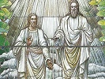

  
[Intangible Textual Heritage](../../index)  [Mormonism](../index.md) 
[Index](index)  [Previous](hou14)  [Next](hou16.md) 

------------------------------------------------------------------------

[Buy this Book at
Amazon.com](https://www.amazon.com/exec/obidos/ASIN/B002ECE8AA/internetsacredte.md)

------------------------------------------------------------------------

  
*History of Utah, 1540-1886*, by Hubert Howe Bancroft, \[1889\], at
Intangible Textual Heritage

------------------------------------------------------------------------

p. 288

### CHAPTER XII. IN THE VALLEY OF THE GREAT SALT LAKE. 1849.

Food Supply and
Shelter—Building Lots—Currency Issue—Bank Notes and Coinage—Private and
Public Buildings—Wide Area of the City—Second Anniversary of the
Pioneers—Festivals and Amusements—Labor a Duty Among the Saints—Effect
of the California Gold Discovery—Immigration—Carrying
Company—California-Bound Emigrants—Their Traffic With the
Mormons—Products and Prices—Gold-Hunting Frowned Upon By the
Church.

    Throughout the winter of 1848-9 food
was scarce among the settlers. Many still subsisted mainly on roots,
thistles, and even on rawhides. [1](#fn_418.md)
Milk, flesh, and the small quantity of breadstuffs that remained were,
however, distributed among the poor in such quantities as to prevent
actual starvation. On April 1, 1849, each household was required to
state the smallest allowance of breadstuffs that would suffice until the
forth-coming harvest. Some received half a pound a day, and others four
ounces. [2](#fn_419.md)

p. 289

    Until the first fruits were reaped the famine continued, but the
harvest of 1849 was a bountiful one, [3](#fn_420.md) and for six years thereafter none wanted
for bread in the city of Salt Lake. [4](#fn_421.md)

    During part of this season many women and children were without
shelter or fuel. To each family as it arrived was given a city lot,
until the site was exhausted, as we have seen; but for most a wagon
served for dwelling during the coldest months, and later an adobe hut,
roofed with unseasoned lumber, and thatched with hay or frozen
mud. [5](#fn_422.md) Before summer all were housed
in log or adobe dwellings, [6](#fn_423.md) the
fort

p. 290

being rapidly broken up by the removal of the houses on to the city
lots. The city was divided into nineteen bishops’ wards; [7](#fn_424.md) the ten-acre blocks were divided into
allotments of an acre and a quarter, the five-acre lots in similar
proportion, each building facing the garden of the one adjoining, the
space of twenty feet left between the houses and the surrounding fence
being afterward planted with trees and shrubbery. [8](#fn_425.md)

    The need of a circulating medium had been felt ever since the valley
had been settled. [9](#fn_426.md) Their currency
was blankets, grain, and seeds; and even after gold-dust was brought in
by the miners great inconvenience was experienced in its use, and many
refused to take it, as there was a waste in weighing it. To meet this
emergency, bank bills for one dollar

p. 291

were issued on the 1st of January, 1849, signed by Brigham Young, Heber
C. Kimball, and Thomas Bullock, clerk. In September, Brigham had brought
eighty-four dollars in small change into the valley, which had been
distributed, but was no longer in circulation. On the 6th of January,
resolutions were passed by the council to the effect that "the Kirtland
bank bills be put into circulation for the accommodation of the people,
thus fulfilling the prophecy of Joseph, that the Kirtland notes would
one day be as good as gold." The first printing was in connection with
the manufacture of paper money. [10](#fn_427.md)

    Previous to the issue of this currency an attempt was made by John
Kay to coin gold-dust, but the crucibles broke in the attempt. All the
dies and everything connected with the coining were made in Salt Lake
City. [11](#fn_428.md) Subsequent attempts were
more successful. The coin was made of pure gold, without alloy, which
made it deficient in weight; it was therefore sold as bullion. Brigham
then proposed the issue of paper currency until gold could be
coined. [12](#fn_429.md) There was also a paper
currency issued some years later by a company in Salt Lake City known as
the Deseret Currency Association, its capital being in cattle, but this
was merely a temporary convenience. [13](#fn_430.md) Currency,

p. 292

in either gold or paper, was afterward designated as valley tan, a name
synonymous with home-made or of Utah manufacture, the origin of which
will be explained later. [14](#fn_431.md)

    Of the houses built early in 1849, few had more than two rooms, many
had only board windows, and some were without doors. Several of the
adobe houses in the fort had fallen down from the effects of the thaw.
When at last they had learned how to make adobes, they were of the best
kind. Alkali at first was mixed with the clay, which, when exposed to
rain, would expand and burst the bricks. After this year more commodious
structures were erected for public and private use, the means being
supplied in part by traffic with emigrants for California. Conspicuous
among them was the council-house on East Temple street, a two-story
stone edifice, forty-five feet square, [15](#fn_432.md) used originally for church purposes,
and afterward occupied by the state and territorial legislatures. In
front of the council-house was temple block, on the south-west corner of
which stood the tabernacle, built in 1851-2, on the ground now occupied
by the assembly hall, with accommodation for 2,500 persons, [16](#fn_433.md) and consecrated on April 6th of the
latter year. [17](#fn_434.md) During

p. 293

its construction, the saints in every part of the world were urged to
self-denial, and it was voted to dispense with the use of tea, coffee,
snuff, and tobacco, the sums thus saved to be also used for the building
of the temple, which was to stand on the same block. The latter was to
be built of stone quarried in the mountains, and a railroad from temple
block to the quarry was chartered for the conveyance of building
material.

    Adjoining the tabernacle was the bowery, 100 by 60 feet, made of
posts and boarding, completed three or four years later, and large
enough to contain 8,000 people, a temporary structure having been
erected in 1848. Among other buildings may be mentioned the tithing
office, the social hall, and the seventies’ hall of science. Several
bridges were also built, which were paid for by the one per centum
property tax. [18](#fn_435.md)

    Thus at the western base of the Wasatch Mountains was laid out the
city of Great Salt Lake, its buildings being distributed over a greater
area than that on which stood, in 1850, the commercial metropolis of the
United States. [19](#fn_436.md) Its site was on a
slope, barely perceptible except toward the north, where it was enclosed
by the Wasatch Range and a spur trending to the westward. Resting on the
eastern bank of the Jordan, it was watered by several creeks; a canal,
twelve miles long, crossing three streams, being proposed to convey the
waters of the Big Cottonwood to the farm-lands south of the city; and
through each street flowed a rivulet of pure water, which was thence
diverted into the garden plats.

 

    On the 24th of July, 1849, was held the second anniversary of the
arrival of the pioneers. [20](#fn_437.md) At
day-break

p. 294

cannon were fired and bands of music passed through the city, arousing
the citizens for the great events of the day. A flag brought from Nauvoo
was prominently displayed, and a larger flag was hoisted from the
liberty-pole. A procession was formed of young men and maidens, who in
appropriate costumes, bearing banners and singing, escorted Brigham to
the bowery. They were received with shouts of "Hosanna to God and the
Lamb!" While the governor and the church dignitaries were passing down
the aisle cheers and shouts of "Hail to the governor of Deseret!"
greeted them on every side. The declaration of independence and the
constitution were then read, followed by patriotic addresses. The
procession was then reformed and marched to the feast served on tables
fourteen hundred feet in length. "The tables were heavily loaded," says
Brigham, "with all the luxuries of field and garden, and with nearly all
the vegetables of the world; the seats were filled and refilled by a
people who had been deprived of those luxuries for years, and they
welcomed to their table every stranger within their border." [21](#fn_438.md) A greater variety was provided, as the
saints had exchanged for many luxuries their flour, butter, potatoes,
and other produce, with passing emigrants.

    Not only on the pioneer anniversary but on the 4th of July, [22](#fn_439.md) at christmas week, and on other
occasions

p. 295

festivities were held. [23](#fn_440.md) Sometimes
the guests contributed toward the expense of the entertainment, the
amount that each one was expected to pay being stated on the card of
invitation. [24](#fn_441.md)

 

    In winter, theatrical performances were given by the Deseret
Dramatic Association at the social hall, and in summer at the bowery,
the parts being well sustained and the orchestra and decorations well
appointed. [25](#fn_442.md) At the former, private
parties were given when the gathering was too large for the residence of
the host; in the basement were appliances for cooking, and adjoining was
a dining-room with seats and tables sufficient for three hundred
persons. All entertainments were opened with prayer; then came dancing,
songs, and music, followed by supper, the guests being dismissed with a
benediction at an early hour.

    The public festivities of the Mormons were always conducted under
the auspices of the church, and none were allowed to join in them who
were not in good standing. To sing, dance, and rejoice before the Lord
was regarded almost as a religious duty, but only those must rejoice
whose hearts were pure and whose hands were clean. Thus, toward
christmas of this year, 1849, regulations were issued by the high
council for the observance of the approaching holidays. They were to
commence on the 20th of December and last until the council should
declare them at an end, officers being appointed to preside over the
dances. No person who had been disfellowshipped

p. 296

or excommunicated was allowed to go forth to the dance. Those who had
sold liquor for gain, thereby corrupting the morals of society, were
also disqualified. All friends and well-wishers to society, all who
remembered the poor and needy, [26](#fn_443.md)
were invited to participate, though not members of the church. But
declares the council: "Woe unto them that dance with guile and malice in
their hearts toward their neighbor! Woe unto them that have secretly
injured their neighbor or his or her property! Woe unto them that are
ministers of disorder and of evil! If these shall go forth in the dance
without confessing and forsaking their guilt, the faith of the council
is that they seal their doom by it."

    After their festivities the people returned, each to his calling,
with renewed zest. It was an article of faith among them that labor was
honorable, and all who were not missionaries were expected to do their
part. By revelation, Joseph Smith was released from this obligation, but
Brigham Young worked as a carpenter in his own mills. Labor was regarded
as a duty no less than prayer or temple service, each one working with
his hands at whatsoever he found to do, and cheerfully contributing his
tithes toward the church revenues, which were expended for public
improvements, for the support of missions, and the relief of the sick
and destitute. [27](#fn_444.md)

p. 297

    Among the causes that led to the prosperity of the people of Utah at
this period was the migration of gold-seekers to California. Hundreds of
emigrants, turning aside to Salt Lake City, wearied and dispirited,
their cattle worn out and their wagons broken, were glad to exchange
them, together with their tools, household furniture, and spare
clothing, for provisions and pack animals at very low rates. [28](#fn_445.md) Many were glad to remain during winter,
and work for their livelihood. Though reports were freely circulated to
the contrary, there is sufficient evidence that as a rule they were
kindly treated, and not a few abandoned their search for gold to cast in
their lot with the saints. [29](#fn_446.md)

    The arrival in November of the first pack-mule train from
California, laden with many luxuries and necessities, was an important
event. The people formed in line, waiting hours for their turn to buy
the limited amount allowed. [30](#fn_447.md) When
a sack of potatoes was

p. 298

brought into the valley in the spring, they were eagerly bought at any
price. From four small ones, costing fifty cents, was obtained a bushel
of good-sized potatoes which were saved for seed.

    The immigration during the season numbered some 1,400 souls, who
were added to the settlers in the valley, [31](#fn_448.md) and who, with the number remaining of
those originally bound for California, made a large population to
clothe, feed, and shelter.

    A carrying company was also established [32](#fn_449.md) in December for the purpose of
conveying passengers and goods from the Missouri River to the gold
regions of California. In their prospectus, the proprietors set forth
that, residing as they did in the valley, and being acquainted with the
route, they could provide fresh animals as they were needed and save the
loss of hundreds and thousands of dollars that had been incurred by
former parties through inexperience. For passengers to Sutter's Fort,
the rate was $300, of which $200 must be paid in advance, and the
remainder on reaching Salt Lake City. For freight, the terms were $250
per ton, of which two thirds must also be paid in advance.

    A small company under Captain Lamoreaux left the valley for Green
River, and there established a ferry and trading post; among them were
wagon-makers and blacksmiths, whose services would be invaluable.

    When the immigrants of this year arrived in the valley of the Great
Salt Lake, many of them were

p. 299

almost destitute of clothing, [33](#fn_450.md)
bedding, and household furniture, such articles as they possessed having
been exchanged for food during their journey. In 1848 it had been
prophesied by Heber C. Kimball that the commodities, known among the
brethren as 'states goods,' would be as cheap in Salt Lake City as in
New York; while Brigham Young, soon after setting forth froth Nauvoo,
had made a similar prediction, declaring that within five years his
people would be more prosperous than they had ever been. Both prophecies
were fulfilled, [34](#fn_451.md) when, during the
first years of the gold fever, company after company came pouring into
Utah, which might now be termed the half-way house of the nation.
Several hundred California-bound emigrants arrived in the valley in
1849, too late to continue their journey on the northern route, and
proposed to spend the winter in the valley. There was scarcely provision
enough for those already there, and as Jefferson Hunt of the battalion
offered to pilot the company over the southern route, they decided to
undertake the trip, and started on the 8th of October, arriving in
California on the 22d of December. [35](#fn_452.md) On the 1st of December nineteen men
came into the city on foot, nearly famished, having been two days making
their way over Big Mountain. Their wagons had been left on Echo Creek,
and their animals at Willow Springs, where the snow, they said, was six
feet deep on a level. Though many of these adventurers were poor, some
of the trains were loaded with valuable merchandise, for which their
owners

p. 300

expected to find a ready market on reaching their destination. But while
sojourning in the valley, news arrived that vessels laden with similar
merchandise had arrived in San Francisco, or were far on their way, and
that already the market was greatly overstocked. [36](#fn_453.md) The emigrants were therefore glad to
exchange their costly outfits and their trading goods for whatever they
could get in exchange, a single horse or a mule, with a small stock of
provisions, being sometimes accepted as an equivalent for property that
had cost the owner thousands of dollars. The cattle thus obtained by the
settlers, in barter, after being fattened on the nutritious grasses of
the valley, were driven to California, where a sure and profitable
market was found.

    As a result of the California-bound migration, there followed an
enormous advance in the price of provisions, flour selling before the
harvest of 1850 at one dollar per pound, and after harvest at
twenty-five dollars per cental. [37](#fn_454.md)
Throughout the autumn of this year the grist-mills were run to their
utmost capacity, grinding wheat for the passing emigrants, who at any
cost must procure sufficient to carry them to the gold mines. Some other
articles of food were for a time equally scarce, sugar selling at the
rate of three pounds for two dollars; [38](#fn_455.md) though beef was plentiful, and could be
had for ten cents per pound. [39](#fn_456.md) It
is probable,

p. 301

however, that these rates represent the prices charged to passing
emigrants, for at this period the wages of laborers did not exceed $2
per day, and of skilled mechanics $3. The saints prided themselves upon
their honorable dealings with these strangers, and the moderate prices
demanded, though frequently charged with swindling. [40](#fn_457.md) They could afford to part with their
produce, because they had learned to dispense with many articles which
among other communities were considered necessaries. For men who had fed
during their first winter in the valley on hides and roots, it was no
great hardship to dispense for a season with a portion of their
provisions, their grain, beef, and butter, their coffee and sugar, in
return for which they received such value.

    It was not of course to be expected that while thousands of
California-bound emigrants were passing each year through the Mormon
settlements, the saints should themselves entirely escape the gold
fever. In November 1848, several small parties of the battalion found
their way to Salt Lake City, [41](#fn_458.md) some
of them bringing considerable quantities of gold-dust, which, as they
relate, had come into their possession in this wise.

    In September 1847 about forty of the battalion men arrived at
Sutter's Fort in search of employment and were hired by Sutter to dig
the races for a flour mill about six miles from the fort and for a
saw-mill some forty-five miles distant. [42](#fn_459.md) The latter work being completed in
January 1848, and the frame of the

p. 302

building erected, water was turned into the flume on the 24th, and the
fall being considerable, washed out a hole near the base of the mill on
reaching the tail-race, whereupon Marshall, Sutter's partner, and
superintendent of the party, examined the spot, fearing that the water
would undermine the foundations. While thus engaged, he observed there
pieces of yellow glistening metal, and picking up a handful put them in
his pocket, not knowing what they were, and supposing probably that he
had found nothing more valuable than iron pyrites.

    They were no iron pyrites, however, that Marshall had found, but, as
it proved, nuggets of gold, the largest of them being worth about five
dollars. The discovery was revealed in confidence to three of the
saints, who unearthed a few more specimens, and soon afterward removed
to a sand-bar in the Sacramento river, since known as Mormon Island.
Here was gold in paying quantities, the average earnings of each man
being twenty to thirty dollars per day. But though dust and nuggets were
freely shown to the brethren, there were few who would believe their
senses, and for weeks the matter caused no excitement. At length,
however, the secret was disclosed, which soon transformed the peaceful
valleys of California into busy mining camps, changing as if by magic
the entire face of the country. How throughout the settlements on
seaboard and on river the merchant abandoned his wares, the lawyer his
clients, the parson his flock, the doctor his patients, the farmer his
standing grain—all making one mad rush for the gold-fields, some on
horseback, some with pack-mules, some with wheelbarrows, some with
costly outfits, and some with no outfit save the clothes on their
backs—is fully set forth in my *History of California*.

    When the disbanded soldiers arrived in the valley of the Great Salt
Lake and displayed their treasures, a cry was raised among the saints,
"To California; to the land of Ophir that our brethren have discovered!"

p. 303

\[paragraph continues\] But from the
twelve came a stern rebuke. "The true use of gold is for paving streets,
covering houses, and making culinary dishes; and when the saints shall
have preached the gospel, raised grain, and built up cities enough, the
Lord will open the way for a supply of gold to the perfect satisfaction
of his people. Until then, let them not be over-anxious, for the
treasures of the earth are in the Lord's storehouse, and he will open
the doors thereof when and where he pleases." [43](#fn_460.md)

    President John Smith wrote to the saints in California in March
1848, urging them to gather at the Great Salt Lake, "that they might
share in the blessings to be conferred on the faithful; and warned them
against settling down at ease in California with an eye and a half upon
this world and its goods, and half an eye dimly set towards Zion on
account of the high mountains and the privations to be endured by the
saints."

    "If we were to go to San Francisco and dig up chunks of gold," said
Brigham to the returned battalion on the 1st of October, 1848, "or find
it in the valley, it would ruin us." In an address on the sabbath he
said: "I hope the gold mines will be no nearer than eight hundred
miles…There is more delusion and the people are more perfectly crazy on
this continent than ever before…If you elders of Israel want to go to
the gold mines, go and be damned. If you go, I would not give a picayune
to keep you from damnation." [44](#fn_461.md) "I
advise the corrupt, and all who want, to go to California and not come
back, for I will not fellowship them…Prosperity and riches blunt the
feelings of man. If the people were united, I would send men to get the
gold who would care no more about it than the dust under their feet, and
then we would gather millions into the church…

p. 304

\[paragraph continues\] Some men don't
want to go after gold, but they are the very men to go." [45](#fn_462.md)

    Thus the threatened migration was stayed; a few companies
departed, [46](#fn_463.md) and were asked in all
kindness never to return. "If they have a golden god in their hearts,"
said Brigham, "they had better stay were they are." But the majority of
the settlers were well content to abide in the valley, building up
towns, planting farms, and tending stock in their land of promise.

------------------------------------------------------------------------

### Footnotes

[288:1](hou15.htm#fr_418.md) 'Many were
necessitated to eat rawhides, and to dig sago and thistle roots for
mouths to subsist upon.' *Hist. B. Young*, MS., 1849, 95.

[288:2](hou15.htm#fr_419.md) The committee on
breadstuffs reported on the 8th of Feb. that there was 78/100 lb. per
capita for the next five months. *Utah Early Records*, MS., 45. 'In the
former part of Feb. the bishops took an inventory of the breadstuff in
the valley, when was reported a little moro than ¾ lb. per day for each
soul, until the 9th of July; and considerable was known to exist which
was not reported. Hence while some were nearly destitute others had
abundance. The price of corn since harvest has been $2; some has sold
for $3; at present there is none in the market at any price. Wheat has
ranged from $4 to $5, and potatoes from $6 to $20, a bushel; and though
not to be bought at present, it is expected that there will be a good
supply for seed by another year.' General Epistle of the Twelve, in
*Frontier Guardian*, May 30, 1849. 'Those persons who had imparted
measurably to these who had not, so that all extremity of suffering from
hunger was avoided.' *Hist. B. Young*, MS., 1849, 95.

[289:3](hou15.htm#fr_420.md) It was not injured by
crickets. *Kane's The Mormons*, 67. 'Our prophet predicted that if we
would exercise patience under our difficulties during the immediate
future, our necessities would be supplied as cheaply as they could be in
the city of St Louis; and this proved to be true, for in 1849 we raised
fair crops.' *Smoot's Mormon Wife*, MS., 5-6.

[289:4](hou15.htm#fr_421.md) The peculiar chemical
formations in earth and water proved of great practical value when once
understood. 'For two years all the salerufus used was obtained from
Saleratus Lake, near Independence Rock; the salt from the lake became an
article of value in local use and among their exports. The alkali swept
down from the mountains, and composed of a great variety of ingredients,
such as magnesia, soda, salt, etc., when once subdued, makes the most
durable of soils, which needs no enriching.' Richards, in *Utah Notes*,
MS., 8.

[289:5](hou15.htm#fr_422.md) 'Now as regards my
beginning at Salt Lake. Soon after my arrival a city lot was assigned to
me for a home and residence, on which I placed my wagon box or wagon
bed, which contained our provisions, bedding, and all our earthly goods,
placed them upon the ground, turned away our stock upon the winter
range, and looked about us. I soon disposed of some of my clothing for
some adobes, and put the walls up of a small room, which we covered with
a tent-cloth, that answered us during the winter, until lumber could be
procured next spring.' *Richards’ Narr*., MS., 38; *Early Records*, MS.,
36-8.

[289:6](hou15.htm#fr_423.md) On Feb. 18th the
people began to move out of the fort to their city lots. *Id*., 47. A
number of temporary farm buildings had been completed before this date.
*Pratt's Autobiography*, 406; *Millennial Star*, x. 370. A correspondent
of the *New York Tribune*, writing from Salt Lake City, July 8, 1849,
gives an exaggerated account of the place, which has been copied by
several writers on Mormonism. 'There were no hotels, because there was
no travel; no barbers' shops, because every one chose to shave his
neighbor; no stores, because they had no goods to sell nor time to
traffic; no centre of business, because all were too busy to make a
centre. There was abundance of mechanics’ shops, of dressmakers,
milliners, and tailors, etc.; but they needed no sign, nor had they time
to paint or erect one, for they were crowded with business. I this day
attended worship with them in the open air. Some thousands of
well-dressed, intelligent-looking people assembled, some on foot, some
in carriages, and on horseback. Many were neatly and even fashionably
clad. The beauty and neatness of the ladies reminded me of some of our
congregations in New York.' The letter is in *Mackay's The Mormons*,
282. It is unnecessary to expose the absurdity of this description, as
the reader is well aware that hundreds of California-bound emigrants
passed through the valley this year. Harvesting began July 9th, and
until that date the Mormons were p. 290 often
without their daily bread, as we have seen. The following is probably
much nearer the truth: 'The houses are small, principally of brick
(adobe), built up only as temporary abodes, until the more urgent and
important matters of enclosure and cultivation are attended to; but I
never saw anything to surpass the ingenuity of arrangement with which
they are fitted up, and the scrupulous cleanliness with which they are
kept. There were tradesmen and artisans of all descriptions, but no
regular stores or workshops, except forges. Still, from the shoeing of a
horse to the mending of a watch there was no difficulty in getting it
done, as cheap and as well put out of hand as m any other city in
America.' *Kelly's Excursion to California*, 226.

[290:7](hou15.htm#fr_424.md) The bishops were
David Fairbanks, John Lowry, Christopher Williams, William Hickenlooper,
William J. Perkins, Addison Everett, Seth Taft, David Pettigrew,
Benjamin Covey, Edward Hunter, John Murdock, Abraham O. Smoot, Isaac
Higbee, Joseph L. Heywood, James Hendrix, Benjamin Brown, Orville S.
Cox, and Joel H. Johnson. *Utah Early Records*, MS., 47-8, 69. The
valley is settled for 20 miles south and 40 miles north, and divided
into 19 wards. *Hist. B. Young*, MS., 1849, 57.

[290:8](hou15.htm#fr_425.md) At a council held
Feb. 17, 1849, the committee on fencing reported that the enclosure
termed the big field would include 291 ten-acre lots, 460 five-acre
lots, the church farm of 800 acres, and 17 acres of fractional lots, the
whole requiring 5,240 rods of fencing, of which it was recommended that
3,216 should be of adobes, 663 of adobes or stone, and 1,361 of ditch,
posts, and rails. 'When the Mormons first arrived they did not quarrel
for best lands, but cultivated a whole district in common, dividing the
harvest according to work done, seed supplied, and need of family. On
dividing the town into lots, each received his plat, and so with fields,
for south of the town lay a field of 6 square miles, cultivated in
common; this was divided into 5-acre square lots and given to heads of
families, by lot or distribution, in tracts of one to eight lots each.
After the distribution some began to speculate with their lots, but to
this the church objected, saying that none should sell his land for more
than first cost and improvements, for it belonged to God, and was merely
held in use by the holder. Still, secret speculations occurred.'
*Olshausen's Mormonen*, 166-7.

[290:9](hou15.htm#fr_426.md) 'Owing to the absence
of small change, the tax collector was instructed give due-bills for
sums less than a dollar, and redeem them when presented in sufficient
amount.' *Hist. B. Young*, MS., 1849, 23.

[291:10](hou15.htm#fr_427.md) Fifty-cent and
one-dollar paper currency was issued. *Hist. B. Young*, MS., 1849, 3. On
the 22d, type was set for 50-cent bills—the first typesetting in the
city. *Id*., 42-3; *S. L. C. Contributor*, ii. 209.

[291:11](hou15.htm#fr_428.md) 'Robert Campbell
engraved the stamps for the coin.' *Wells’ Narr.*, MS., 42. Brigham
says, 'I offered the gold-dust back to the people, but they did not want
it.' *Hist. B. Young*, MS., 1849, 1. 'Thos L. Smith, a mountaineer,
wrote me from Bear River Valley, offering to sell me $200 or $300 in
small coin…and take our currency for the same, and he would trade his
skins, furs, robes, etc., with us.' *Id*., 79.

[291:12](hou15.htm#fr_429.md) 'John Kay coined
$2.50, $5, and $20 pieces.' *Nebeker's Early Justice*, MS., 3. A
description is given in *Juv. Inst*. of coins with beehive and spread
eagle on one side, with inscription 'Deseret Assay Office, Pure Gold,'
and at the base '5 D.' On the reverse is a lion, surrounded by 'Holiness
to the Lord,' in characters known as the Deseret alphabet. Vol. ix. no.
4, p. 39. In 1849 and 1850, coins of the value of $20, $10, $5, and
$2.50 were struck off. Their fineness was 899-1000, and no alloy was
used except a little silver. *S. L. C. Contributor*, ii. 209. 'The
gold-dust was sufficient in quantity for all ordinary purposes…In the
exchange the brethren deposited the gold-dust with the presidency, who
issued bills or a paper currency; and the Kirtland safety fund resigned
it on a par with gold.' *Id*., 56.

[291:13](hou15.htm#fr_430.md) See *Taylor's
Reminiscences*, MS., 23.

[292:14](hou15.htm#fr_431.md) See chap. xix., note
[44](hou22.htm#fn_812.md), this vol.

[292:15](hou15.htm#fr_432.md) 'I was appointed
superintendent of public works in the fall of 1848. The first house that
was built was a little adobe place that was used for the church
office…The little office that was the first place built was one story,
about 18 by 12 feet, slanting roof covered with boards and dirt. This
remained the church office for about two years…The foundation of the
council-house was laid in the spring of 1849, and then the first story
put up.' *Wells’ Narr.*, MS., 41-2. Built by tithing. *Hist. B. Young*,
MS., 1849, 55. At a meeting held Oct. 1, 1848, it was resolved to build
a council-house, and on the 7th of November masons commenced laying the
foundation. *Utah Early Records*, MS., 36, 38.

[292:16](hou15.htm#fr_433.md) Linforth gives its
dimensions at 126 ft by 64, and states that the roof was arched, without
being supported by pillars. *Route from Liverpool*, 109. In *Utah Early
Records*, MS., 125, 127, it is stated that the dimensions were 120 by 60
ft, and that work was begun May 21st. See also *Deseret News*, May 17,
1851; *The Mormons at Home*, 112-13, 147-9; *Burton's City of the
Saints*, 270.

[292:17](hou15.htm#fr_434.md) At a general
conference, the proceedings of which are related in the *Contributor*,
ii. 333. The conference lasted several days, and at its conclusion a
collection was made to provide funds for a sacramental service, $149
being given in coin, together with several pounds’ weight of silver
watch-cases, spoons, rings, and ornaments. From the silver, cups were
made, which are still in use at the tabernacle.

[293:18](hou15.htm#fr_435.md) Resolved that a tax
of one per ct per annum be assessed on property to repair public
highways. *Hist. B. Young*, MS., 1849, 5.

[293:19](hou15.htm#fr_436.md) *Kane's The
Mormons*, 74; *New York Tribune*, Oct. 7, 1849.

[293:20](hou15.htm#fr_437.md) The 4th and 24th of
July were at first celebrated together, but on the latter date because
bread and vegetables were more plentiful at the end of month than at the
beginning. *Utah Early Records*, MS., 91.

[294:21](hou15.htm#fr_438.md) 'The hospitalities
of the occasion were not confined to the saints alone, but included
several hundreds of California emigrants who had stopped to recruit, as
well as threescore Indians,' says Eliza Snow. See *Snow's Biography*,
95-107, for description of the celebration; also *Kane's The Mormons*,
80-1; *Hist. B. Young*, MS., 108-116, 143; *Mrs Horne's Migrations*,
MS., 30; *Frontier Guardian*, Sept. 19, 1849. After dinner four and
twenty toasts were drunk, followed by volunteer toasts. President Young
declared that he never saw such a dinner in his life. One of the elders
remarked that it was almost a marvellous thing that everybody was
satisfied, and…not an oath was uttered, not a man intoxicated, not a jar
or disturbance occurred to mar the union, peace, and harmony of the
day.' *Frontier Guardian*, Sept. 19, 1849. Among the guests was the
Indian chief Walker, who, accompanied by Soweite, chief of the Utahs,
and several hundred Indians, men, women, and children, had visited the
city in Sept. 1848. *Utah Early Records*, MS., 33.

[294:22](hou15.htm#fr_439.md) For a description of
4th of July festivities, see *Frontier Guardian*, July 10, 1850, Oct. 3,
1851; *Deseret News*, July 12, 1851, July 10, 1852; *S. L. C.
Contributor*, ii. 271.

[295:23](hou15.htm#fr_440.md) The christmas
festival of 1851 is described in the *Deseret News*, Jan. 24, 1852. 'On
the 24th,' writes Brigham in regard to another occasion, 'I invited the
wives of the twelve apostles, and other elders who were on missions,
with a number of my relatives, to dine at my house. Seventy ladies sat
down at the first table. I employed five sleighs to collect the company;
the day was stormy: near my house the snow drifted three feet deep.'
*Hist. B. Young*, MS., 1850, 2.

[295:24](hou15.htm#fr_441.md) Contributions were
often made in the shape of eatables, and an in-door picnic extemporized.
*Ferris’ Utah and the Mormons*, 306.

[295:25](hou15.htm#fr_442.md) In May 1851, the
second act of 'Robert Macaire' was performed at the bowery, the
performance concluding with the farce of 'The Dead Shot.' *Contributor*,
ii. 271.

[296:26](hou15.htm#fr_443.md) 'Bring all your
tithes and offerings to the proper place for the poor, that there be
none hungry among us, and let the poor rejoice; and then you may rejoice
in the dance to your heart's content.' Regulations of the High Council,
in *Frontier Guardian*, Nov. 28, 1849. Brigham, in an address at the
state-house in 1852, at a party given to the legislature, said: 'I want
it distinctly understood that fiddling and dancing are no part of our
worship. My mind labors like a man logging. This is the reason why I am
fond of these pastimes; they give me a privilege to throw everything off
and shake myself, that my body may exercise and my mind rest.' And
again: 'This company is controlled like the ship by the rudder in a
gentle breeze, that can be turned hither and thither at the will and
pleasure of him who commands.' *Hist. B. Young*, MS., 1852, 22.

[296:27](hou15.htm#fr_444.md) *Olshausen's
Mormonen*, 164-5. On July 28, 1850, the president writes to Orson Hyde,
then at Kanesville. 'Our celebration was well attended. It is a general
time of health with the saints, and peace and plenty of hard work, as
every one has been so busy that they can hardly get time to eat or
sleep. You speak about hurry and bustle at Kanesville; but if you were
here, to see, feel, and realize the burdens, labors, and
responsibilities, which are daily, p. 297
hourly, momentarily, rolling, piling, tumbling, and thundering upon us,
you would at least conclude that there was no danger of our getting the
gout from idleness or too much jollity.' *Frontier Guardian*, Sept. 18,
1850. Mention of cholera on the Mississippi and Missouri rivers in the
spring of 1849 is made by Brigham. 'Many Mormon brethren and sisters
emigrating on those rivers died; 60 died going from St Louis to
Kanesville, mostly from England and Wales, under Capt. Dan. Jones.'
*Hist. B. Young*, MS., 1849, 85.

[297:28](hou15.htm#fr_445.md) Horses, harnesses,
carriages, wagons, etc., were bought of eager emigrantsat one fifth of
their cost in the states. *Utah Early Records*, MS., 113.

[297:29](hou15.htm#fr_446.md) In the autumn of
1849 many emigrants, while resting in Salt Lake City, wrote letters to
their friends, in which they acknowledged the kindness and hospitality
shown them by the saints. Extracts from these letters were published in
newspapers throughout the states. Gunnison, *The Mormons*, 65, says:
'Their many deeds of charity to the sick and broken-down gold-seekers
all speak loudly in their favor, and must eventually redound to their
praise.' See also *Kane's The Mormons*, 76-7; Stansbury's *Expedition to
G. S. Lake*, i. 134. In March 1851, numbers of emigrants were baptized,
and most of them remained in Utah. *Id*., 123. D.J. Staples, who
remained at S. L. City for two or three weeks with a Boston party bound
for California in 1849, says: 'The Mormons showed their kindness in
every possible way, supplying all wants and taking care of the sick.'
*Incidents and Inform*., in *Cal*., MS., D. 1-3. See also *Van Dyke's
Statement*, in *Id*., 1. Among later instances may be mentioned that of
John C. Frémont, who with nine white men and twelve Indians arrived at
Parowan Jan. 7, 1854, in a starving condition. He was supplied with
provisions and fresh animals, setting forth eastward on the 20th.

[297:30](hou15.htm#fr_447.md) Brown sugar was $1 a
lb.; and everything else in proportion. No one was allowed more than one
pound of anything. *Mrs Horne's Migrations*, MS., 30.

[298:31](hou15.htm#fr_448.md) 'Our cattle
stampeded, and at the south pass of the Platte we were overtaken by a
heavy storm, in which 70 animals were frozen. We made our journey to
Salt Lake City, 1,034 miles, in 145 days, arriving Oct. 27th.' *Geo. A.
Smith's Autobiog*., in *Tullidge's Mag*., July 1884. The cattle of the
California Enterprise Company, under Judge Thos K. Owen of Ill.,
stampeded near the forks of the Platte and ran back 130 miles in about
26 hours; they were bronght alon g by Capt. Allen Taylor's company,
which received from their owners a series of resolutions expressive of
their gratitude. *Hist. B. Young*, MS., 1849, 157-8.

[298:32](hou15.htm#fr_449.md) Termed the Great
Salt Lake Valley Carrying Company. The proprietors were Shadrach Roundy,
Jedediah M. Grant, John S. Fullmer, George D. Grant, and Russell Homer.
*Utah Early Records*, MS., 101; *Hist. B. Young*, MS., 1849, 168.

[299:33](hou15.htm#fr_450.md) Parley relates that
during 1848 he and his family were compelled to go barefooted for
several months, reserving their Indian moccasins for extra occasions.
*Autobiog*., 405.

[299:34](hou15.htm#fr_451.md) In the summer of
1849, almost every article except tea and coffee sold at 50 per cent
below the prices ruling in eastern cities. *Frontier Guardian*, Sept. 5,
1849.

[299:35](hou15.htm#fr_452.md) 'The company became
dissatisfied at the continued southern direction. At Beaver Creek, one
Capt. Smith came up with a company of packers, saying that he had maps
and charts of a new route, called Walker's cut-off. All the packers and
most of Capt. Hunter's co. joined Smith. After wandering about the
mountains for a time many turned back and took the southern route, while
Capt. Smith and a few others struggled through and arrived in California
on foot.' *Hist. B. Young*, MS., 1849, 167.

[300:36](hou15.htm#fr_453.md) 'Thousands of
emigrants…have passed through Salt Lake City this season, exchanging
domestic clothing, wagons, etc., for horses and mules.' *Hist. B.
Young*, MS., 1849, 143.

[300:37](hou15.htm#fr_454.md) *Utah Early
Records*, MS., 112; *Contributor*, ii. 240. See also *Frontier
Guardian*, Sept. 18, 1850, where is a copy of an address delivered by
Brigham Young at the bowery, S. L. City. 'I say unto you, farmers, keep
your wheat, for I foresee if you are not careful starvation will be on
our heels.' It was not intended, however, that food should be withheld
from the destitute; in another address from Brigham, published in the
same paper, we read: 'I say to you, latter-day saints let no man go
hungry from your doors; divide with them and trust in God for more.'
'Emigrants, don't let your spirits be worn down; and shame be to the
door where a man has to go hungry away.'

[300:38](hou15.htm#fr_455.md) On Nov. 21, 1849, Mr
Vasquez opened a store in Salt Lake City, and met with ready sale for
his sugar at this rate. *Utah Early Records*, MS., 100.

[300:39](hou15.htm#fr_456.md) Fuel and building
material were costly, firewood being worth, in 1850, ten dollars per
cord, adobe bricks a dollar a hundred, and lumber five dollars the
hundred feet. Two years later, 'states goods' had also become scarce
throughout the territory, linen selling for 20 to 30 cents per yard,
flannel for p. 301 30 to 40 cents, prints for
25 to 50 cents, and jeans for 75 cents to $1.25; while a bottle of ink
cost $2, and a ream of writing-paper $10 to $12. *Deseret News*, Nov. 6,
1852, where it is stated that on some classes of goods traders realized
from 200 to 10,000 per cent profit.

[301:40](hou15.htm#fr_457.md) 'I saved straw that
spring and braided forty hats…I made one to order and sold to an
emigrant at the usual price, $1. He was surprised at its cheapness, but
in all our dealings with emigrants we took no advantage of them. I took
boarders at five or six dollars a week.' *Mrs Richards’ Rem*., MS., 36.

[301:41](hou15.htm#fr_458.md) Others had already
arrived in June and Sept. of this year. *Utah Early Records*, MS., 30-1.

[301:42](hou15.htm#fr_459.md) Their pay was to be
12½ cents per cubic yard, with rations and free pasture for their stock.
*Tyler's Hist. Mormon Battalion*, 332.

[303:43](hou15.htm#fr_460.md) Second General
Epistle of the Twelve, dated Salt Lake City, Oct. 12, 1849, in *Frontier
Guardian*, Dec. 26, 1849.

[303:44](hou15.htm#fr_461.md) *Hist. B. Young*,
MS., 1849, 100-2, 123.

[304:45](hou15.htm#fr_462.md) On the 7th of
December, 1848, Brigham writes in his journal: 'Some few have caught the
gold fever; I counselled such, and all the saints, to remain in the
valleys of the mountains, make improvements, build comfortable houses,
and raise grain against the days of famine and pestilence with which the
earth would be visited.'

[304:46](hou15.htm#fr_463.md) The gold fever first
broke out in June 1848, news of the discovery being brought by a party
of battalion men that arrived from California in that month. In March
1849, about a dozen families departed or were preparing to depart for
the mines. In March 1851, about 520 of the saints were gathered at
Payson, Utah county, most of them for the purpose of moving to
California. *Utah Early Records*, MS., 31, 69, 122.

------------------------------------------------------------------------

[Next: Chapter XIII. Settlement and Occupation of the Country.
1847-1852.](hou16.md)
