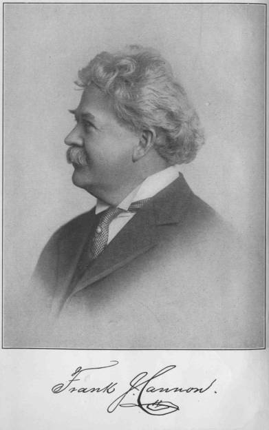

[Intangible Textual Heritage](../../index) [Mormonism](../index.md)

------------------------------------------------------------------------

<table width="75%">
<colgroup>
<col style="width: 50%" />
<col style="width: 50%" />
</colgroup>
<tbody>
<tr class="odd">
<td width="50%" data-valign="CENTER"></td>
<td width="50%" data-valign="CENTER"><h1 id="under-the-prophet-in-utah" data-align="CENTER">Under the Prophet in Utah</h1>
<h3 id="by-frank-j.-cannon-and-harvey-j.-ohiggins." data-align="CENTER">by Frank J. Cannon and Harvey J. O'Higgins.</h3>
<h4 id="section" data-align="CENTER">[1911]</h4></td>
</tr>
</tbody>
</table>

------------------------------------------------------------------------

This is a memoir of Frank J. Cannon (1859-1933). Although born into a
prominent Mormon family, Cannon was a freethinker and a progressive. He
recounts an insiders' view of the painful process by which the Mormon
church and the state of Utah became integrated into the United States.
He played an active role in this history, lobbying for statehood both in
the halls of Washington D.C. and in the inner councils of the Mormon
church. This work is highly critical of the Mormon hierarchy, the
conformist and inward-looking aspects of Mormon society, and of
polygamy. However, he also praises the social programs of the Church.
This is an important source document for the history of the Mormon
people and the state of Utah.

------------------------------------------------------------------------

[Title Page](title.md)  
[Note](note.md)  
[Introduction](intro.md)  
[Foreword](foreword.md)  
[I In the Days of the Raid](chap01.md)  
[II On a Mission to Washington](chap02.md)  
[III Without a Country](chap03.md)  
[IV The Manifesto](chap04.md)  
[V On the Road to Freedom](chap05.md)  
[VI The Goal-and After](chap06.md)  
[VII The First Betrayals](chap07.md)  
[VIII The Church and the Interests](chap08.md)  
[IX At the Crossways](chap09.md)  
[X On the Downward Path](chap10.md)  
[XI The Will of the Lord](chap11.md)  
[XII The Conspiracy Completed](chap12.md)  
[XIII The Smoot Exposure](chap13.md)  
[XIV Treason Triumphant](chap14.md)  
[XV The Struggle for Liberty](chap15.md)  
[XVI The Price of Protest](chap16.md)  
[XVII The New Polygamy](chap17.md)  
[XVIII The Prophet of Mammon](chap18.md)  
[XIX The Subjects of the Kingdom](chap19.md)  
[XX Conclusion](chap20.md)  
