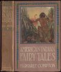
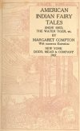
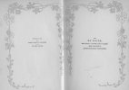

  
[Intangible Textual Heritage](../../index)  [Native American](../index.md) 
[Index](index)  [Next](ait01.md) 

------------------------------------------------------------------------

*American Indian Fairy Tales*, by Margaret Compton, \[1907\], at
Intangible Textual Heritage

------------------------------------------------------------------------

# AMERICAN

# INDIAN FAIRY

# TALES

##### SNOW BIRD,

##### THE WATER TIGER, etc.

###### BY

## MARGARET COMPTON

###### With numerous illustrations

#### NEW YORK

#### DODD, MEAD & COMPANY

#### \[1907\]

Scanned at Intangible Textual Heritage, February 2007. This text is in
the public domain in the United States because it was published prior to
January 1st, 1923. These files may be used for any non-commercial
purpose provided this notice of attribution is left intact in all
copies.

[  
Click to enlarge](img/cover.jpg.md)  
Front Cover and Spine  

[  
Click to enlarge](img/front.jpg.md)  
“Once he found a water-lily with a leaf so broad that it made a
petticoat for his wife”  

[  
Click to enlarge](img/title.jpg.md)  
Title Page  

[  
Click to enlarge](img/verso.jpg.md)  
Verso  

COPYRIGHT, 1895  
BY  
DODD, MEAD & COMPANY  
\_\_\_\_\_\_\_\_  
All rights reserved

TO  
MY SISTER,  
WHO STILL "LOVES FAIRY TALES,"  
THIS VOLUME IS  
AFFECTIONATELY DEDICATED.

------------------------------------------------------------------------

[Next: Author's Note](ait01.md)
