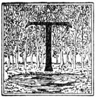

  
[Intangible Textual Heritage](../../index)  [Native American](../index) 
[Index](index)  [Previous](ait11)  [Next](ait13) 

------------------------------------------------------------------------

*American Indian Fairy Tales*, by Margaret Compton, \[1907\], at
Intangible Textual Heritage

------------------------------------------------------------------------

p. 93 p. 94 p. 95

### THE STAR MAIDEN.

|                     |
|---------------------|
|  |

HE Ojibways were a great nation whom the fairies loved. Their land was
the home of many spirits, and as long as they lived on the shores of the
great lakes the woods in that country were full of fairies. Some of them
dwelt in the moss at the roots or on the trunks of trees. Others hid
beneath the mushrooms and toadstools. Some changed themselves into
bright-winged butterflies or tinier insects with shining wings. This
they did that they might be near the children they loved and play with
them where they could see and be seen.

But there were also evil spirits in the land. These burrowed in the
ground, gnawed at the roots of the loveliest flowers and destroyed them.
They breathed upon the corn and blighted it. They listened whenever they
heard men talking, and carried the news to those with whom it would make
most mischief.

It is because of these wicked fairies that the Indian must be silent in
the

p. 96

woods and must not whisper confidences in the camp unless he is sure the
spirits are fast asleep under the white blanket of the snow.

The Ojibways looked well after the interests of the good spirits. They
shielded the flowers and stepped carefully aside when moss or flower was
in their path. They brushed no moss from the trees, and they never
snared the sunbeams, for on them thousands of fairies came down from the
sky. When the chase was over they sat in the doorways of their wigwams
smoking, and as they watched the blue circles drift and fade into the
darkness of the evening, they listened to the voices of the fairies and
the insects' hum and the thousand tiny noises that night always brings.

One night as they were listening they saw a bright light shining in the
top of the tallest trees. It was a star brighter than all the others,
and it seemed very near the earth. When they went close to the tree they
found that it was really caught in the topmost branches.

The wise men of the tribe were summoned and for three nights they sat
about the council fire, but they came to no conclusion about the
beautiful star. At last

p. 97

one of the young warriors went to them and told them that the truth had
come to him in a dream.

While asleep the west wind had lifted the curtains of his wigwam and the
light of the star fell full upon him. Suddenly a beautiful maiden stood
at his side. She smiled upon him, and as he gazed speechless she told
him that her home was in the star and that in wandering over all the
earth she had seen no land so fair as the land of the Ojibways. Its
flowers, its sweet-voiced birds, its rivers, its beautiful lakes, the
mountains clothed in green, these had charmed her, and she wished to be
no more a wanderer. If they would welcome her she would make her home
among them, and she asked them to choose a place in which she might
dwell.

The council were greatly pleased; but they could not agree upon what was
best to offer the Star Maiden, so they decided to ask her to choose for
herself.

She searched first among the flowers of the prairie. There she found the
fairies’ ring, where the little spirits danced on moonlight nights.
"Here," thought she, "I will rest." But as she swung herself backwards
and forwards on the stem of a lovely blossom, she heard a terrible noise

p. 98

and fled in great fear. A vast herd of buffaloes came and took
possession of the fairies' ring, where they rolled over one another, and
bellowed so they could be heard far on the trail. No gentle star maiden
could choose such a resting-place.

She next sought the mountain rose. It was cool and pleasant, the moss
was soft to her dainty feet, and she could talk to the spirits she
loved, whose homes were in the stars. But the mountain was steep, and
huge rocks hid from her view the nation that she loved.

She was almost in despair, when one day as she looked down from the edge
of the wild rose leaf she saw a white flower with a heart of gold
shining on the waters of the lake below her. As she looked a canoe
steered by the young warrior who had told her wishes to his people, shot
past, and his strong, brown hand brushed the edge of the flower.

"That is the home for me," she cried, and half-skipping, half-flying
down the side of the mountain, she quickly made her way to the flower
and hid herself in its bosom. There she could watch the stars as well as
when she looked upward from the cup of the mountain rose; there she
could talk to the star spirits, for they

p. 99

bathed in the clear lake; and best of all, there she could watch the
people whom she loved, for their canoes were always upon the water.

------------------------------------------------------------------------

[Next: The Fighting Hare](ait13)
