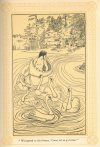

  
[Intangible Textual Heritage](../../index)  [Native American](../index.md) 
[Index](index)  [Previous](ait16)  [Next](ait18.md) 

------------------------------------------------------------------------

*American Indian Fairy Tales*, by Margaret Compton, \[1907\], at
Intangible Textual Heritage

------------------------------------------------------------------------

p. 141 p. 142
p. 143

### THE ISLAND OF SKELETONS.

|                     |
|---------------------|
|  |

IG Wave and his little nephew, Red Shell, lived together in a deep
forest. The boy was the only relative that the old man had, and he was
very fond of him. He had brought Red Shell and his sister, Wild Sage, to
his home some years before, just after the great plague had killed most
of his tribe, among them the father and mother of the children. But they
had not been many months in the forest before Wild Sage was stolen by a
giant who lived on the Island of Skeletons.

Big Wave warned the boy never to go towards the east; for, if by any
chance, he should cross a certain magic line of sacred meal that Big
Wave had drawn, he would be at the mercy of the giant.

The boy obeyed for a time; but by and by he grew tired of playing in one
place, so he went towards the east, not noticing when he crossed the
magic line, till he came to the shore of a great lake.

p. 144

He amused himself for a while, throwing pebbles into the water, and
shooting arrows. A man came up to him, and said, "Well, boy, where is
your lodge?"

Red Shell told him. Then the man proposed shooting arrows to see who
could shoot the higher. Red Shell had had much practice, and though he
was only a boy, his arm was strong, and he drew the bow far back and
sent the arrow much higher than the man did.

The man laughed and said, "You are a brave boy; now let us see whether
you can swim as well as you can shoot."

They jumped into the water and tried holding their breath while
swimming. Again the boy proved himself the victor.

When they were again on land, the man said to him, "Will you go with me
in my canoe? I am on my way to an island where there are pretty birds,
and you can shoot as many as you please."

Red Shell said he would go, and looked about for a canoe. The man began
singing, and presently there appeared a canoe drawn by six white swans,
three on either side. The boy and his companion stepped in and the man
guided the swans by singing.

p. 145

The island was so long that he could not see the end of it, but it was
not very wide. It was thickly wooded and there was so much undergrowth
that the ground could hardly be seen, but Red Shell noticed heaps of
bones under the bushes, and asked what they were. He was told that the
island had once been a famous hunting-ground and these were the bones of
the animals that had been killed.

After wandering about for some time, the man proposed another swim. They
had been in the water but a few minutes when the boy heard singing, and
looking around he saw the man going off in the canoe and taking his own
and Red Shell's clothes with him. He shouted, but neither the man nor
the birds paid any attention to him.

Thus he was left alone and naked, and it was fast growing dark. Then he
remembered his uncle's warnings, and was so miserable from cold, hunger
and fear, that at last he sat down and cried.

By-and-by he heard a voice calling to him, "Hist! keep still."

He looked round and saw a skeleton lying on the ground not far from him.
It beckoned to him and said, "Poor boy, it was the same with me, but I
will help

p. 146

you if you will do me a service. Go to that tree" (pointing to one close
by) "dig on the west side of it, and you will find a pouch of smoking
mixture and a pipe. Bring them to me. You can get a flint on the shore.
Bring that also."

The boy was terribly frightened, but the skeleton spoke kindly, and not
as though he meant to do harm. Red Shell therefore went to the tree, and
brought the pipe and smoking mixture. Then he found a flint and on being
asked to do so struck fire, lit the pipe and handed the same to the
skeleton.

It smoked quickly, drawing the smoke into the mouth and letting it
escape between the ribs. Red Shell watched and saw mice run out from
between the bones. When the skeleton was rid of them it said: "Now I
feel better, and can tell you what to do to escape my fate. A giant is
coming to-night with three dogs, to hunt you and kill you for his
supper. You must lose the trail for them by jumping into the water many
times on your way to a hollow tree, which you will find on the other
side of the island. In the morning after they have gone, come to me."

Red Shell thanked the skeleton and

p. 147

started at once to find the tree. It was quite dark, so he could see
nothing, but he ran from tree to tree, climbing hallway up each one, and
running into the water many times before he found the place where he had
been told to sleep.

Towards morning he heard the splash of a canoe in the water, and soon a
giant followed by three large dogs, strode into the forest.

"You must hunt this animal," the giant said to the dogs.

They scented the trail and dashed through the bushes. They rushed up one
tree and then another, and at last came back to the giant with their
tails between their legs, for they had found nothing.

He was so angry that he struck the foremost animal with his war-club and
killed it on the spot. He skinned it and ate it raw. Then he drove the
two others down to the canoe, jumped in and went away.

When they were out of sight of the island, Red Shell crept from his
hiding place and went back to the skeleton.

"You are still alive?" it asked in surprise. "You are a brave boy.
To-night the man who brought you here will come to drink your blood. You
must go

p. 148

down to the shore before the darkness comes and dig a pit in the sand.
Lie down in it and cover yourself with sand. When he leaves his canoe,
get into it and say 'Come swans, let us go home.' If the man calls you,
you must not turn round or look at him. When you are free, do not forget
the skeleton."

Red Shell promised to come back to the island and to do all that he
could for the poor bones. He went down to the shore and dug the pit deep
enough so that when he stood in it his head was on a level with the
water. When he heard the song in the distance he knew the swans were
coming; so he covered his head with sand and waited till he heard a
footstep on the dry leaves.

Then he crept out stealthily, stepped into the canoe and whispered to
the swans, "Come, let us go home." He began the song that he had heard
their master sing to them, and the canoe glided from the shore.

The swans carried him down the lake to a large cleft rock in the center.
They drew the canoe through the opening and through the cave till they
came to a stone door. Red Shell tried to open it, but could not. Then he
turned the canoe

[  
Click to enlarge](img/14800.jpg.md)  
“Whispered to the Swans, ‘Come, let us go home.’”  

p. 149

around and struck the door with the stern.

The door flew open and Red Shell found himself in a fine lodge. He saw
his own clothes and many others heaped in a corner near the fire which
was burning brightly. A kettle of soup was steaming over it and there
were some potatoes in the ashes on the hearth.

Seeing no one, the boy ate supper and then lay down to sleep on a couch
of wild-cat skins.

In the morning he went out and stepping into the canoe, said, "Come,
swans, let us go to the island."

He saw the two dogs lying asleep in the sun and, on landing, found that
then had killed their master.

The skeleton was delighted to see him and praised him for his courage
and for being true to his word. But he said to him, "You must not go
home yet. Travel toward the east three days and you will come to some
huge rocks. There you will see a young girl drawing water from a spring.
She is your sister, Wild Sage, whom the giant stole many moons since,
and whom you believed dead. You will be able to get her away. When you
have done so, come back to me."

p. 150

Red Shell at once set out for the east and in three days he found the
rocks of which he had been told. As he came near them he saw a lovely
girl drawing water. "Sister," he said, going up to her, "you must come
home with me."

She was frightened and tried to run away. Looking back, she saw that it
was really her brother, when she was even more afraid, though she turned
and spoke to him. "Hist," said she, "a giant keeps me here. Go before he
sees you or he will kill you."

Red Shell did not move.

"Go," said Wild Sage.

"No," he answered, "not till you go with me. Take me to your lodge."

The giant had gone to a cranberry swamp, and Wild Sage knew that he
would not return until the evening; so she ventured to take her brother
home with her. She dug a pit in one corner of the lodge, told him to get
into it, and then covered it with her bed of buffalo skins.

Just before the darkness came the giant's dogs rushed in, barking
furiously. "Who?" said the giant, "is hidden here?"

"No one," said Wild Sage.

p. 151

"There is, there is," said the giant, "or the dogs would not bark like
that."

They did not discover Red Shell, however, so the giant sat down to his
supper.

"This boy is not tender, he is not cooked enough, get up and cook him
more," said the giant.

"Cook it yourself, if it doesn't suit you," she answered.

The giant took no notice of her answer, but called to her to come and
take off his moccasins.

"Take them off yourself," she said.

"Kaw," thought the giant, "now I know she has some one hidden. I will
kill him in the morning."

Early the next day the giant said he was going to the cranberry swamp to
get some children for his dinner. He did not go far from the lodge, but
hid himself in some bushes close to the shore.

He saw Wild Sage and her brother get into a canoe, and threw a hook
after them, which caught the boat and drew it towards the shore. But Red
Shell took up a stone and broke the hook, and they floated off once
more.

The giant was in a terrible rage. He lay down flat on the ground, and,
putting his mouth to the water, drank so fast

p. 152

that the canoe was drawn close to the shore He began to swell from
drinking such a quantity, and could not move. Red Shell took another
stone and threw it at him. It struck him and he snapped in two, and the
water he had swallowed flowed back into the lake.

Red Shell and his sister then sailed to the island, where the two dogs
who had eaten their master rushed down to meet them. The boy raised his
hand threateningly, and said: "Off to the woods as wolves. You no longer
deserve to be dogs."

The animals slunk away growling, and as they disappeared were seen to
change into lean and hungry wolves.

Red Shell went to the skeleton, who commanded him to gather all the
bones that he could find on the island and to lay them side by side in
one place. Then he was to say to them, "Dead folk, arise!"

It took him and his sister many days, for there were bones everywhere.
When all had been arranged in one place, Red Shell stood off at a little
distance and called loudly, "Dead folk, arise!" The bones raised
themselves and took human form. All the men had bows and arrows,

p. 153

but some had only one arm, and others only one leg. The skeleton whom
Red Shell had first met became a tall, handsome warrior, perfect in
every limb. He saluted Red Shell as Chief, and the others did the same.

Then the boy and his sister crossed the lake and traveled westward till
they came to their uncles' lodge. He was very old, his fire was out and
he was still mourning for his nephew. But as he listened to the story of
the lad's adventures, and realized that he had come back unhurt, some of
his years left him.

They built a long lodge with many fireplaces; then Red Shell returned to
the island and brought back those who had been skeletons. The handsome
brave, who was known as White Eagle, married Wild Sage, and they all
dwelt together in peace to the end of their lives.

------------------------------------------------------------------------

[Next: Stone-Shirt and the One-Two](ait18.md)
