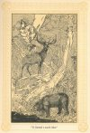

  
[Intangible Textual Heritage](../../index)  [Native American](../index.md) 
[Index](index)  [Previous](ait18)  [Next](ait20.md) 

------------------------------------------------------------------------

*American Indian Fairy Tales*, by Margaret Compton, \[1907\], at
Intangible Textual Heritage

------------------------------------------------------------------------

p. 167 p. 168
p. 169

### THE GREAT WIZARD.

|                     |
|---------------------|
|  |

ANGLED-HAIR, son of the West-wind, was a giant in size and his face was
as black as the feathers of the crow. His hair was of twisted snakes,
gray, black and spotted, with an adder raising its copper-colored head
for his crown, while a rattlesnake spread itself across his shoulders.
He was the greatest of all wizards, and could change himself into any
bird or beast at will, could disguise his voice, and did both good and
evil as he felt inclined.

He lived with his grandmother, who had been thrown from the moon by a
jealous rival. Their lodge was on the edge of the prairie not far from
the Big Sea Water.

He himself did not know his power until one day while playing with a
beautiful snake, whose colors were brighter than any of those upon his
head, he found that by means of it he could do magic. He had caught the
snake and

p. 170

kept it in a bowl of water, feeding it every day on birds and insects.
By chance he let fall some seeds, which were turned into birds as they
touched the water, and the snake greedily devoured them. Then he
discovered that everything he put into the water became alive.

He went to the swamp where he had caught the snake, for others, which he
put into the bowl. Happening to rub his eyes while his fingers were
still wet he was surprised to find how much clearer things at a distance
appeared.

He gathered some roots, powdered them, and put them into the water. Then
he took a little of the water into his mouth and blew it out in spray
which made a bright light. When he put the water on his eyes he could
see in the dark. By bathing his body with it he could pass through
narrow or slippery places. A feather dipped into it would shoot any bird
at which it was aimed, and would enter its body like an arrow.

He was able to heal wounds and sicknesses and to conquer all his
enemies, but for all this he was a bad spirit nearly all his life.

His father, the West-wind, had intrusted Tangled Hair's brothers with
the

p. 171

care of three-fourths of the earth, the north, the south, and the east;
but gave nothing to him, the youngest. When he was old enough to know
how he had been slighted, he was very angry and sought to fight his
father.

He took his bearskin mittens and dipped them into the snake-water,
thereby making them strong with magic, so that he could break off great
boulders by merely striking them. He chased his father across the
mountains, hurling boulder after boulder at him until he drove him to
the very edge of the earth. He would have killed the West-wind if he had
dared, but he was afraid of his brothers, who were friendly to one
another, and he knew that he could not stand against the three. So he
compelled his father to give him power over serpents, beasts and
monsters of all kinds, and to promise him a place in his own kingdom
after he should have rid the earth of them.

Having thus secured his share, he returned to his lodge, where he was
sick for a long time from the wounds that he had received.

One of his first adventures after he had recovered was capturing a great
fish, from which he took so much oil, that when he

p. 172

poured it into a hollow in the woods, it formed a small lake, to which
he invited all the animals for a feast.

As fast as they arrived he told them to jump in and drink. The bear went
in first, followed by the deer and the oppossum. The moose and the
buffalo were late and did not get as much as the others. The partridge
looked on until nearly all the oil was gone, while the hare and the
marten were so long in coming, that they did not get any. That is why
animals differ so much in fatness.

When they had done feasting, Tangled Hair took up his drum, beat upon
it, and invited his guests to dance. He told them to pass round him in a
circle, keeping their eyes shut all the time.

When he saw a fat fowl pass by him he wrung its neck, beating loudly on
his drum to drown its cries, and the noise of its fluttering. After
killing each one, he would call out, "That's the way, my brothers,
that's the way!"

At last a small duck, being suspicious of him, opened one eye, and
seeing what he was doing, called as loudly as she could, "Tangled Hair
is killing us," and jumped and flew towards the water.

Tangled Hair followed her, and just as

[  
Click to enlarge](img/17200.jpg.md)  
“It formed a small lake.”  

p. 173

she was getting into the water, gave her a kick which flattened her
back, and straightened her legs out backward, so that she can no longer
walk on land, and her tail-feathers are few to this day.

The other birds took advantage of the confusion to fly away, and the
animals ran off in all directions.

After this Tangled Hair set out to travel, to see if there were any
wizards greater than himself. He saw all the nations of red men, and was
returning quite satisfied, when he met a great magician in the form of
an old wolf, who was journeying with six young ones.

As soon as the wolf saw him, he told the whelps to keep out of the way,
for Tangled Hair's fame for cruelty and wickedness had been carried
everywhere by the animals and birds he had tried to kill.

As the young wolves were running off, Tangled Hair said to them, "My
grandchildren, where are you going? Stop and I will go with you."

The old wolf was watching him and came up in time to answer, "We are
going to a place where we can find most game, where we may pass the
winter."

Tangled Hair said he would like to go

p. 174

with them and asked the old wolf to change him into a wolf. Now this was
very foolish, for he thereby lost his power, whereas if he had changed
himself into one he might still have kept it, but even the greatest
wizard did not know everything.

The old wolf was only too glad to grant his wish, and changed him into a
wolf like himself. Tangled Hair was not satisfied and asked to be made a
little larger. The wolf made him larger; and as he was still
dissatisfied, he made him twice as large as the others.

Tangled Hair was better pleased, but he still thought he might be
improved, so he said to the old wolf, "Do, please make my tail a little
larger and more bushy."

The wolf did this, and Tangled Hair found a large tail very heavy to
drag about with him.

Presently they came to the bottom of a ravine up which they rushed into
the thick woods where they discovered the track of a moose. The young
wolves followed it, while the old wolf and Tangled Hair walked on after
them, taking their time.

"Which do you think is the swiftest

p. 175

runner among my whelps?" said the wolf.

"Why the foremost one, that takes such long leaps," said Tangled Hair.

The old wolf laughed sneeringly.

"You are mistaken," he said, "he will soon tire out. The one who seems
to be slowest will capture the game."

Shortly afterward they reached a place where one of the young wolves had
dropped a small bundle.

"Pick it up," said the wolf to Tangled Hair.

"No," replied he, "what do I want with a dirty dog-skin?"

The wolf took it up and it was turned into a beautiful robe.

"I will carry it now," said Tangled Hair.

"Oh, no," said the wolf, "I cannot trust you with a robe of pearls," and
immediately the robe shone, for nothing could be seen but pearls.

They had gone about six arrow-flights farther when they saw a broken
tooth that one of the young wolves had dropped in biting at the moose as
it passed.

"Tangled Hair," said the wolf, "one of the children has shot at the
game, pick up his arrow."

p. 176

"No," he replied, "what do I want with a dirty dog's tooth?"

The old wolf took it up, and it became a beautiful silver arrow.

They found that the young wolves had killed a very fat moose. Tangled
Hair was hungry, but the wolf charmed him so that he saw nothing but the
bones picked bare. After a time the wolf gave him a heap of fresh ruddy
meat cut, so it seemed to Tangled Hair, from the skeleton.

"How firm it is!" he exclaimed.

"Yes," answered the wolf, "*our* game always is. It is not a long tail
that makes the best hunter."

Tangled Hair was a good hunter when he was not too lazy to undertake the
chase. One day he went out and killed a large fat moose, but having
lived well in the wolf's lodge he was not very hungry, and so turned the
carcass from side to side, uncertain where to begin. He had learned to
dread the ridicule of the wolves, who were always showing him how little
he knew as a wolf, yet he could not change himself into a man again.

"If I begin at the head," he said, "they will say I ate it backwards. If
I cut the side first, they will say I ate it sideways." He turned it
round so that

p. 177

the hindquarter was in front of him. "If I begin here, they will say I
ate it forwards." But he began to be hungry, so he said, "I will begin
here, let them say what they will."

He cut a piece off the flank and was just about to put it into his mouth
when he heard the branches of a large tree creaking. "Stop, stop," he
said to the tree, for the sound annoyed him. The tree paid no attention
to him, so he threw down his meat, exclaiming, "I cannot eat with such a
noise about!"

He climbed the tree and was pulling at the branch which by rubbing
against another had caused the creaking, when it was suddenly blown
towards him and his paw was caught so that he could not get it out.
Pretty soon a pack of wolves came along and he called out to them,

"Go away, go away!"

The chief of the wolves knew Tangled Hair's voice and said to the
others, "Let us go on, for I am sure he has something there he does not
want us to see."

They found the moose and began eating it. Tangled Hair could not get to
them, so they finished the animal, leaving nothing but the bones. After
they had gone a storm arose which blew the branches of

p. 178

the trees apart, and Tangled Hair was able to get out, but he had to go
home hungry.

The next day the old wolf said to him, "My brother, I am going to leave
you, for we cannot live together always."

"Let me have one of your children for my grandson," said Tangled Hair.

The old wolf left the one who was the best hunter, and also the lodge.

Tangled Hair was disenchanted after the wolves had gone, and when he
assumed his natural shape, his power as a wizard came back. He was very
fond of his grandson and took good care of him, giving much thought
night and day to his welfare. One day he said to him, "My grandson, I
dreamed of you last night, and I feel that trouble will come to you
unless you will heed what I say. You must not cross the lake that lies
in the thick woods. No matter what may the need or how tired you may be,
go around it, even though the ice looks strong and safe."

In the early spring when the ice was breaking up on the lakes and
rivers, the little wolf came to the edge of the water late in the
evening. He was tired and it was such a long way round. He stood

p. 179

and thought to himself, "My grandfather is too cautious about this
lake," and he tried the ice with his foot, pressing his weight upon it.
It seemed strong to him, so he ventured to cross. He had not gone half
way, however, when it broke and he fell in, and was seized by the
serpents whose lodge was under the water.

Tangled Hair guessed what had happened to him when night came and again
the day and he did not return. He mourned many days first in his lodge,
and then by a small brook that ran into the lake.

A bird that had been watching him said, "What are you doing here?"

"Nothing," said Tangled Hair, "but can you tell me who lives in this
lake?"

"Yes," said the bird, "the Prince of Serpents lives here, and I am set
by him to watch for the body of Tangled Hair's grandson, whom they
killed three moons since. You are Tangled Hair, are you not?"

"No," was the answer, "Why do you think he would wish to come here? Tell
me about these serpents."

The bird pointed to a beautiful beach of white sand where he said the
serpents

p. 180

came just after mid-day to bask in the sun. "You may know when they are
coming," said he, "because all the ripples will disappear and the water
will be smooth and still before they rise.

"Thank you," said Tangled Hair, "I am the wizard Tangled Hair. Do not
fear me. Come and I will give you a reward."

The bird went to him and Tangled Hair placed a white medal round his
neck, which the Kingfisher wears to this day. While putting it on he
tried to wring the bird's neck. He did this for fear it might go to the
serpents and tell them he was watching for them. It escaped him,
however, with only the crown feathers ruffled.

He went to the beach of white sand and changing himself into an oak
stump waited for the serpents. Before long the water became smooth as
the lake of oil he himself had once made. Soon hundreds of serpents came
crawling up on the beach. The Prince was beautifully white, the others
were red and yellow.

The Prince spoke to the others and said, "I never saw that black stump
there before; it may be the wizard, Tangled Hair."

p. 181

Then one of the largest serpents went to the stump and coiled itself
round the top, pressing it very hard. The greatest pressure was on
Tangled Hair's throat, and he was just ready to cry out when the serpent
let go. Eight of the others did the same to him, but each let go just in
time. They then coiled themselves up on the beach near their Prince, and
after a long time fell asleep.

Tangled Hair was watching them closely, and when he saw the last one
breathing heavily in sleep, he took his bow and arrows and stepped
cautiously about until he was near the Prince, whom he shot and wounded.

The serpents were roused by his cry, and plunging into the water, they
lashed the waves so that a great flood was raised and Tangled Hair was
nearly drowned. He climbed into a tall tree, and when the water was up
to his chin he looked about for some means of escape. He saw a loon and
said to him, "Dive down, my brother, and bring up some earth so that I
can make a new world."

The bird obeyed him, but came up lifeless. He next asked the muskrat to
do him the service, and promised him if he succeeded, a chain of
beautiful little lakes

p. 182

surrounded by rushes for his lodge in future. The muskrat dived down,
but floated up senseless. Tangled Hair took the body and breathed into
the nostrils, which restored the animal to life. It tried again and came
up the second time senseless, but it had some earth in its paws.

Tangled Hair charmed the earth till it spread out into an island, and
then into a new world. As he was walking upon it, he met an old woman,
the mother of the Prince of Serpents, looking for herbs to cure her son.
She had a pack of cedar cords on her back. In answer to his questions
she said she intended it for a snare for Tangled Hair.

Having found out all he wished, Tangled Hair killed her, took off her
skin, wrapped it about him, and placing the cedar cord on his back, went
to her lodge.

There he saw the skin of his beloved grandson hanging in the doorway.
This made him so angry that he could hardly keep up the disguise. He sat
down outside the door and began weaving a snare of the cedar cord,
rocking himself to and fro and sobbing like an old woman. Some one
called to him to make less noise and to come and attend to the Prince.

p. 183

He put down the snare, and wiping his eyes, went in, singing the songs
the old woman had told him would cure her son.

No one suspected him, and he pretended to make ready to pull out the
arrow which he found was not deeply embedded in the Prince's side.
Instead of pulling it out he gave it a sudden thrust and killed the
Prince; but he had used so much force that he burst the old woman's
skin. The serpents hissed and he fled quickly from the place.

He took refuge with the badger, and with its help he threw a wall of
earth against the opening of their lodge so that no one could get at
him. They had another opening behind the rock, through which they could
bring in food so that they could not be starved out by the serpents.

Tangled Hair soon grew tired of living under ground, so he started to go
out, and, as the badger stood in his way, and did not move quickly
enough to please him, he kicked the poor animal and killed him.

He then ran back towards the serpent's lodge, and finding the dead body
of the Prince, which the serpents in their haste to follow him had left
unburied, he put

p. 184

the skin around him and went boldly up to the serpent tribe. They were
so frightened that they fell into the lake and never again ventured
forth.

After many years of wickedness, Tangled Hair repented, and traveled to
the end of the earth, where he built himself a lodge, and tried, by good
deeds, to rid himself of remembrances. But even there he was a terror to
men and beasts.

Having shown, however, that he was really sorry for his misdeeds, his
father, the West-wind gave him a part of his kingdom. He went to live
beyond the Rocky mountains, and took the name of the North-west wind.

------------------------------------------------------------------------

[Next: White Cloud's Visit to the Sun-Prince](ait20.md)
