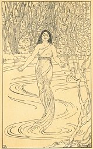

  
[Intangible Textual Heritage](../../index)  [Native American](../index) 

------------------------------------------------------------------------

<table width="75%">
<colgroup>
<col style="width: 50%" />
<col style="width: 50%" />
</colgroup>
<tbody>
<tr class="odd">
<td width="50%" data-valign="TOP"></td>
<td width="50%" data-valign="CENTER"><h1 id="american-indian-fairy-tales" data-align="CENTER">American Indian Fairy Tales</h1>
<h2 id="by-margaret-compton" data-align="CENTER">by Margaret Compton</h2>
<h4 id="section" data-align="CENTER">[1907]</h4></td>
</tr>
</tbody>
</table>

------------------------------------------------------------------------

[Contents](#contents)    [Start Reading](ait00)

------------------------------------------------------------------------

This is a collection of Native American folklore, retold for children
and young adults, over a century ago. The author, probably not a Native
American herself, drew on authentic lore from a wide variety of culture
regions, but sprinkled in stereotypical language and anomalous items
from the woodland area ("squaw," "papoose," "wigwam"). However, the
author was obviously well-intentioned and, for her time, appears to have
had a fairly progressive attitude. Notably, she preserves some of the
motifs in the stories such as grotesque monsters and cross-dressing,
which some other children's book authors of her day (and ours) might
have glossed over.

This is the second edition of this book, which was originally published
in 1895 and titled Snow Bird and the Water Tiger and other American
Indian Tales. The uncredited illustrations are nice examples of
children's book art from the period. The book also has decorative
borders on every page, some of which can be viewed on the [verso page
image](img/verso.jpg).

------------------------------------------------------------------------

 [Title Page](ait00)  
[Author's Note](ait01)  
[Contents](ait02)  
[List of Illustrations](ait03)  
[The Story-Teller Himself](ait04)  
[Snowbird and the Water-Tiger](ait05)  
[The Coyote or Prairie Wolf.](ait06)  
[How Mad Buffalo Fought the Thunder-Bird](ait07)  
[The Red Swan](ait08)  
[The Bended Rocks](ait09)  
[White Hawk, the Lazy](ait10)  
[The Magic Feather](ait11)  
[The Star Maiden](ait12)  
[The Fighting Hare](ait13)  
[The Great Head](ait14)  
[The Adventures of Living Statue](ait15)  
[Turtle-Dove, Sage-Cock, and the Witch](ait16)  
[The Island of Skeletons](ait17)  
[Stone-Shirt and the One-Two](ait18)  
[The Great Wizard](ait19)  
[White Cloud's Visit to the Sun-Prince](ait20)  
