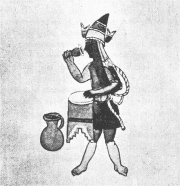

[Sacred-Texts](../../../index)  [Native American](../../index) 
[Aztec](../index)  [Illustrations](illust)  [Index](index) 
[Previous](rva14)  [Next](rva16) 

------------------------------------------------------------------------

# XV. Hymn to a Night-God.

### XV. Xippe icuic, Totec, yoallauana.

[English](#english)

PRIEST OF XIPPE TOTEC, DRINKING AND PLAYING ON A DRUM

1\. Yoalli tlauana, iztleican nimonenequia xiyaqui mitlatia
teocuitlaquemitl, xicmoquenti quetlauia.

2\. Noteua chalchimamatlaco, apana, y temoya ay quetzallaueuetl, ay
quetzalxiuicoatl, nechiya iqui nocauhquetl, ouiya.

3\. Maniyauia, nia nia poliuiz, ni yoatzin achalchiuhtla noyollo,
ateucuitlatl nocoyaitaz, noyolceuizqui tlacatl achtoquetl tlaquauaya,
otlacatqui yautlatoaquetl ouiya.

4\. Noteua cc in tlaco xayailiuiz qonoa y yoatzin motepeyocpa
mitzualitta moteua, noyolceuizquin tlacatl achtoquetl tlaquauaya,
otlacatqui yautlatoaquetl, ouiya.

Var. i. Quetloujia. 2. Noteuhoa chalchimmama tlacoapana itemoia. 3.
Achalchiuhtla. 4. Centlaco, mitzualitla.

### Gloss.

1\. *Q. n.*, yn ti yoallauana, ti xipe, totec, tleica in ti monequi in
timoçuma, in timotlatia, *id est*, tleica in amo quiauiteocultlaquemitl,
xicmoquenti, *q. n.*, ma quiaui, ma ualauh yn ad.

2\. *Q. n.*, yn ti noteuh, otemoc in mauhoualla yn mauh; ay quetzalla
ueuetl, *id est*, ye tlaquetzalpatia ye tlaxoxouia, ye xopantla. Ay
quetzal xiuhcoatl nechia iqui no cauhquetl, *id est*, ca ye otechcauh yn
mayanaliztli.

3\. *Q. n.*, ma mauh, ma nipoliui yn ni yoatzin, *id est*, in catleuatl,
yuhquin chalchiuitl noyollo. A teocuitlatl nocoyaitaz, *q. n.*, in
catleuatl achtomochiuaz ninoyolceuiz.

{p. 57}

4\. *Q. n.*, yn oteuh cequi tlatlacotyan in mochiua initonacayouh, auh
in tlein tlatlacotyan achto mochiua mochi tlacatl achto mitzualmaca, auh
iniquac ye omochimochiuh occeppa nomochi tlacatl mitzualmaca yn
motonacayuh.

### Hymn of the High Priest of Xipe Totec.

1\. The nightly drinking, why should I oppose it? Go forth and array
yourselves in the golden garments, clothe yourselves in the glittering
vestments.

2\. My god descended upon the water, into the beautiful glistening
surface; he was as a lovely water cypress, as a beauteous green serpent;
now I have left behind me my suffering.

3\. I go forth, I go forth about to destroy, I, Yoatzin; my soul is in
the cerulean water; I am seen in the golden water; I shall appear unto
mortals; I shall strengthen them for the words of war!

4\. My god appears as a mortal; O Yoatzin, thou art seen upon the
mountains; I shall appear unto mortals; I shall strengthen them for the
words of war.

### Notes.

There is slight mention of the deity Xipe Totec in the Spanish writers.
He was the patron divinity of the silversmiths, and his festival,
attended with peculiarly bloody rites, was celebrated in the first month
of the calendar. (Duran, *Historia*, cap. 87; Sahagun, Lib. L, cap. 18,
Lib. IL, cap. 21, etc.) Totec is named as one of the companions of
Quetzalcoatl, and an ancient divinity whose temple stood on the

{p. 58}

Tzatzitepec (see the *Codex Vaticanus*; Tab. XII., in Kingsborough's
*Mexico*). His high priest was called *Youallauan*, "the nocturnal
tippler" (*youalli*, night, and *tlauana*, to drink to slight
intoxication), and it was his duty to tear out the hearts of the human
victims (Sahagun, *u. s.*). The epithet *Yoatzin*, "noble night-god,"
bears some relation to the celebration of his rites at night.

------------------------------------------------------------------------

[Next: XVI. Hymn to the Goddess of Food.](rva16) 
