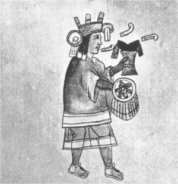

[Sacred-Texts](../../../index)  [Native American](../../index) 
[Aztec](../index)  [Illustrations](illust)  [Index](index) 
[Previous](rva15)  [Next](rva17) 

------------------------------------------------------------------------

# XVI. Hymn to the Goddess of Food.

### XVI. Chicomecoatl icuic.

[English](#english)

CHICOMECOATL, GODDESS OF FOOD AND DRINK

1\. Chicomollotzin xayameua, ximiçotica aca tona titech icnocauazqui
tiyauia mochan tlallocan nouia.

2\. Xayameua ximiçotica aca tonan titech icnocauazqui tiyauian mochan
tlallocan nouiya.

Var. 1. Xaia mehoa.

### Gloss.

1\. *Q. n.*, yn ti chicomolotl, *id est*, in ti centli ximeua, xiça,
xixoa, ca otimouicaya in mochan tlallocan.

2\. *Q. n.*, xayameua, *id est*, ximeua, xixua, xiça, ca otimouicaya in
mochantzinco in tlallocan ca yuhquin ti tonatzon.

### Hymn to Chicomecoatl.

1\. O noble Chicomolotl, arise, awake, leave us not unprotected on the
way, conduct us to the home of Tlaloc.

2\. Arise, awake, leave us not unprotected on the way, conduct us to the
home of Tlaloc.

### Notes.

The goddess Chicomecoatl, "seven guests," was the deity who presided
over food and drink. Hence in the first verse she is referred to as
Chicomolotl, "seven ears of corn," and is spoken of as a guide to
Tlalocan, or the home of abundance.

Father Duran, who gives a long chapter on this goddess (*Historia*, cap.
92), translates her name "serpent of seven heads," and adds that she was
also called *Chalciucihuatl*,

{p. 60}

"Lady of the Emerald," and *Xilonen*, "goddess of the tender ears of
maize." Every kind of seed and vegetable which served for food was under
her guardianship, and hence her festival, held about the middle of
September, was particularly solemn. Her statue represented her as a girl
of. about twelve years old.

------------------------------------------------------------------------

[Next: XVII. Hymn to the Gods of Wine.](rva17) 
