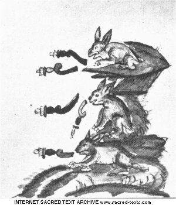

[Sacred-Texts](../../../index)  [Native American](../../index) 
[Aztec](../index)  [Illustrations](illust)  [Index](index) 
[Previous](rva16)  [Next](rva18) 

------------------------------------------------------------------------

# XVII. Hymn to the Gods of Wine.

### XVII. Totochtin incuic Tezcatzoncatl.

[English](#english)

TOTOCHTIN, THE RABBITS, GODS OF THE DRUNKARDS

1\. Yyaha, yya yya, yya ayya, ayya ouiya, ayya yya, ayya yya, yyauiyya,
ayya ayya, yya ayya, yya yya yye.

2\. Coliuacan mauizpan atlacatl ichana, yya ayya, yyayyo.

3\. Tezcatzonco tecpan teutl, macoc: ye chocaya, auia, macaiui, macayui
teutl, macoc yye chocaya.

4\. Auia axalaco, tecpanteutl, macoc yye chocaya, macayui, macayui teutl
macoc yye chocaya.

Var. 3. Tezcatzoncatl tepan. 4. Axalaca.

### Gloss.

1\. Y tlauelcuic, tlauelcuica.

2\. Coliuacan mauizpa tlacatlichana, *q. n.*, in tlacatl, *id est*,
octli ompa, ichan ni colhoacan. Mauizpa, *q. n.*, temamauhtican.

3\. Tezcatzonco, tecpanteutl, *q. n.*, ye choca in omacoc teutl
tezcatzonco tecpan, *id est*, octli. Quinionacayotia in teutl. Macaiui
teutl, *q. n.*, macamo omatoni in teutl, *id est*, octli, ye choca
cayamo, ynemac.

4\. Aia, axalaco tecpanteutl, *q. n.*, axala, in tecpanteutl. Ye choca,
yn omacoc, *id est*, octli axalatecpan, ye choca in omacoc, macamo omaco
ni ye choca cayamo ynemac.

### Hymn to Tezcatzoncatl Totochtin.

1\. Alas! alas! alas! alas! alas! alas!

2\. In the home of our ancestors this creature was a fearful thing.

{p. 62}

3\. In the temple of Tezcatzoncatl he aids those who cry to him, he
gives them to drink; the god gives to drink to those who cry to him.

4\. In the temple by the water-reeds the god aids those who call upon
him, he gives them to drink; the god aids those who cry unto him.

### Notes.

Tezcatzoncatl was one of the chief gods of the native inebriating
liquor, the pulque. Its effects were recognized as most disastrous, as
is seen from his other names, *Tequechmecaniani*, "he who hangs people,"
and *Teatlahuiani*, "he who drowns people." Sahagun remarks, "They
always regarded the pulque as a bad and dangerous article." The word
*Totochtin*, plural of *tochtli*, rabbit, was applied to drunkards, and
also to some of the deities of special forms of drunkenness.

The first verse is merely a series of lamentations. The second speaks of
the sad effects of the pulque in ancient times. (On Colhuacan see Notes
to Hymn XIII.)

------------------------------------------------------------------------

[Next: XVIII. Hymn to the Master of Waters.](rva18) 
