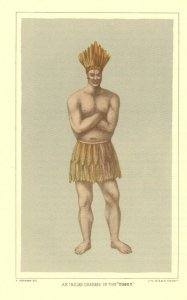

  
[Intangible Textual Heritage](../../../index.md)  [Native
American](../../index)  [California](../index.md) 

------------------------------------------------------------------------

<table data-widht="75%">
<colgroup>
<col style="width: 50%" />
<col style="width: 50%" />
</colgroup>
<tbody>
<tr class="odd">
<td data-valign="VCENTER" data-witdh="50%"></td>
<td data-valign="VCENTER" data-witdh="50%"><h1 id="chinigchinich" data-align="CENTER">Chinigchinich</h1>
<h2 id="by-friar-geronimo-boscana" data-align="CENTER">by Friar Geronimo Boscana</h2>
<h2 id="tr.-by-alfred-robinson" data-align="CENTER">tr. by Alfred Robinson</h2>
<h4 id="section" data-align="CENTER">[1846]</h4></td>
</tr>
</tbody>
</table>

------------------------------------------------------------------------

[Jump to Contents](#contents)    [Start Reading](bosc00.md)

------------------------------------------------------------------------

Chinigchinich is an ethnographic account of the culture and (notably)
religious beliefs of the native Californians in the vicinity of the
famous mission San Juan Capistrano. This is the mission where the
swallows, legendarily, return every year. There is nothing, however,
about the returning swallows in this book. Boscana was one of the few
Spanish missionaries who, like Bishop Landa in the Yucatan, actually
took an interest in the culture they were destroying.

Boscana was, typically, a bigot and a racist (he describes the Indians
as being like monkeys). However, he lived among them for decades and
obviously had an inquisitive mind and a talent for observation. While he
condemns the practices and beliefs of the indigenous people, he
describes them in great detail. Barring a time machine, this is the only
first-hand account of mission-era Juaneños we will ever have.

The translator of this treatise, Alfred Robinson, was one of the first
Yankees to settle in California. This translation was published
originally as a large appendix to Robinson's travelog Life in
California, or possibly his book was supposed to be an extended
introduction to Boscana. In any case, this translation of Boscana was
the first book ever published by an American about California; it is
extremely rare. Boscana was also translated by J. P. Harrington in the
1940s. This etext was scanned from a beautiful (and limited) Biobooks
edition of Robinson published in 1947. The pagination reflects that
edition.

------------------------------------------------------------------------

[Title Page](bosc00.md)  
[Translator's Introduction](bosc01.md)  
[Introduction](bosc02.md)  
[Chapter I. Of What Race of People Are These Indians?](bosc03.md)  
[Chapter II. On the Creation of the Universe](bosc04.md)  
[Chapter III. Of the Creation of the World According to Those Residing
on the Sea-Coast](bosc05.md)  
[Chapter IV. Description of the Vanquech or Temple](bosc06.md)  
[Chapter V. Obedience and Subjection to Their Captain](bosc07.md)  
[Chapter VI. The Instructions Given to Their Children](bosc08.md)  
[Chapter VII. On Matrimony](bosc09.md)  
[Chapter VIII. On Their Mode of Life and Occupation](bosc10.md)  
[Chapter IX. On Their Principal Feasts and Dances](bosc11.md)  
[Chapter X. Of Many of Their Extravagances](bosc12.md)  
[Chapter XI. Their Calendar](bosc13.md)  
[Chapter XII. The Indian Wars](bosc14.md)  
[Chapter XIII. Their Funeral Ceremonies](bosc15.md)  
[Chapter XIV. The Immortality of the Soul](bosc16.md)  
[Chapter XV. Origin of the Population of the Mission of St. Juan
Capistrano](bosc17.md)  
[Chapter XVI. The Character of the Indian](bosc18.md)  
[Characteristic Anecdotes](bosc19.md)  
