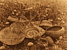

  
[Intangible Textual Heritage](../../../index)  [Native
American](../../index)  [California](../index)  [Index](index) 
[Previous](coli08)  [Next](coli10) 

------------------------------------------------------------------------

  
*The Culture of the Luiseño Indians*, by Philip Stedman Sparkman,
\[1908\], at Intangible Textual Heritage

------------------------------------------------------------------------

### ARTICLES MADE OF PLANT FIBERS.

The best fiber is made from dogbane or Indian hemp, *Apocynum
cannabinum*, a perennial plant with annual stems. The inner bark
furnishes the fiber. Sometimes the outer covering is scraped off and the
inner bark then removed from the stalk; or the bark is pulled off
entire, and soaked in boiling water, after which the outer covering
easily separates from the fiber. In either case the fiber is rolled into
a ball, and made into twine by rolling it between the palm of the hand
and the bare thigh.

A milkweed, *Asclepias eriocarpa*, furnishes a light-colored fiber, but
it is not so durable as that obtained from dogbane. The fiber is
separated from the pulp by soaking the stems in boiling water; or, late
in the season, when the pulp has decayed, it may be separated by merely
basting the stems. It is then made into a ball., which is afterwards
made into twine in the same manner as dogbane fiber.

The common nettle, *Urtica holosericea*, also furnishes a fiber, but it
is little esteemed.

The twine made from the plants mentioned is usually two-ply,

p. 203

but three-ply and four-ply twine is also made. [2a](#fn_2) Bowstrings are made from such twine,
generally of dogbane.

A large-meshed net for carrying bulky or heavy articles, ikut, is also
made from twine. This carrying-net has a cord attached that passes
across the forehead, which bears part of the weight of the contents. A
net-work sack for carrying acorns, kawish, was formerly made, the mesh
being sufficiently small to prevent the acorns from falling through. The
mouth of this sack might be tied and the sack itself placed in the
large-meshed carrying net, or it could be used alone, as it had a cord
attached to it in the same manner as the carrying net. One we have seen
would probably hold about a. bushel. Other net-work sacks with a still
finer mesh are said to have been made at one time. In these small seeds
were carried.

A long net, yulapish, for use at rabbit drives, was occasionally made.
These were considered very valuable, much time being consumed in their
manufacture. A draw-net for catching rabbits and jackrabbits was also
made. This was placed in their runs, or stretched between bushes where
they would be likely to pass. An endeavor was then made to drive them
towards the nets. A small fine-meshed dip-net was made for catching a
very small fish found in streams. A large dip-net was made for sea
fishing.

The front apron worn by women was also formerly made from this cordage,
sometimes of net-work and sometimes of loose strings suspended to a cord
tied around the waist.

Slings, pivanlish, were also made from twine, and it was used for many
other purposes. The fiber of *Yucca Mohavensis*, so much used by the
Cahuillas, is seldom employed by the Luiseños, though a fish line was
formerly made from it. The leaves are soaked in water until the pulpy
part decays, when they are basted to separate the fiber.

From the fibers covering the bulb of the soap-root, *Chlorogalum
pomeridianum*, a small brush, alukut, is made. This is used, in pounding
acorns, to sweep up the scattered meal, and to brush it from the mortar.

p. 204

### BASKETS AND BASKET-MAKING.

Basket making is an art in which the Luiseños are quite adept. Their
usual basketry is a coiled ware, the foundation of the coil being
composed of a long grass, *Epicampes rigens Californica*. The splints
with which the coil is wrapped are usually from the aromatic sumac,
*Rhus trilobata*, but when it is wished to give a brown color the lower
part of a rush is used.

Several different forms of these coiled baskets are made, each having a
different name, and being used for a different purpose. One conical
shaped basket did duty as a hat, chilkwut, and was also used as a
drinking vessel, also at times to eat out of. A large basket, peyevla,
was used for storage purposes, various kinds of food being kept in it. A
nearly flat basket, tukmal, was used for winnowing and cleaning seeds,
and for other purposes. To winnow, the article was placed in the basket,
lifted in the air, and allowed to fall slowly so that the wind would
carry away the rubbish. The most common basket, pa’kwut, is
basin-shaped. This form varies in size. Fourteen inches in diameter and
four deep would be a medium size. Another kind, called peyevmal, usually
has the sides bulging slightly, with the mouth drawn in; these are the
smallest of all.

Baskets are always patterned with black, and sometimes also with brown,
on the light ground of the sumac, and rarely a basket is made entirely
black or brown. No model is ever used, except possibly of late years
occasionally; and no two baskets are ever exactly alike. Basket-making
is a very slow and tedious process, there being from ten to eighteen
wraps of the coil to an inch in an ordinary basket, and in rare cases
even more. Quite a small basket, if well made, will require ten thousand
stitches or wraps of the coil. Sometimes a pattern is made to represent
a bird, animal, or leaf, but most of them represent the momentary fancy
of the maker. Much has been written to prove that Indian basket patterns
have some hidden symbolic or religious significance, but in the case of
the Luiseños they have none whatever. On this point we speak positively.

Besides, the coiled baskets, woven or twined ones are made from a rush,
*Juncus Mertensianus*. These are of open-work, and

p. 205

are quite roughly made. One kind is used as a sifter, another to leach
acorn-meal in, others of different sizes are used for every-day
purposes, such as gathering acorns and cactus. It is known that some of
the Indians of Southern California made baskets of rushes, coated with
asphaltum to render them waterproof, but the Luiseños say that they
never made this class of baskets.

------------------------------------------------------------------------

### Footnotes

[203:2a](coli09.htm#fr_3) The twine made by the
California Indians was almost invariably two-ply. Perhaps the Luiseño
three-ply and four-ply string is due to European influence.

------------------------------------------------------------------------

[Next: Bows and Arrows](coli10)
